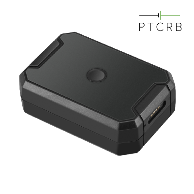

# Concox - AT1

El AT1 es un rastreador GNSS/GPS compacto diseñado para el seguimiento de activos en entornos exigentes y la monitorización de flotas, ahora compatible con Plaspy para una integración sencilla en flujos de telemática en la nube. Con una carcasa IP67, soporte magnético robusto y una batería recargable de larga duración de 6,000 mAh, el AT1 proporciona seguimiento en tiempo real confiable y conciencia situacional para mercancías, contenedores, activos de alto valor y monitorización de personas vulnerables.

El dispositivo combina posicionamiento GNSS preciso con respaldo por LBS, detección de eventos a bordo y almacenamiento local de datos para mantener actualizados tus paneles de Plaspy incluso en zonas de cobertura difíciles. Diseñado para ser compatible con Plaspy, el AT1 ayuda a flotas y gestores de activos a implementar flujos de anti‑robo, informes de telemetría y despliegues de larga autonomía con un mínimo esfuerzo de instalación.

## Características Clave

- Rastreador GPS compatible con Plaspy, diseñado para seguimiento de activos reubicables y gestión de flotas con instalación mínima.
- Carcasa robusta IP67 y montaje magnético para uso fiable en exteriores y en contenedores.
- Gran autonomía: batería Li‑Polymer de 6,000 mAh para ~25 días de operación típica y modo de espera ultralargo \(hasta 1,5 años en modos de ahorro de energía\).
- Posicionamiento de alta precisión: GPS con respaldo LBS y precisión de posición superior a 2,5 m CEP bajo buena recepción para un seguimiento en tiempo real fiable.
- Sensores a bordo y funciones de anti‑manipulación: sensor de luz, acelerómetro, alarmas de sobrevelocidad y geocercas, para flujos de anti‑robo y detección de movimientos.
- Micrófono impermeable, monitoreo de voz remoto y grabación de voz a bordo para una mayor conciencia situacional basada en audio cerca del dispositivo.
- Almacenamiento local en búfer \(32+32 Mb\) y soporte de protocolos estándar para asegurar la entrega de telemetría a Plaspy y a sistemas de terceros.

## Cómo Funciona con Plaspy

Cuando se empareja con Plaspy, el AT1 envía actualizaciones de ubicación, eventos y telemetría a través de enlaces celulares para que puedas ver las posiciones en tiempo real, generar alertas y analizar rutas históricas desde una única plataforma. Plaspy puede ingerir las posiciones GPS/LBS del AT1 y los eventos disparados por sensores para proporcionar seguimiento en tiempo real, manejo de alarmas e informes para la gestión de flotas y la protección de activos.

- Actualizaciones de ubicación y telemetría en tiempo real mediante GSM cuádri‑banda \(850/900/1800/1900 MHz\) — ranura Nano‑SIM \(2G\).
- Alertas de manipulación, movimiento y sobrevelocidad enviadas a Plaspy para respuestas inmediatas de anti‑robo y seguridad.
- Almacenamiento de datos local que acumula ubicaciones y grabaciones de voz cuando la cobertura se interrumpe y las envía a Plaspy cuando la conectividad se restablece.
- Funciones de audio \(monitoreo de voz remoto y grabación a bordo\) que pueden mostrarse en la interfaz de Plaspy para contextualizar la situación.
- Modos de informes configurables \(GPS regular, seguimiento, ahorro de energía\) para equilibrar la frecuencia de informes y la autonomía de la batería en flujos de trabajo impulsados por Plaspy.

## Visión Técnica

| Conectividad | GSM cuádri‑banda \(850/900/1800/1900 MHz\) — ranura Nano‑SIM \(2G\) |
| --- | --- |
| Bandas | 850 / 900 / 1800 / 1900 MHz \(2G mundial\) |
| Alimentación y Batería | 6,000 mAh recargable Li‑Polymer \(3.7 V\); ~25 días de operación típica en modo GPS regular; los modos de ahorro de energía extienden el modo de espera hasta 1.5 años \(según especificaciones del dispositivo\) |
| Almacenamiento | Almacenamiento local a bordo \(32+32 Mb\) para almacenamiento en búfer de ubicaciones y audio |
| Sensores & Entradas | Sensor de luz \(detección de manipulación\), acelerómetro \(movimiento/vibración\), función de desactivación on/off, alertas de baja batería |
| Acústica | Micrófono impermeable, monitoreo de voz remoto, grabación de voz a bordo, notificaciones por exceso de decibelios \(~3 m de rango de monitoreo\) |
| GNSS | Posicionamiento GPS con respaldo LBS; precisión de posición \<2,5 m CEP bajo buena recepción |
| Sensibilidad & TTFF | Sensibilidad de seguimiento –165 dBm; sensibilidad de adquisición –148 dBm; TTFF en caliente ≤1 s, en frío ≤32 s |
| Rango de Operación | –20 °C a +70 °C; 5–95% de humedad no condensante; carcasa IP67 |
| Datos & Protocolos | Soporte de protocolos estándar para integración en la nube y con terceros; almacenamiento en búfer y reenvío local |
| Factor de Forma | 85 × 58 × 29 mm; 161 g; montaje magnético robusto para una instalación prácticamente nula |
| Bluetooth | No especificado / no incluido |
| Gestión Remota | Integración en la nube/terceros mediante protocolos estándar \(FOTA no especificado\) |

## Casos de Uso

- Gestión de flotas para remolques y activos no motorizados — rastrea ubicación y movimiento entre centros con una larga autonomía de la batería.
- Monitoreo de mercancías y contenedores — robustez IP67 y montaje magnético permiten una colocación segura en exteriores de contenedores para logística transfronteriza.
- Prevención de robos y detección de manipulación — sensor de luz, acelerómetro y función de desactivación on/off ayudan a detectar manipulaciones no autorizadas y intentos de apagado.
- Apoyo a personas vulnerables o cuidadores — monitoreo de voz remoto y grabación proporcionan mayor conciencia situacional cuando se despliega con consentimiento y políticas adecuadas.
- Monitoreo de activos temporales o reubicables — instalación rápida y operación multi‑modo hacen del AT1 una opción ideal para flotas estacionales y equipos en préstamo.

## Por qué Elegir Este Rastreador con Plaspy

El AT1 reúne hardware robusto, larga autonomía y sensórica práctica en un rastreador GPS compacto que es compatible con Plaspy desde el primer momento. Para empresas que necesitan un seguimiento en tiempo real y telemetría confiables sin instalaciones complejas, el AT1 reduce el tiempo de despliegue al tiempo que mantiene datos de eventos ricos y contexto de audio. Su almacenamiento local en búfer y el respaldo por LBS ayudan a garantizar la continuidad de los datos hacia Plaspy en zonas con cobertura celular intermitente.

Elige el AT1 con Plaspy cuando necesites una solución fiable y de baja manutención para la gestión de flotas y la monitorización anti‑robo, además de la posibilidad de ampliar flujos de telemática \(p. ej., monitorización de combustible, registro de ignition o control del inmovilizador\) a través de Plaspy cuando existan interfaces de vehículo o sensores externos. El resultado es una solución de rastreo escalable y fácil de gestionar que proporciona conciencia situacional y ahorros operativos a largo plazo para despliegues centrados en activos.

