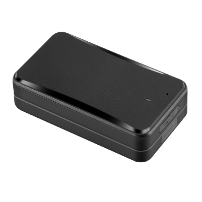

# Concox - AT4

El Concox AT4 es un rastreador GPS portátil con montaje magnético, diseñado para despliegues de larga autonomía y uso en entornos exigentes. Combina posicionamiento por GPS y por red con una batería de alta capacidad y una carcasa con protección IPX5 para ofrecer información de ubicación confiable, alertas por manipulación y monitoreo de audio discreto. Su formato compacto y la base magnética potente lo hacen adecuado para fijaciones temporales o semipermanentes en vehículos, remolques y otros activos móviles.

Como dispositivo compatible con Plaspy desde el primer momento, el AT4 puede transmitir datos de ubicación, estado y eventos directamente a Plaspy para monitoreo centralizado y supervisión operativa. Los administradores de flotas y propietarios de activos pueden utilizar los paneles de Plaspy para ver posiciones en tiempo real, recibir notificaciones de manipulación y energía, e incluir los eventos del AT4 en flujos de trabajo de reportes y alertas sin hardware adicional.

## Características principales

- Rastreador GPS compatible con Plaspy que reporta ubicación, movimiento y eventos a su panel de Plaspy.
- Autonomía ultralarga gracias a una batería de alto rendimiento de 10,000 mAh, ideal para despliegues de bajo mantenimiento.
- Carcasa resistente con clasificación IPX5 y montaje magnético fuerte para una colocación rápida y discreta en activos.
- Posicionamiento combinado por GPS y LBS para estimaciones de ubicación fiables en condiciones variadas.
- Diseño con detección de manipulación que notifica retiro de tapa y cortes de energía para soportar flujos anti robo.
- Micrófono integrado para monitoreo de audio discreto y detección de vibración basada en acelerómetro.
- Almacenamiento local y amplia cobertura celular para almacenar reportes cuando la conectividad es intermitente.

## Cómo funciona con Plaspy

Al integrarse con Plaspy, el AT4 envía reportes de posición, actualizaciones de estado y notificaciones de eventos a una vista unificada de gestión de flotas, permitiendo que los equipos monitoreen activos en tiempo real e investiguen actividad histórica. Plaspy procesa las transmisiones de ubicación y eventos del dispositivo y las presenta junto con otros datos de la flota para apoyar la toma de decisiones operativas.

- Las ubicaciones en tiempo real y las telemetrías aparecen en Plaspy para seguimiento en vivo y reproducciones de rutas.
- Las notificaciones de manipulación y apagado se enrutan a Plaspy para activar alertas y reglas de escalamiento.
- Eventos de vibración, exceso de velocidad y geocercas se reportan a Plaspy para notificaciones automáticas y generación de informes.
- La capacidad de monitoreo de audio remoto está disponible a través de Plaspy cuando su uso está permitido y habilitado.
- El almacenamiento en el dispositivo permite que el AT4 haga buffering de datos de ubicación durante cortes para que Plaspy reciba los reportes en caché cuando se restablece la conectividad.

## Casos de uso típicos

- Flotas de alquiler de vehículos que requieren rastreo magnético discreto para recuperación y control de usos indebidos.
- Seguimiento de remolques y activos donde la larga duración de la batería reduce la necesidad de servicio frecuente.
- Protección anti robo para equipos con alertas por manipulación, detección de vibraciones y monitoreo de geocercas.
- Monitoreo de seguridad discreto donde la verificación por audio y el historial de posiciones apoyan las investigaciones.

## Por qué elegir este rastreador con Plaspy

El AT4 es apropiado para organizaciones que necesitan rastreo confiable y de bajo mantenimiento para activos móviles. Su larga autonomía y su carcasa resistente disminuyen la carga operativa para flotas y propietarios de activos, mientras que la detección de manipulación y el monitoreo remoto añaden capas prácticas de seguridad. Al combinarse con Plaspy, los datos del AT4 pasan a formar parte de una solución telemática más amplia que respalda la visibilidad en vivo, alertas automatizadas y análisis histórico.

Si desea saber más sobre cómo el AT4 puede integrarse con Plaspy y cómo Plaspy puede centralizar el seguimiento de su flota y activos, visite https://www.plaspy.com. Las especificaciones del producto, la disponibilidad y los datos del fabricante pueden cambiar con el tiempo, así que verifique las especificaciones actuales y la documentación oficial en el sitio del fabricante https://www.iconcox.com/.
