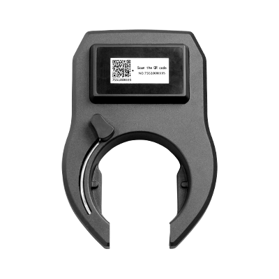

# Concox - BL10

El Concox BL10 es un candado inteligente para bicicletas con GNSS y rastreador GPS oculto, pensado para flotas de bicicletas compartidas y operadores de micromovilidad. Combina un mecanismo de cierre robusto con reporte continuo de ubicación para ofrecer a los operadores un dispositivo integrado de gestión de flotas y antirrobo, adecuado para despliegues exteriores prolongados y programas de uso público.

Como dispositivo compatible con Plaspy desde el primer momento, el BL10 transmite datos de ubicación y eventos directamente al entorno de gestión de Plaspy. Esa compatibilidad facilita que los operadores centralicen el seguimiento en vivo, las alertas de geocerca, las notificaciones de manipulación y la información básica de estado operativo junto con otros activos gestionados en Plaspy.

## Aspectos clave

- Dispositivo combinado de candado inteligente y rastreador diseñado para bicicletas compartidas y operaciones de micromovilidad.
- Reportes de ubicación en tiempo real y notificaciones de eventos enviados a Plaspy para monitoreo centralizado.
- Carcasa resistente al clima con clasificación IPX5, pensada para uso exterior en entornos urbanos.
- Larga vida de despliegue gracias a una batería de alta capacidad y opción de carga asistida por panel solar para reducir visitas de mantenimiento.
- Desbloqueo por Bluetooth y soporte iBeacon para acceso sin contacto por parte del usuario y posicionamiento de corto alcance.
- Alertas por geocerca y manipulación para acelerar los flujos de trabajo de respuesta y recuperación ante robo.
- Factor de forma compacto para facilitar su integración en despliegues a gran escala.

## Cómo funciona con Plaspy

Al utilizarlo con Plaspy, el BL10 entrega flujo continuo de ubicación y eventos a una única plataforma de gestión, lo que permite a los operadores supervisar el estado de la flota, responder a incidentes y analizar el uso desde un mismo lugar.

- Actualizaciones de ubicación en tiempo real dirigidas a Plaspy para visibilidad continua y mapeo de la flota.
- Notificaciones de geocerca que se activan cuando las bicicletas entran o salen de zonas predefinidas.
- Alertas de manipulación y vibración remitidas a Plaspy para apoyar la recuperación rápida y la intervención.
- Eventos de proximidad Bluetooth e iBeacon registrados en Plaspy para control de desbloqueos y comprobaciones de ubicación a corto alcance.
- Información de estado del dispositivo y conectividad visible en Plaspy para ayudar a planificar mantenimiento y redistribución.

## Casos de uso típicos

- Flotas de bicicletas compartidas y programas públicos que requieren hardware integrado de candado y rastreador.
- Operadores de micromovilidad que aplican reglas de geocerca y monitorean la ubicación de activos en áreas urbanas densas.
- Flujos de trabajo de disuasión y recuperación de robos que utilizan alertas de manipulación y localización en vivo para acelerar la recuperación.
- Operaciones que buscan reducir visitas de mantenimiento en campo gracias a la larga duración de la batería y la opción solar.
- Análisis de uso e informes básicos de viajes basados en eventos de desbloqueo e historiales de ubicación.

## Por qué elegir este rastreador con Plaspy

El BL10 está diseñado para operadores que desean un único dispositivo que combine cierre y rastreo para flotas de micromovilidad. Su carcasa resistente y su orientación a despliegues exteriores prolongados ayudan a reducir tiempos de inactividad, mientras que el desbloqueo por proximidad integrado y el posicionamiento de corto alcance soportan flujos de acceso sin contacto y registro de uso dentro de Plaspy.

Si usted administra bicicletas compartidas u otros activos similares y necesita una unidad compatible con Plaspy que equilibre durabilidad, datos operativos y funciones antirrobo, el BL10 es una opción práctica. Conozca más sobre Plaspy en el sitio principal https://www.plaspy.com y verifique las especificaciones, disponibilidad y detalles del fabricante en la web de Concox https://www.iconcox.com/ ya que las características y la documentación del producto pueden cambiar con el tiempo.
