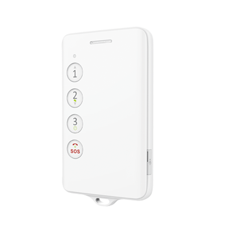

# Concox - GK309E

El GK309E Segunda Generación de Concox es un teléfono GPS infantil compacto diseñado para ayudar a los padres a localizar a sus hijos. Al integrar funciones básicas de teléfono celular con rastreo GPS y soporte opcional de RFID, el GK309E se presenta como una opción económica y práctica para la seguridad estudiantil y la supervisión diaria. Con botón SOS y compatibilidad con números familiares, el dispositivo permite comunicación rápida y un canal de contacto en emergencias.

Como dispositivo compatible con Plaspy, el GK309E puede integrarse en una plataforma centralizada de seguimiento para mejorar la visibilidad y el control. Al usarlo con Plaspy, las capacidades de ubicación y alerta del GK309E forman parte de un flujo de monitoreo más amplio, lo que permite a cuidadores o administradores ver posiciones, recibir avisos críticos y consolidar registros para reportes y uso operativo.

## Características principales

- Diseñado para la localización infantil con posicionamiento basado en GPS.
- Soporte opcional de RFID para usos adicionales de proximidad o acceso.
- Botón SOS y soporte para números familiares que permiten contacto inmediato en emergencias.
- Restricciones de llamadas para evitar comunicaciones con números desconocidos y aumentar la seguridad.
- Combinación económica de teléfono básico y rastreador GPS inalámbrico ideal para estudiantes.
- Elección práctica para monitoreo rutinario como traslados escolares y trayectos cortos.

## Cómo funciona con Plaspy

El GK309E se integra con Plaspy enviando actualizaciones de ubicación y eventos de alerta que Plaspy recopila, muestra y gestiona. Plaspy presenta la actividad del dispositivo en una interfaz centralizada para que cuidadores y administradores monitoreen movimientos, respondan a eventos SOS y mantengan un historial de actividad del equipo.

- Visibilidad de ubicación en tiempo real en los mapas de Plaspy para seguimiento instantáneo.
- Alertas SOS y de emergencia que se envían a los flujos de notificaciones de Plaspy para atención rápida.
- Informes históricos de ubicación y reproducción de trayectos para revisiones y reportes posteriores.
- Alertas por geocerca y zonas para notificar cuando un dispositivo entra o sale de áreas designadas.
- Agrupamiento y gestión de dispositivos para organizar múltiples unidades GK309E en escuelas o flotas familiares.

## Casos de uso típicos

- Supervisión de niños durante los traslados diarios a la escuela y actividades extracurriculares.
- Control de estudiantes en excursiones y salidas pedagógicas.
- Gestión de un conjunto de dispositivos estudiantiles para una escuela o centro de cuidado infantil.
- Tranquilidad para padres de niños pequeños que requieren comunicación simple y visibilidad de ubicación.
- Coordinación de la logística de recogida y entrega en grupos pequeños de estudiantes.

## Por qué elegir este rastreador con Plaspy

El GK309E es una opción sensata para instituciones y padres que necesitan un dispositivo de localización infantil sencillo con funciones básicas de seguridad. Su combinación de teléfono, ubicación GPS, soporte SOS y RFID opcional lo hace flexible para entornos escolares y familiares sin añadir complejidad innecesaria.

Usado con Plaspy, el GK309E resulta más fácil de administrar a gran escala. Plaspy se enfoca en mostrar datos de ubicación, alertas e informes de manera clara y accionable, lo que ayuda a convertir las señales del dispositivo en supervisión operativa y respuestas oportunas. Para equipos o familias que buscan monitoreo consolidado de dispositivos estudiantiles, GK309E más Plaspy ofrece un equilibrio práctico entre funciones de seguridad y gestión centralizada.

Para saber más sobre el uso del GK309E con Plaspy, visite el sitio web de Plaspy en https://www.plaspy.com. Las especificaciones del producto, la disponibilidad y los detalles del fabricante pueden cambiar con el tiempo, por lo que le recomendamos verificar la información técnica actual en el sitio oficial de Concox en https://www.iconcox.com/.
