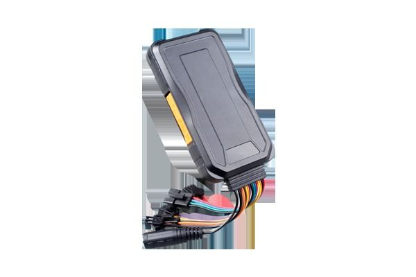

# Concox - GT06F

El Concox GT06F es un rastreador GPS compacto para vehículos, diseñado para ofrecer seguimiento de ubicación fiable tanto de automóviles como de bienes valiosos. Combina un formato pequeño y discreto con funcionalidades esenciales como actualizaciones de ubicación en tiempo real, geocercas, monitoreo remoto, varios tipos de alarma y reproducción del historial de rutas. El dispositivo está pensado para ser fácil de usar y se adapta bien a colocaciones discretas dentro de un vehículo o sobre otros elementos a rastrear.

Como dispositivo compatible con Plaspy, el GT06F puede integrarse en la plataforma para proporcionar visibilidad centralizada y control operativo. Plaspy puede recibir datos de ubicación y eventos desde el rastreador, de modo que usted pueda supervisar activos, recibir alertas y revisar rutas históricas dentro de la misma interfaz. Esta compatibilidad convierte al GT06F en una opción práctica para quienes buscan un rastreo sencillo combinado con las herramientas de Plaspy para gestión de flotas y activos.

## Puntos clave

- Diseño compacto y discreto, adecuado para vehículos y activos portátiles
- Seguimiento en tiempo real para visibilidad de ubicación actualizada
- Soporte de geocercas para generar alertas al cruzar límites definidos
- Capacidad de monitoreo remoto para captar audio ambiental alrededor del dispositivo
- Múltiples tipos de alarma, incluyendo exceso de velocidad y notificaciones de alimentación
- Reproducción del historial para revisar rutas y ubicaciones pasadas

## Cómo funciona con Plaspy

Al integrarse con Plaspy, el GT06F envía sus datos de seguimiento a los paneles y herramientas de informes de la plataforma para ofrecer visibilidad continua y detección de eventos. Esta integración le permite centralizar las operaciones de rastreo y aprovechar las funcionalidades de Plaspy para monitoreo y análisis.

- Mostrar la ubicación en vivo de unidades GT06F en los mapas de Plaspy para supervisión en tiempo real
- Configurar alertas de geocerca en Plaspy y recibir notificaciones cuando un rastreador entre o salga de áreas definidas
- Usar los informes de Plaspy para revisar la reproducción del historial y analizar rutas pasadas con fines operativos
- Recibir y gestionar notificaciones de alarma en Plaspy desde los tipos de alerta incorporados en el rastreador
- Incluir unidades GT06F en las vistas de flota de Plaspy para monitoreo consolidado de múltiples dispositivos

## Casos de uso típicos

- Rastreo vehicular para pequeñas flotas y automóviles de propiedad particular
- Protección de activos móviles que se benefician de una colocación discreta
- Monitoreo de ubicación de niños o familiares para mayor tranquilidad
- Revisión de rutas y análisis histórico de ubicaciones para obtener información operativa
- Supervisión remota donde el audio ocasional y las alertas aportan contexto situacional

## Por qué elegir este rastreador con Plaspy

El GT06F es una opción práctica para organizaciones y particulares que requieren un rastreador compacto y fácil de ocultar con un conjunto estándar de funciones de seguimiento. Su lista de características —seguimiento en tiempo real, geocercas, alarmas, monitoreo remoto y reproducción de historial— cubre necesidades operativas comunes para la supervisión de vehículos y activos, y estas capacidades se integran de forma natural en los flujos de trabajo de Plaspy para visibilidad y alertas.

Combinar el GT06F con Plaspy ayuda a centralizar los datos de rastreo y simplifica la supervisión de múltiples dispositivos. Si busca un rastreador sencillo para integrar en una solución más amplia de seguimiento y gestión de flotas, el GT06F ofrece un equilibrio entre funcionalidad y diseño discreto que funciona bien dentro de Plaspy.

Para obtener más información sobre Plaspy y cómo puede gestionar unidades Concox GT06F visite https://www.plaspy.com. Las especificaciones y la disponibilidad del producto pueden cambiar con el tiempo, por lo que es recomendable verificar los detalles técnicos actuales y la documentación del fabricante en el sitio oficial de Concox https://www.iconcox.com/.
