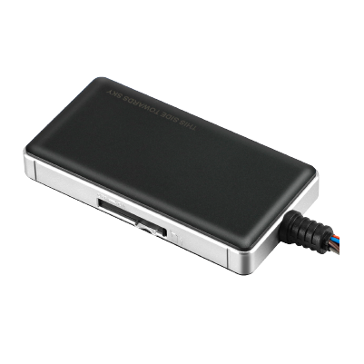

# Concox - GT06N

El Concox GT06N es un rastreador GPS vehicular multifuncional diseñado para ofrecer gestión de flotas y monitoreo de vehículos confiables. Pensado para reportes continuos de posición y detección de eventos, el GT06N incluye detección de ignición, alertas de pánico SOS, monitoreo de audio y control de inmovilizador remoto, además de un diseño compacto y batería de respaldo para mantener la continuidad en campo.

Como dispositivo compatible con Plaspy listo para usar, el GT06N envía datos de ubicación y eventos a Plaspy para su visualización, gestión de alertas e informes. Su combinación de posicionamiento GNSS preciso, E/S prácticas y múltiples disparadores de eventos lo hace ideal para organizaciones que desean agregar rastreo vehicular y controles antirrobo a su despliegue Plaspy.

## Características principales

- Rastreador probado, diseñado para gestión de flotas y monitoreo antirrobo.
- Posicionamiento GNSS de alta precisión con exactitud adecuada para seguimiento vehicular.
- Soporte para inmovilizador remoto que permite corte autorizado de combustible o energía como parte de flujos antirrobo.
- Entrada ACC y E/S digitales para detección del estado del vehículo y reporte de eventos.
- Monitoreo de audio integrado con soporte para micrófono externo para escucha en cabina donde esté permitido.
- Diseño eléctrico robusto con amplio rango de voltaje de entrada y batería de respaldo de grado industrial para mantener el rastreo durante cortes de energía.
- Múltiples alertas de evento, incluyendo exceso de velocidad, geovallas, vibración, batería baja y apagado de energía para generar notificaciones operativas.

## Cómo funciona con Plaspy

Al integrarse con Plaspy, el GT06N transmite ubicación, estados de entradas y alarmas a la plataforma para que los operadores puedan monitorear flotas en tiempo real y revisar trayectos históricos. Plaspy procesa los datos del rastreador y los pone a disposición en mapas, reglas de alerta e informes para apoyar las operaciones diarias y la respuesta a incidentes.

- Actualizaciones de ubicación en tiempo real y reproducción histórica para revisión de rutas y auditoría.
- Estado de ignición y eventos de E/S digitales mappeados en Plaspy para diferenciar entre vehículo en marcha y estacionado.
- Reportes de pánico SOS y de apagado de energía encaminados a las alertas de Plaspy para notificación rápida de incidentes.
- Control de inmovilizador remoto disponible para operadores autorizados mediante flujos de trabajo de Plaspy para respuesta ante robos.
- Alertas basadas en eventos como exceso de velocidad, geovallas y vibración integradas en las reglas y canales de notificación de Plaspy.

## Casos de uso típicos

- Flujos de trabajo antirrobo e inmovilización para flotas corporativas y vehículos de alquiler.
- Monitoreo de flotas en tiempo real para despacho, supervisión de rutas y respuesta a incidentes.
- Operaciones de renta y arrendamiento que requieren alertas SOS y registros de eventos para seguridad del conductor y resolución de disputas.
- Logística y entregas donde las alertas de vibración y posición ayudan a detectar manipulaciones.
- Ampliación de telemetría cuando se emplean entradas accesorias para capturar estados adicionales del vehículo.

## Por qué elegir este rastreador con Plaspy

El GT06N ofrece un conjunto equilibrado de funciones alineadas con las necesidades comunes de gestión de flotas: posicionamiento GNSS confiable, E/S prácticas para eventos del vehículo y controles antirrobo que se integran en los flujos de la plataforma. Al emparejarlo con Plaspy, estas capacidades se vuelven operativas mediante herramientas de mapeo, alertas e informes que ayudan a los equipos de operaciones a mantener visibilidad y reaccionar ante incidentes.

Si desea saber más sobre cómo Plaspy puede funcionar con hardware compatible como el Concox GT06N, visite https://www.plaspy.com. Las especificaciones del producto y la disponibilidad pueden cambiar con el tiempo, por lo que es recomendable verificar los detalles técnicos actuales y la documentación oficial del fabricante en https://www.iconcox.com/.
