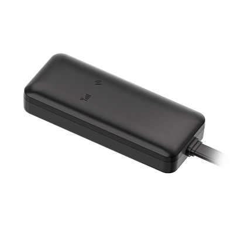

# Concox - GT06S

El GT06S es un rastreador GNSS mini diseñado para el seguimiento discreto de vehículos y activos de flota. Su tamaño compacto y su amplio rango de entrada de 9–90V CC lo hacen apto para motocicletas, automóviles y camiones pesados. Además, incorpora funciones prácticas como corte remoto de combustible o alimentación mediante relé, detección de encendido y un micrófono, lo que aporta soporte útil para labores antirrobo y mayor conciencia situacional en operaciones comerciales.

Como dispositivo compatible con Plaspy, el GT06S puede enviar datos de ubicación y eventos a los flujos de trabajo modernos de gestión de flotas. Plaspy puede procesar la telemetría del equipo para ofrecer mapeo en vivo, alertas e informes, permitiendo que usted combine la información del GT06S con otras señales de la flota para obtener una visibilidad operativa más completa y una respuesta más rápida ante incidentes de seguridad y seguridad vial.

## Puntos clave

- Diseño compacto y discreto para instalaciones encubiertas y protección de activos vehiculares
- Compatible con Plaspy para seguimiento en tiempo real, creación de alertas e informes históricos en paneles de control de flota
- Amplio rango de entrada 9–90V CC que soporta desde motocicletas hasta camiones de servicio pesado
- Funciones antirrobo como corte remoto mediante relé y monitoreo según estado de encendido
- Posicionamiento GNSS que combina GPS, BDS y LBS para reportes de ubicación confiables
- Micrófono incorporado y detección de movimiento para conciencia situacional y detección de eventos del conductor
- Almacenamiento de registros a bordo y bajo consumo energético para preservar el historial durante cortes temporales

## Cómo funciona con Plaspy

Al integrarse con Plaspy, el GT06S transmite su ubicación e información de eventos a la nube, donde Plaspy mapea e interpreta los datos en tiempo real. Plaspy convierte telemetría como estado de encendido, eventos de movimiento y el estado del inmovilizador remoto en notificaciones, vistas en vivo y registros históricos que apoyan la supervisión de la flota y los flujos de trabajo de seguridad.

- Actualizaciones de ubicación en tiempo real y visibilidad de rutas dentro de los paneles de Plaspy
- Estado de encendido e inmovilizador controlado por relé visibles y gestionables desde Plaspy
- Alertas por manipulación, batería baja y movimiento entregadas a Plaspy para atención inmediata
- Eventos generados por el acelerómetro para análisis de seguridad y revisión de comportamiento del conductor
- Subida de registros a bordo tras la reconexión para mantener un historial continuo en Plaspy

## Casos de uso comunes

- Gestión de flotas para seguimiento continuo, análisis de rutas y monitoreo operativo
- Flujos de trabajo antirrobo y recuperación usando corte remoto y alertas de manipulación para respuesta rápida
- Protección de flotas de motocicletas e inventario de concesionarios con una instalación de bajo perfil
- Programas de seguridad y capacitación de conductores utilizando detección de eventos por movimiento y revisión de incidentes
- Continuidad de activos y cumplimiento donde el registro fuera de línea preserva el historial de ubicaciones durante cortes

## Por qué elegir este rastreador con Plaspy

El GT06S es una opción práctica para organizaciones que requieren un rastreador pequeño y confiable que aporte telemetría útil sin una instalación invasiva. Su amplia tolerancia de voltaje y su posicionamiento GNSS integrado ayudan a garantizar reportes de ubicación consistentes en distintos tipos de vehículos, y las funciones antirrobo ofrecen un valor tangible para flotas preocupadas por la seguridad.

Al combinarse con Plaspy, el GT06S puede incorporarse a flujos centralizados de monitoreo, alertas e informes para que los equipos obtengan visibilidad en tiempo real y registros históricos buscables. Para flotas y administradores de activos que priorizan despliegues discretos, seguimiento confiable y alertas integradas, el GT06S ofrece un equilibrio sensato de funciones que complementan la gestión de flotas impulsada por Plaspy.

Para obtener más información sobre Plaspy y cómo se utilizan los dispositivos compatibles en nuestra plataforma visite https://www.plaspy.com. Las especificaciones del producto y la disponibilidad pueden cambiar con el tiempo, así que por favor verifique los detalles actuales y la documentación oficial con el fabricante en https://www.iconcox.com/.
