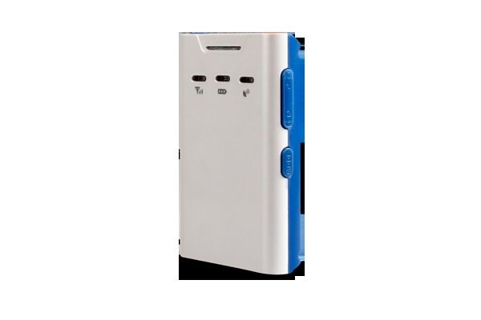

# Concox - GT300

El Concox GT300 es un rastreador GPS con receptor incorporado de teléfono de seguridad GSM/GPS. Diseñado especialmente para niños, ancianos, equipaje y mascotas, este dispositivo ofrece una solución confiable para mantener a salvo a tus seres queridos y pertenencias más preciadas.

El receptor GPS del GT300 cuenta con una sensibilidad superior y un tiempo rápido de primer arreglo, lo que garantiza una precisión y eficiencia óptimas en la localización. Además, su subsistema de banda cuádruple GPRS/GSM es compatible con las frecuencias 850/900/1800/1900 MHz, lo que permite una conectividad estable y confiable en casi cualquier parte del mundo.

La integración del sistema es sencilla y se proporciona una documentación completa para aprovechar al máximo todas las funciones del rastreador. El GT300 es compatible con una amplia variedad de informes, incluyendo emergencias, fronteras geográficas, batería baja y alarma SOS, lo que te permite estar siempre informado y tomar medidas rápidas en caso de cualquier eventualidad.

Características destacadas:

- Receptor GPS de alta sensibilidad
- Tiempo rápido de primer arreglo
- Subsistema de banda cuádruple GPRS/GSM
- Compatibilidad con frecuencias 850/900/1800/1900 MHz
- Integración sencilla y documentación completa
- Amplia variedad de informes, incluyendo emergencias, fronteras geográficas, batería baja y alarma SOS

