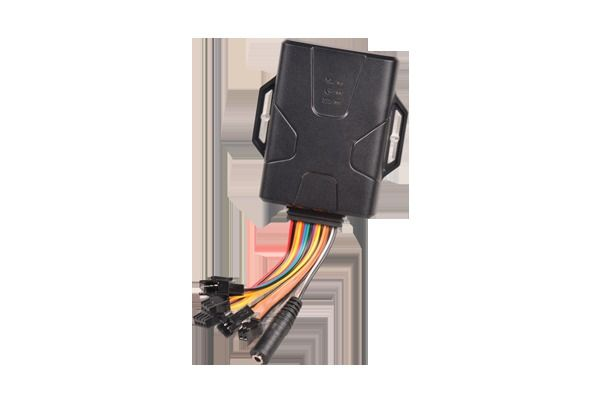

# Concox - GT800

El Concox GT800 es un rastreador GPS multifuncional para vehículos, pensado para ofrecer seguimiento preciso y confiable en autos y vehículos comerciales ligeros. Combina posicionamiento GPS y AGPS con capacidades de detección de eventos como monitoreo del estado de las puertas, comunicación bidireccional y función de llamada SOS, lo que lo hace útil tanto para supervisión rutinaria como para situaciones de emergencia. El GT800 está dirigido a usuarios que necesitan funcionalidades prácticas con un buen equilibrio entre rendimiento y costo.

Como dispositivo compatible con Plaspy, el GT800 puede integrarse en la plataforma de gestión de flotas de Plaspy para proporcionar visibilidad centralizada y supervisión operativa. La compatibilidad le permite a usted usar Plaspy para ver datos de ubicación, recibir alertas de estado como eventos de apertura de puertas y señales SOS, e incluir equipos GT800 en informes y flujos de trabajo de monitoreo administrados desde Plaspy.

## Aspectos clave

- Rastreo por GPS y AGPS para actualizaciones oportunas de posición y visibilidad de rutas
- Detección del estado de las puertas para notificar cambios en el acceso al vehículo
- Capacidad de comunicación bidireccional para interacción remota con el dispositivo cuando está soportada
- Función de llamada SOS para alertas de emergencia y atención rápida a sucesos críticos
- Balance práctico de funciones y precio, adecuado tanto para vehículos individuales como para despliegues en flotas
- Opción confiable para monitoreo básico de flotas y necesidades de seguridad vehicular

## Cómo funciona con Plaspy

Al integrarse con Plaspy, el GT800 envía información de ubicación y eventos a una plataforma única donde gerentes de flota y operadores pueden monitorear activos, configurar alertas y revisar la actividad histórica. Plaspy consolida los datos de los dispositivos GT800 para mejorar la conciencia operativa y ayudar a los equipos a responder ante incidentes.

- Visualización en vivo de la ubicación y historial de rutas (breadcrumb) para cada vehículo equipado con GT800
- Alertas de eventos entregadas a través de Plaspy por cambios en el estado de las puertas y activaciones de SOS
- Monitoreo a nivel de flota para seguir el estado, movimiento y eventos recientes de los vehículos en una sola vista
- Informes y registros de actividad para revisión de desempeño y análisis operativo
- Uso de funciones de comunicación bidireccional mediante flujos de trabajo habilitados en Plaspy cuando la configuración del dispositivo lo soporte

## Casos de uso típicos

- Gestión de flotas pequeñas y medianas que requieren visibilidad de ubicación y alertas básicas de eventos
- Seguridad y monitoreo de vehículos corporativos y unidades de servicio
- Supervisión de vehículos de alquiler donde importa el estado de las puertas y el historial de ubicaciones
- Operaciones de transporte y reparto que necesitan rastreo de posición y notificaciones de incidentes
- Seguimiento de vehículos personales para mayor seguridad y alertas de emergencia

## Por qué elegir este rastreador con Plaspy

El GT800 es una opción sensata para organizaciones e individuos que buscan un rastreo vehicular confiable sin complejidad innecesaria. Su combinación de rastreo GPS y AGPS, detección de apertura de puertas, comunicación bidireccional y soporte SOS lo hace útil para monitoreo, seguridad y operaciones básicas de flota. Integrado con Plaspy, el GT800 puede gestionarse junto con otros dispositivos para ofrecer una visión operativa más clara y agilizar las tareas de supervisión rutinaria.

Para obtener más información sobre cómo los dispositivos GT800 pueden funcionar dentro de Plaspy visite https://www.plaspy.com. Las especificaciones del producto, disponibilidad y detalles del fabricante pueden cambiar con el tiempo, por lo que le recomendamos verificar las especificaciones actuales y la documentación oficial en el sitio de Concox https://www.iconcox.com/.
