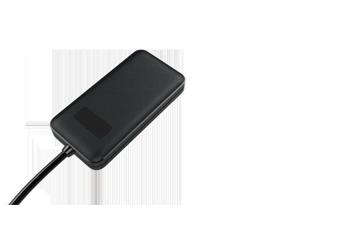

# Concox - GV20

El Concox GV20 es un rastreador GPS 3G pensado para el seguimiento de automóviles, motocicletas y autobuses. Diseñado para ofrecer visibilidad de la ubicación en condiciones operativas exigentes, el GV20 proporciona posicionamiento en tiempo real, registro de rutas y reproducción histórica (flashback) para que los operadores puedan supervisar movimientos y revisar viajes anteriores. La descripción del producto destaca funciones prácticas como el corte remoto de combustible y alimentación, reporte del estado de encendido y notificaciones de alerta instantáneas para facilitar el control operativo.

Como dispositivo compatible con Plaspy, el GV20 puede integrarse en los flujos de monitoreo de flotas para enviar información de posición y estado a la plataforma. Al combinarse con Plaspy, las capacidades principales del equipo —seguimiento en vivo, historial de rutas, alertas y control remoto de cortes— se muestran dentro de una vista centralizada de la flota, ayudando a gerentes y despachadores a tomar decisiones informadas y reaccionar con rapidez ante incidentes.

## Aspectos destacados

- Rastreo GPS 3G para vehículos, motocicletas y autobuses
- Actualizaciones de ubicación en tiempo real con registro de rutas y reproducción histórica (flashback)
- Capacidad de corte remoto de combustible y alimentación para mayor control sobre los vehículos
- Reporte del estado de encendido para apoyar la supervisión operativa
- Notificaciones instantáneas ante desviaciones y eventos anómalos
- Opción rentable con características competitivas orientadas al uso en flotas

## Cómo funciona con Plaspy

Cuando el GV20 se conecta a Plaspy, la plataforma recibe los mensajes de posición y estado del equipo y los presenta en un panel unificado para monitoreo e informes. Plaspy utiliza los datos del dispositivo para ofrecer visibilidad, alertas y reproducción histórica, lo que permite a los equipos mantener supervisión sobre flotas mixtas.

- Ubicación en vivo mostrada en los mapas de Plaspy para visibilidad continua del vehículo
- Historial de rutas y reproducción (flashback) para revisar movimientos y eventos pasados
- Reenvío de alertas a Plaspy para notificaciones oportunas ante desviaciones de ruta u otros eventos configurados
- Acciones de control remoto como corte de combustible o alimentación disponibles mediante flujos de trabajo compatibles
- Estado de encendido y condición básica del vehículo presentados para apoyar decisiones operativas
- Informes consolidados para analizar viajes, actividad y apoyar requerimientos de cumplimiento

## Casos de uso habituales

- Monitoreo diario de flotas para empresas con flotas pequeñas y medianas
- Seguimiento de rutas de autobús y verificación de cumplimiento de itinerarios
- Supervisión de flotas de reparto en motocicleta donde se requieren rastreadores compactos
- Inmovilización remota en casos de uso no autorizado o recuperación por robo
- Gestión de vehículos de renta para monitorear uso y responder a excepciones

## Por qué elegir este rastreador con Plaspy

El GV20 es una opción práctica para organizaciones que necesitan rastreo vehicular confiable con funciones de control adicionales como el corte remoto de combustible y alimentación. Su enfoque en características esenciales para flotas lo hace adecuado para operadores que buscan visibilidad clara de ubicaciones, historial de rutas y alertas oportunas sin complejidad innecesaria.

Al integrarlo con Plaspy, los datos del GV20 se convierten en información accionable mediante monitoreo centralizado, alertas y reportes. Para equipos que priorizan el control operativo y una supervisión de flota directa, esta combinación ofrece un equilibrio entre capacidad y valor, manteniendo la implementación y la gestión diaria manejables.

Para obtener más información sobre cómo Plaspy puede funcionar con dispositivos Concox visite https://www.plaspy.com. Las especificaciones del producto, la disponibilidad y los detalles del fabricante pueden cambiar con el tiempo, por lo que le recomendamos verificar la información técnica y la compatibilidad actual en el sitio oficial de Concox https://www.iconcox.com/.
