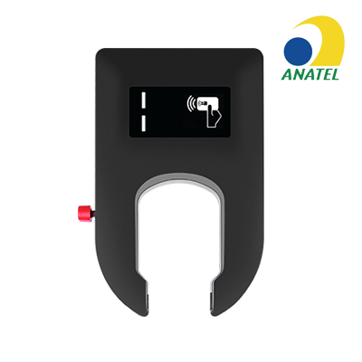

# Concox - JM-BL11

El JM-BL11 es un candado GNSS resistente diseñado para sistemas de bicicletas compartidas y soluciones de micromovilidad a gran escala. Pensado para uso exigente en exteriores, combina posicionamiento GNSS con A-GPS y respaldo LBS, control local por Bluetooth 4.0 LE, mecánica antimanipulación y una batería de larga duración con opción de carga solar para facilitar despliegues distribuidos y reducir el mantenimiento rutinario.

Como dispositivo compatible con Plaspy, el JM-BL11 entrega ubicación, telemetría y eventos que los operadores de flota necesitan para obtener visibilidad en tiempo real y control operativo. Integrado en Plaspy, el JM-BL11 aporta los datos fundamentales para mapas en vivo, aplicación de geocercas, alertas de manipulación y movimiento, y reportes de estado de la flota, convirtiéndolo en una opción práctica para servicios de movilidad compartida a gran escala.

## Características principales

- Diseñado para micromovilidad y flotas de bicicletas compartidas con una carcasa robusta y resistente a manipulaciones
- Posicionamiento GNSS con A-GPS y respaldo LBS para reportes de ubicación consistentes en distintos entornos
- Batería de larga duración con carga solar opcional para ampliar el tiempo en campo y reducir visitas de servicio
- Control local por Bluetooth 4.0 LE y desbloqueo mediante código QR para interacciones de usuario y flujos operativos
- Alertas de movimiento y manipulación además de comunicaciones seguras TLS para protección contra robos y registro de eventos
- Pensado para despliegues a gran escala con almacenamiento en el dispositivo y factor de forma compacto adecuado para candados

## Cómo funciona con Plaspy

Al integrarse con Plaspy, el JM-BL11 transmite fijaciones de ubicación, señales de evento y telemetría del dispositivo para que los operadores supervisen el estado de la flota y respondan a incidentes. Plaspy procesa esos datos para alimentar mapas, alertas y registros históricos que respaldan operaciones y procedimientos de seguridad eficientes.

- Ubicación y telemetría en tiempo real visibles en los mapas en vivo de Plaspy para control y despacho
- Alertas de movimiento y manipulación que generan notificaciones y registros de evento para manejo rápido de incidentes
- Estado de batería y carga solar utilizado por Plaspy para programar mantenimiento y optimizar la disponibilidad
- Eventos de desbloqueo por Bluetooth y QR registrados para auditorías de uso y control de accesos
- Eventos de geocerca y alertas de zona aplicados y reportados a través de Plaspy para prevención de robos

## Casos de uso típicos

- Flotas de bicicletas compartidas y alquileres sin estaciones que requieren seguimiento escalable y monitoreo de disponibilidad
- Flujos de trabajo de antirrobo y recuperación mediante geocercas, alertas de manipulación y reportes de ubicación
- Despliegues urbanos distribuidos que se benefician de energía asistida por solar para ampliar los intervalos de servicio
- Desbloqueo mediante app y flujos de usuario con interacciones por Bluetooth y código QR
- Planificación de mantenimiento basada en telemetría de batería e historial de movimiento para priorizar servicios

## Por qué elegir este rastreador con Plaspy

El JM-BL11 combina hardware duradero y comunicaciones seguras con funciones enfocadas en la gestión de flotas necesarias para operaciones de micromovilidad. Su diseño prioriza la longevidad, la protección antimanipulación y las interacciones locales con el usuario, características que se alinean con las necesidades operativas que Plaspy aborda en visibilidad de flota, alertas y reportes.

Si usted está evaluando hardware compatible, el JM-BL11 es una opción práctica al integrarlo con Plaspy porque facilita datos continuos de ubicación y eventos que la plataforma utiliza para ofrecer monitoreo en vivo, aplicación de geocercas y análisis históricos. Para obtener más información sobre Plaspy y cómo los rastreadores compatibles se integran en nuestra plataforma visite https://www.plaspy.com. Product specifications and availability can change over time, so verify current technical details with the manufacturer at https://www.iconcox.com/.
