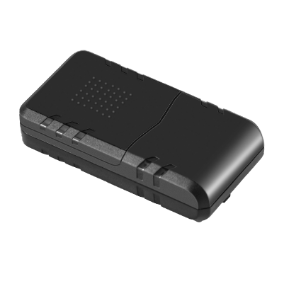

# Concox - JM-LG01

El JM-LG01 es un rastreador GNSS GPS portátil de Concox diseñado para el monitoreo prolongado de activos sin alimentación. Pensado para una gestión de flotas de bajo mantenimiento y la protección de activos, el equipo destaca por su larga autonomía de batería, posicionamiento de alta sensibilidad, telemetría consciente ante manipulaciones y una carcasa resistente al agua con un potente imán para una instalación prácticamente inmediata.

Al ser compatible con Plaspy, el JM-LG01 puede enviar fijaciones de ubicación, alertas de eventos y telemetría a los paneles de gestión de flotas y activos de Plaspy. Esta compatibilidad hace que el JM-LG01 sea relevante para equipos que requieren seguimiento confiable a largo plazo, reproducción histórica de rutas y notificaciones configurables en la plataforma cloud de Plaspy sin necesidad de servicios de mantenimiento frecuentes.

## Aspectos principales

- Compatible con Plaspy para seguimiento en tiempo real, reproducción histórica y visualización en la nube.
- Capacidad de espera ultra larga para despliegues extendidos con mantenimiento mínimo.
- Posicionamiento GNSS de alta sensibilidad para datos de ubicación confiables al aire libre.
- Carcasa resistente y a prueba de agua con montaje magnético fuerte para despliegues rápidos.
- Telemetría con detección de manipulación, incluyendo alertas por movimiento y sensor de luz.
- Registro local de posiciones para preservar el historial cuando la conectividad es intermitente.

## Cómo funciona con Plaspy

Cuando se conecta a Plaspy, el JM-LG01 transmite fijaciones de ubicación validadas y telemetría de eventos a las herramientas de monitoreo y reporte de Plaspy, de modo que usted puede mantener visibilidad sobre activos distribuidos. Plaspy ingiere las posiciones y alarmas del dispositivo para habilitar supervisión en vivo y flujos de trabajo automatizados.

- Actualizaciones de ubicación en vivo y visualización de posiciones en los paneles de Plaspy.
- Reproducción histórica de rutas para revisar movimientos y respaldar auditorías.
- Alertas por manipulación y sensor de luz dirigidas a equipos de operaciones o seguridad.
- Notificaciones de batería baja y estado para planificar mantenimiento y sustitución de baterías.
- Alertas de violación de geocercas y reportes programados procesados como eventos en Plaspy.

## Casos de uso típicos

- Gestión de flotas de alquiler de autos para vehículos fuera de servicio y apoyo en recuperación.
- Protección de préstamos prendarios y colaterales con historial persistente de ubicaciones.
- Rastreo de remolques, equipos y otros activos sin alimentación donde la vida útil de la batería es crítica.
- Instalaciones remotas o estacionales que requieren larga autonomía y baja necesidad de mantenimiento.

## Por qué elegir este rastreador con Plaspy

El JM-LG01 combina seguimiento de larga duración y telemetría sensible a manipulaciones con un formato compacto y ligero que reduce el tiempo de instalación y la carga operativa. Su diseño está orientado a organizaciones que necesitan un sensor de ubicación resistente y de bajo mantenimiento para alimentar las funciones de monitoreo, alertas y reportes de Plaspy.

Para saber más sobre cómo Plaspy puede usar los datos del JM-LG01 para mejorar la visibilidad y proteger activos visite https://www.plaspy.com. Las especificaciones del producto, la disponibilidad y la información del fabricante pueden cambiar con el tiempo, por favor verifique las especificaciones actuales en el sitio del fabricante https://www.iconcox.com/.
