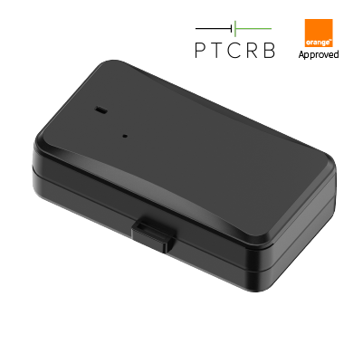

# Concox - JM-LL01

El JM-LL01 es un rastreador GNSS para activos compacto y robusto, diseñado para despliegues de largo plazo y bajo consumo, y es totalmente compatible con Plaspy. Diseñado para un seguimiento en tiempo real fiable y eficiente en extensas áreas geográficas, el JM-LL01 combina conectividad LTE Cat M1 / NB-IoT con respaldo GSM 2G, posicionamiento de múltiples fuentes \(GPS + BDS con respaldo LBS\) y una gran batería recargable de 10,000 mAh para proporcionar telemetría e información de ubicación donde se requiere operación prolongada sin supervisión.

Optimizado para la gestión de flotas, activos en alquiler, logística y monitoreo general de activos, el JM-LL01 ofrece durabilidad de grado industrial \(IP65\), detección de manipulación, BLE 4.2 para configuración local y memoria a bordo para registro offline. Cuando se combina con Plaspy, este rastreador aporta seguimiento en tiempo real fiable, telemetría y alertas de eventos en una única plataforma para obtener información accionable y mejorar los flujos de trabajo de control de activos y anti-robos.

## Aspectos destacados

- Compatible con Plaspy para una integración fluida en paneles de seguimiento en tiempo real y gestión de flotas.
- Batería de Li‑Polímero de 10,000 mAh de larga vida con modos configurables de Standby, Inteligente y Ahorro de energía para entre 6 días y 3 años de operación, dependiendo de la estrategia de informe.
- LTE Cat M1 y NB‑IoT \(NB2\) con respaldo GSM 2G para cobertura de área amplia y telemetría de bajo consumo.
- Posicionamiento GNSS de alta precisión \(GPS + BDS\) con respaldo LBS y precisión reportada por debajo de 2.5 m CEP.
- Detección de manipulación integrada \(sensor de luz\), acelerómetro de 3 ejes para detección de movimiento y alertas de vibración y sobrevelocidad para monitoreo anti-robos.
- Carcasa robusta IP65 con base magnética o montajes con correa para una instalación rápida y a prueba de manipulación en vehículos, contenedores y equipos.
- BLE 4.2 para configuración local y la capacidad de emparejarse con sensores Bluetooth donde sea compatible.
- Memoria a bordo para hasta 1,000 entradas de datos GPS para asegurar la continuidad cuando no haya cobertura de red.

## Cómo funciona con Plaspy

La integración del JM-LL01 con Plaspy habilita seguimiento en tiempo real, alertas activadas por eventos y reportes de telemetría histórica para la gestión de flotas y la protección de activos. El dispositivo transmite posiciones GNSS y telemetría de sensores a través de redes LTE Cat M1, NB-IoT o 2G. Plaspy procesa esos datos para mostrar la ubicación en tiempo real, activar reglas de geocerca y generar informes que respalden flujos de trabajo operativos y de seguridad.

- Actualizaciones de ubicación y telemetría en tiempo real sobre LTE Cat M1 / NB‑IoT con respaldo 2G para mantener la continuidad.
- Alertas de manipulación y retirada de cubierta \(sensor de luz\) enviadas a Plaspy para notificaciones inmediatas de anti-robos.
- Eventos de batería baja, vibración y sobrevelocidad reportados a Plaspy para activar acciones de mantenimiento o seguridad.
- Registro a bordo \(1,000 entradas GPS\) se envía a Plaspy cuando se restaura la conectividad para conservar las trazas históricas.
- Soporte BLE 4.2 para configuración local y emparejamiento opcional con sensores Bluetooth mediante flujos de trabajo de Plaspy cuando sea necesario.

## Resumen técnico

| Conectividad | LTE Cat M1 \(eMTC\) y NB‑IoT \(NB2\); respaldo GSM 2G |
| --- | --- |
| Bandas / Variantes de red | Cat M1 / NB‑IoT optimizados para IoT con respaldo GSM 2G — variantes de operador/banda dependen del modelo y de la certificación regional |
| Potencia y batería | 10,000 mAh Li‑Polímero recargable de grado industrial \(3.7 V\); recarga vía micro USB o USB‑C; modos operativos configurables \(Standby, Inteligente, Ahorro de energía\); tiempo de funcionamiento aproximadamente 6 días a 3 años según la estrategia de informes |
| Interfaces y sensores | Ranura SIM estándar; BLE 4.2 para configuración local; acelerómetro interno de 3 ejes; sensor de luz para detección de manipulación; memoria a bordo para hasta 1,000 entradas GPS |
| GNSS | Posicionamiento de múltiples fuentes: GPS + BDS con respaldo LBS; precisión \< 2.5 m CEP |
| Bluetooth | BLE 4.2 con antena interna \(para configuración local y emparejamiento opcional con periféricos BLE\) |
| Gestión remota | Configuración y gestión vía APP móvil, Tracksolid Pro, herramientas de PC y SMS |
| Formato y ambiental | Carcasa compacta y resistente, clasificación IP65; base magnética o montajes con correa; dimensiones 109.0 × 61.0 × 30.5 mm; peso 297 g; temperatura de funcionamiento −20 °C a +70 °C; humedad 5 %–95 % sin condensación |
| Certificaciones | CE, FCC, PTCRB, RoHS, AT&T, TELEC, Orange, WEEE |

## Casos de uso

- Monitoreo de activos a largo plazo para contenedores, remolques y equipos en alquiler, donde la vida de la batería y la operación sin supervisión son críticas.
- Seguimiento de flotas para logística y distribución: ubicación en tiempo real, además de alertas de exceso de velocidad y movimiento para mejorar el cumplimiento de rutas y la seguridad.
- Monitoreo anti-robos para activos de alto valor mediante alertas de manipulación, detección de vibración y notificaciones de geocerca enviadas a Plaspy.
- Telemetría de sitios remotos o infraestructura donde la cobertura es intermitente: el registro a bordo mantiene el historial de ubicación hasta la carga.
- Reasignación de activos e instalaciones temporales usando base magnética o montajes con correa para fijar rápidamente el dispositivo a activos de metal o contenedores.

## Por qué elegir este rastreador con Plaspy

Elegir el JM-LL01 con Plaspy ofrece una solución equilibrada para seguimiento en tiempo real fiable, telemetría a largo plazo y control de activos seguro. La conectividad optimizada para IoT con LTE Cat M1 y NB‑IoT mantiene el flujo de datos mientras conserva la vida de la batería, y la gran batería interna, junto con perfiles de potencia configurables, reduce los ciclos de mantenimiento y el costo total de propiedad. Una construcción robusta, protección IP65, detección de manipulación y registro a bordo hacen que el JM-LL01 sea adecuado para implementaciones exigentes de gestión de flotas y anti-robos.

Con configuración flexible a través de APP, Tracksolid Pro, herramientas de PC o SMS y BLE 4.2 nativo para la configuración local, integrar el JM-LL01 en Plaspy es sencillo: permite a los equipos de operaciones obtener visibilidad en tiempo real, alertas impulsadas por telemetría e historial de seguimiento sin cambios complejos en el hardware. Para empresas centradas en una gestión de flotas escalable, informes ricos en telemetría y medidas prácticas de anti-robos, el JM-LL01 emparejado con Plaspy ofrece una plataforma de seguimiento confiable y rentable.

