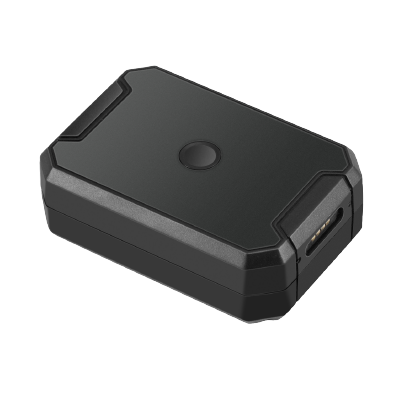

# Concox - JM-LL02

El JM-LL02 de Concox es un rastreador GPS resistente compatible con Plaspy, diseñado para despliegues de activos a largo plazo donde la mínima intervención en la instalación y una amplia autonomía de espera son cruciales. Combina posicionamiento multifuente con conectividad celular y una batería industrial de alta capacidad para ofrecer reportes de ubicación continuos y telemetría de eventos en activos móviles como remolques, contenedores y maquinaria de obra. El equipo cuenta con una carcasa IP67, montaje magnético integrado y configuración por Bluetooth a bordo para facilitar la redistribución sin herramientas y una puesta en marcha sencilla en campo.

Como dispositivo compatible con Plaspy, el JM-LL02 puede transmitir su ubicación y datos de evento a Plaspy para monitoreo centralizado, alertas e informes. Su enfoque en la longevidad de la batería, detección de manipulación y posicionamiento fiable lo hace ideal para flujos de trabajo de Plaspy orientados a la seguridad de activos, supervisión de flotas y visibilidad logística. Las organizaciones que usan Plaspy pueden aprovechar el JM-LL02 para reducir ciclos de mantenimiento, mejorar la respuesta ante robo y mantener un rastreo continuo durante recorridos prolongados.

## Puntos clave

- Rastreador GPS compatible con Plaspy con conectividad LTE Cat M1 y NB2 y retroceso a GSM para cobertura celular resistente
- Batería industrial de larga duración de 6,000 mAh diseñada para prolongar la autonomía en espera y reducir los intervalos de mantenimiento
- Carcasa robusta con protección IP67 y soporte magnético para fijación no permanente y redeployment sencillo
- Posicionamiento multifuente con alta sensibilidad y precisión CEP por debajo de 2.5 m para reportes de ubicación precisos
- Bluetooth 5.0 integrado para configuración sin cables y aprovisionamiento rápido en campo
- Alertas por escenarios como batería baja, manipulación, vibración, exceso de velocidad y eventos de geocerca para apoyar flujos anti robo
- Almacenamiento en búfer local para proteger contra pérdidas temporales de conectividad y preservar la telemetría reciente

## Cómo funciona con Plaspy

Al emparejarlo con Plaspy, el JM-LL02 convierte señales GNSS y eventos a bordo en paneles accionables y alertas automatizadas. El rastreador envía ubicación y notificaciones de escenarios a Plaspy, de modo que usted pueda monitorear activos en tiempo real, revisar rutas históricas y responder a incidentes. El Bluetooth facilita la configuración inicial para que los dispositivos se aprovisionen y reporten a Plaspy con mínimo esfuerzo en terreno.

- Actualizaciones de ubicación en tiempo real y reproducción de rutas históricas en las vistas de mapas de Plaspy
- Notificaciones de entrada y salida de geocercas dirigidas a Plaspy para alertas y flujos automatizados
- Alertas por escenarios como batería baja, manipulación, vibración y exceso de velocidad entregadas al flujo de eventos de Plaspy
- Almacenamiento local en búfer para asegurar que los datos recientes se reenvíen a Plaspy tras interrupciones temporales de conectividad
- Aprovisionamiento y redeployment mediante Bluetooth para reducir el tiempo de configuración al asignar dispositivos a activos

## Casos de uso típicos

- Rastreo de flotas para vehículos de alquiler y remolques ligeros donde el montaje magnético y la larga autonomía reducen los costos operativos
- Monitoreo de activos para maquinaria de construcción y plantas móviles con alertas de manipulación y vibración para seguridad
- Vigilancia de contenedores y logística durante tránsitos prolongados que requieren larga autonomía y reportes con búfer
- Flujos anti robo y recuperación que dependen de notificaciones de geocerca y manipulación entregadas a Plaspy
- Programas de redeployment rápido donde la configuración por Bluetooth y el montaje no invasivo aceleran la rotación de activos

## Por qué elegir este rastreador con Plaspy

El JM-LL02 es una opción práctica para organizaciones que necesitan un rastreador duradero y de bajo mantenimiento compatible con Plaspy. Su combinación de larga vida de batería, carcasa resistente y montaje sencillo reduce el trabajo en sitio mientras ofrece la fidelidad de ubicación y la notificación de eventos necesarias para la protección de activos y la supervisión de flotas. Para equipos que gestionan activos dispersos o con conectividad intermitente, el dispositivo equilibra resistencia y facilidad de uso.

Al integrar el JM-LL02 con Plaspy, esas capacidades de dispositivo se incorporan a paneles centralizados y alertas configurables para que los equipos operativos puedan actuar rápidamente sobre los datos de ubicación y eventos. Si sus prioridades incluyen largos tiempos de espera, aprovisionamiento simple en campo y rastreo resistente, el JM-LL02 es una sólida opción compatible con Plaspy a considerar.

Aprenda más sobre Plaspy en el sitio principal https://www.plaspy.com. Las especificaciones del producto, la disponibilidad y los detalles del fabricante pueden cambiar con el tiempo, por lo que verifique las especificaciones y la documentación actual en el sitio oficial del fabricante https://www.iconcox.com/.
