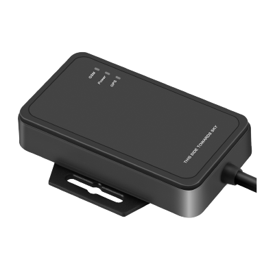

# Concox - JM-VG01

El JM-VG01U es un dispositivo avanzado de rastreo de vehículos de Concox que ofrece capacidades analíticas excepcionales. Equipado con un acelerómetro de 3 ejes y un giroscopio de 3 ejes, puede detectar ocho tipos de comportamientos de conducción inapropiados, asegurando una mayor seguridad en la carretera.

Una de las características destacadas del JM-VG01U es su rastreo GPS asistido por INS, que garantiza un seguimiento constante incluso en áreas con señal GPS deficiente o sin señal en absoluto. Esto significa que siempre puede conocer la ubicación de su vehículo, independientemente de las circunstancias.

El dispositivo también cuenta con un sistema avanzado de análisis de comportamiento de conducción, que le alerta cuando se detecta alguno de los ocho comportamientos de conducción peligrosos. Esto le permite tomar medidas inmediatas y abordar cualquier riesgo o problema potencial.

Con una precisión de kilometraje de más del 98%, el JM-VG01U proporciona cálculos precisos de kilometraje basados en un algoritmo único. Esto significa que puede confiar en datos precisos de kilometraje para diversos fines, como la gestión de flotas o el seguimiento de gastos.

El dispositivo cuenta con un acelerómetro y giroscopio de 6 ejes, lo que permite la detección sensible de aceleración lineal y velocidad angular. Esto permite un seguimiento y análisis más precisos de los movimientos del vehículo.

Otras características destacadas del JM-VG01U incluyen la detección de encendido, un botón de pánico para situaciones de emergencia, capacidades de corte remoto para inmovilizar un vehículo y resistencia al polvo y agua IP65 para un rendimiento óptimo en condiciones difíciles.

En general, el JM-VG01U es un rastreador de vehículos confiable y repleto de funciones que ofrece capacidades analíticas avanzadas y características de seguridad mejoradas. Ya sea que sea un administrador de flotas o un propietario de vehículo preocupado, este dispositivo puede proporcionar información valiosa y tranquilidad.

