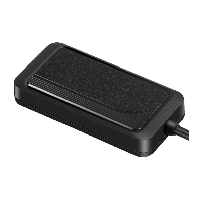

# Concox - JM-VG03

El Concox JM-VG03 es un rastreador GPS compacto diseñado para una amplia variedad de vehículos. Admite un rango de voltaje operativo amplio, por lo que es adecuado para autos, camiones, motocicletas y otros tipos de unidades. El equipo prioriza un posicionamiento confiable gracias a su antena interna de gran tamaño y su formato facilita una instalación discreta. La protección física contra polvo y agua es IP65, lo que le permite operar en entornos exigentes.

Como dispositivo compatible con Plaspy, el JM-VG03 ofrece las funcionalidades esenciales que esperan los administradores de flotas y propietarios de vehículos para supervisión y seguridad. Funciones clave como alertas antirrobo por desconexión de energía y manipulación, notificaciones sobre comportamiento de conducción, capacidad de corte remoto a través de un relé, detección de ignición y geocercas resultan útiles para usuarios de Plaspy que requieren visibilidad centralizada, alertas e informes en flotas mixtas.

## Principales beneficios

- Amplio rango de voltaje apto para autos, camiones y motocicletas, ideal para flotas diversas
- Diseño compacto con antena integrada de gran tamaño para mejorar el posicionamiento y facilitar instalaciones ocultas
- Alertas antirrobo que incluyen notificaciones por desconexión de alimentación y manipulación
- Detección y análisis de eventos de conducción, como frenadas bruscas, giros pronunciados y exceso de velocidad
- Clasificación IP65 para resistencia al polvo y al agua, soportando condiciones exteriores adversas
- Posibilidad de corte remoto mediante relé instalado para inmovilizar un vehículo cuando sea necesario
- Geocercas y múltiples alertas por batería baja, extracción o deriva de posición

## Cómo funciona con Plaspy

Al integrarse con Plaspy, el JM-VG03 transmite datos de ubicación y eventos que la plataforma puede mostrar, notificar e incluir en informes. Las notificaciones y señales de estado del equipo se traducen en acciones y alertas dentro de Plaspy para facilitar la supervisión operativa.

- Visibilidad de ubicación en tiempo real y de historial dentro de Plaspy para seguimiento de flotas y revisión de rutas
- Alertas de eventos como desconexión de energía, manipulación, cambios de ignición y cruces de geocercas enviadas a Plaspy para notificación en tiempo real
- Eventos de comportamiento de conducción disponibles en los paneles e informes de Plaspy para apoyar programas de seguridad y coaching de conductores
- Acciones de inmovilización remota reflejadas en Plaspy para control centralizado cuando el dispositivo y la instalación soportan comandos al relé
- Informes resumidos y exportables para evaluar el desempeño de la flota, revisar incidentes y cumplir con requisitos de supervisión

## Casos de uso habituales

- Monitoreo de flotas mixtas que incluyen autos, camionetas, camiones y motocicletas
- Prevención de robo y respuesta rápida mediante alertas por manipulación y desconexión de energía
- Supervisión del comportamiento de conducción para programas de seguridad y capacitación de conductores
- Gestión de vehículos de alquiler y compartidos con geocercas y funciones de inmovilización remota
- Supervisión logística y de entregas donde la robustez y la instalación discreta son importantes

## Por qué elegir este rastreador con Plaspy

El JM-VG03 es una opción práctica para organizaciones que necesitan un rastreador compacto y resistente, capaz de operar en un amplio rango de voltajes. Su combinación de alertas antirrobo, monitoreo del comportamiento de conducción y geocercas lo hace adecuado tanto para flotas comerciales como para la seguridad de vehículos particulares. Integrado con Plaspy, el dispositivo alimenta información de ubicación y eventos en una plataforma centralizada que ayuda a los equipos a mantener visibilidad, responder a incidentes y analizar tendencias operativas.

Si desea saber más sobre cómo Plaspy puede trabajar con dispositivos como el Concox JM-VG03, visite https://www.plaspy.com. Las especificaciones del producto, disponibilidad y detalles del fabricante pueden cambiar con el tiempo, por lo que le recomendamos verificar la información técnica actual y la documentación oficial en el sitio del fabricante https://www.iconcox.com/.
