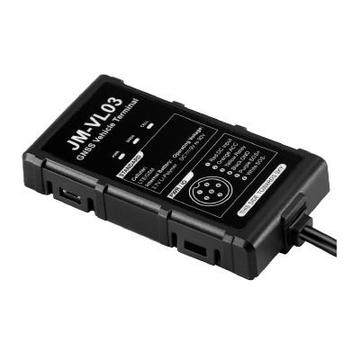

# Concox - JM-VL03

El Concox JM-VL03 es un rastreador GPS 4G LTE Cat 1 compacto diseñado para gerentes de flota, aseguradoras y equipos de protección de activos vehiculares. Combina posicionamiento continuo y telemetría basada en eventos en una carcasa IP65, con conmutación a GSM, una pequeña batería interna de respaldo y un amplio rango de voltaje de entrada para adaptarse a automóviles, motocicletas, scooters y equipos ligeros.

Como dispositivo compatible con Plaspy, el JM-VL03 proporciona los flujos de ubicación y eventos que la plataforma necesita para monitoreo de flotas y flujos de trabajo antirrobo. Su detección de encendido, control de relé y salidas de alerta lo hacen idóneo para integrarse con los paneles, reglas de notificación y reportes de Plaspy, de modo que usted pueda convertir señales del dispositivo en acciones operativas.

## Aspectos clave

- Rastreador 4G LTE Cat 1 compatible con Plaspy y con fallback a GSM para conectividad resiliente y actualizaciones casi en tiempo real.
- Amplio rango de entrada de 9–90 VDC y factor de forma compacto para instalaciones flexibles en distintos tipos de vehículos y equipos ligeros.
- Reportes de comportamiento del conductor que registran aceleraciones bruscas, frenadas fuertes y virajes bruscos para programas de seguridad y telemática.
- Soporte de inmovilizador remoto basado en relé y detección de encendido ACC para acciones antirrobo y apagado controlado.
- Posicionamiento GNSS preciso y alertas por eventos como geocercas, exceso de velocidad, vibración y eventos de alimentación.
- Carcasa robusta con protección IP65 y diseño pensado para entornos exteriores vehiculares.

## Cómo funciona con Plaspy

Cuando usted lo utiliza con Plaspy, el JM-VL03 transmite ubicación y datos de eventos para que los servicios de la plataforma muestren posiciones en vivo, disparen alertas y ejecuten reglas automatizadas. Plaspy procesa la telemetría del dispositivo y la presenta en paneles y reportes para respaldar la visibilidad de la flota, la respuesta a incidentes y el análisis operativo.

- Ubicación y telemetría en tiempo real en los mapas de Plaspy para seguimiento en vivo y supervisión de rutas.
- Estado de encendido ACC y reportes de entradas digitales para apoyar el monitoreo de utilización y reglas sensibles al encendido.
- Control de inmovilizador por relé iniciado desde Plaspy para acciones antirrobo e intervenciones remotas.
- Eventos de comportamiento del conductor reportados como telemetría para análisis de seguridad y reportes de tendencia en Plaspy.
- Entradas y salidas de geocercas, alertas por exceso de velocidad, vibración y eventos de energía que alimentan las notificaciones y flujos automatizados de Plaspy.
- Historial de eventos del dispositivo y reportes que apoyan revisiones operativas e informes de cumplimiento.

## Casos de uso típicos

- Gestión de flotas para empresas pequeñas y medianas que requieren visibilidad de la posición y del comportamiento de manejo.
- Programas de telemática para aseguradoras que usan eventos de conducción brusca y colisiones para evaluación de riesgo y soporte de siniestros.
- Protección de activos y antirrobo con control remoto de inmovilizador, alertas por geocerca y notificaciones de remoción.
- Monitoreo de motocicletas, scooters y flotas de alquiler donde el tamaño compacto y el amplio soporte de voltaje son importantes.
- Seguimiento logístico y de última milla donde una conectividad celular resiliente reduce las brechas en los reportes.

## Por qué elegir este rastreador con Plaspy

El JM-VL03 es una opción práctica para organizaciones que necesitan un rastreador compacto y resistente que alimente a Plaspy con datos de ubicación y eventos accionables. Su combinación de compatibilidad de voltaje, reporte de comportamiento del conductor y control por relé lo hace adecuado para flotas mixtas y despliegues antirrobo donde se requieren tanto posicionamiento como controles basados en eventos. Usar el JM-VL03 con Plaspy ayuda a convertir eventos del dispositivo en notificaciones, automatizaciones e información operativa sin complejidad innecesaria.

Para obtener más información sobre cómo Plaspy soporta dispositivos como el Concox JM-VL03 visite https://www.plaspy.com. Las especificaciones del producto, la disponibilidad y los detalles del fabricante pueden cambiar con el tiempo, por lo que verifique la información técnica y la documentación actual en el sitio del fabricante https://www.iconcox.com/.
