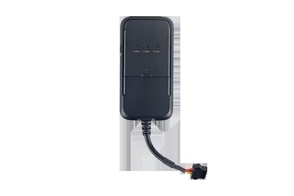

# Concox - JV200

El Concox JV200 es un rastreador GPS para vehículos diseñado para ofrecer seguimiento en línea confiable y en tiempo real. Pensado para aplicaciones vehiculares, el JV200 emplea comunicación inalámbrica GSM GPRS GPS e incorpora AGPS para posicionamientos rápidos, logrando un arranque en frío en menos de 10 segundos. Su formato compacto y su construcción resistente lo hacen apto para uso continuo en distintos entornos vehiculares.

Como dispositivo compatible con Plaspy, el JV200 puede reenviar actualizaciones de posición e información básica de seguimiento a la plataforma Plaspy para obtener visibilidad centralizada. Esta compatibilidad convierte al JV200 en una opción práctica para organizaciones que desean integrar datos de ubicación en tiempo real en Plaspy para supervisión, generación de informes y control operativo sin cambiar su infraestructura de hardware.

## Aspectos clave

- Seguimiento en línea y en tiempo real para visibilidad continua del vehículo
- AGPS para posicionamientos rápidos con arranque en frío en menos de 10 segundos
- Comunicación inalámbrica GSM GPRS GPS para actualizaciones de ubicación
- Diseño compacto que facilita su instalación discreta en vehículos
- Construcción duradera pensada para operación vehicular regular
- Compatible con Plaspy para monitoreo y creación de informes centralizados

## Cómo funciona con Plaspy

Cuando se configura para trabajar con Plaspy, el Concox JV200 envía datos de posición a la plataforma Plaspy, donde gestores de flota y operadores pueden ver ubicaciones en vivo y revisar la actividad reciente. La integración permite consolidar el seguimiento vehicular en los paneles y reportes de Plaspy para apoyar las operaciones diarias y la toma de decisiones.

- Visibilidad de ubicaciones en tiempo real en los mapas de Plaspy
- Monitoreo a nivel de flota para gestionar múltiples dispositivos JV200 de forma conjunta
- Alertas y notificaciones gestionadas por Plaspy ante movimientos o cambios de estado
- Reproducción de rutas históricas e informes para análisis de viajes
- Funciones de supervisión operativa como asignación de vehículos y verificación de estado

## Casos de uso típicos

- Gestión de flotas pequeñas y medianas
- Visibilidad en entregas y logística para supervisar rutas
- Seguimiento de flotas de alquiler para controlar uso y ubicación
- Rastreo de vehículos particulares como medida disuasoria y apoyo en recuperación
- Supervisión de vehículos de servicio en campo para coordinar técnicos y tareas

## Por qué elegir este rastreador con Plaspy

El JV200 es un rastreador vehicular sencillo que se centra en la funcionalidad esencial: actualizaciones oportunas de posición, obtención rápida por AGPS y un diseño compacto y resistente para uso en vehículos. Estas características lo convierten en una alternativa práctica cuando la prioridad es un reporte de localización fiable que se pueda agregar y gestionar desde una plataforma como Plaspy.

En conjunto con Plaspy, el JV200 ayuda a las organizaciones a centralizar la visibilidad de sus vehículos, simplificar la generación de informes y mantener supervisión operativa sin complejidad innecesaria. Si sus necesidades se orientan a seguimiento en tiempo real confiable y gestión consolidada, el JV200 es una opción relevante dentro del ecosistema de dispositivos compatibles con Plaspy.

Para más información sobre Plaspy y cómo los dispositivos JV200 pueden integrarse en la plataforma, visite https://www.plaspy.com. Las especificaciones y la disponibilidad de producto pueden cambiar con el tiempo, por lo que le recomendamos verificar los detalles actuales y la documentación oficial en el sitio del fabricante https://www.iconcox.com/ antes de tomar decisiones de compra.
