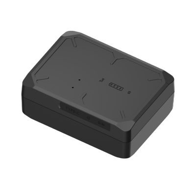

# Concox - LG300

El LG300 rastreador de activos resistente es compatible con Plaspy y está diseñado para el seguimiento industrial persistente de vehículos, contenedores y carga de alto valor. Como rastreador GPS concebido para despliegues de larga duración en modo de espera, el LG300 combina posicionamiento multi-constelación con una batería Li‑Polímero recargable de 10,000 mAh y una carcasa IP66 para ofrecer ubicación confiable y telemetría de manipulación donde se requiere larga vida útil y resiliencia ambiental.

Diseñado para integrarse con Plaspy para la gestión de flotas y el seguimiento en tiempo real, el LG300 envía datos de ubicación y eventos a la nube o por SMS, habilitando el monitoreo anti-robo, captura de audio de incidentes de forma remota y reportes configurables para equilibrar el detalle de telemetría y la duración de la batería. Cuando se empareja con Plaspy, este dispositivo compatible con Plaspy pasa a formar parte de una solución de seguimiento escalable que complementa otra telemetría de la flota, como el monitoreo de combustible o controles de inmovilizador gestionados por la plataforma.

## Puntos clave

- Rastreador GPS compatible con Plaspy para seguimiento en tiempo real e integración con la gestión de flotas.
- Posicionamiento multi-constelación \(GPS + BDS + LBS\) con precisión reportada inferior a 2,5 m CEP.
- Operación de espera prolongada alimentada por una batería Li‑Polímero recargable de 10,000 mAh para despliegues extendidos.
- Carcasa robusta con clasificación IP66 y rango operativo para soportar condiciones de campo y entornos adversos.
- Detección de manipulación mediante sensor de luz y acelerómetro de 3 ejes para alertas antirobo y supervisión de movimientos.
- Alertas activadas por sonido y grabación de audio automática/remota para capturar el contexto del incidente.
- Monitoreo remoto vía SMS o plataforma en la nube y modos de seguimiento configurables para optimizar la vida de la batería frente a la frecuencia de informes.

## Cómo funciona con Plaspy

El LG300 transmite fijaciones de posición GNSS y telemetría de eventos a través de GSM a los puntos de ingesta de Plaspy, o puede consultarse/mandarse por SMS cuando la conectividad de red lo requiera. Plaspy ingiere la secuencia de ubicación del LG300, eventos de movimiento y manipulación, estado de la batería y alertas disparadas por audio para proporcionar paneles de control consolidados, alertas e informes históricos para equipos de gestión de flotas. Los modos de informe configurables permiten intercambiar la frecuencia de informes por la duración de la batería; Plaspy utiliza la cadencia de informes del dispositivo para generar un seguimiento en tiempo real preciso y reproducción histórica.

- Actualizaciones en tiempo real de ubicación y telemetría entregadas a Plaspy a través de GSM, la nube o SMS.
- Detección de manipulación y movimiento \(sensor de luz + acelerómetro de 3 ejes\) para alertas anti‑robo.
- Alertas de batería baja \(umbral configurable por el usuario; el dispositivo emite alertas a &lt;20% por defecto\) reportadas a Plaspy.
- Alertas disparadas por sonido con grabación de audio automática y a demanda para capturar el contexto del incidente.
- Modos de funcionamiento configurables \(modo GPS regular y modo de seguimiento dedicado\) para equilibrar la frecuencia de informes y la autonomía de la batería.

## Resumen técnico

| Modelo | LG300 |
| --- | --- |
| Conectividad | 2G GSM \(comunicación GSM\) |
| Bandas | B2 / B3 / B5 / B8 |
| SIM | Ranura Nano‑SIM |
| GNSS | GPS + BDS + LBS \(multi‑constelación\) |
| Posicionamiento | Precisión reportada &lt; 2,5 m CEP |
| Sensibilidad GNSS | Sensibilidad de GNSS: -165 dBm |
| Tiempo para la Primera Fijación \(TTFF\) | Promedio de arranque en caliente ≤ 1 s; Promedio de arranque en frío ≤ 32 s \(cielo despejado\) |
| Alimentación y Batería | 10,000 mAh / 3.7 V batería recargable Li‑Polímero \(diseñada para larga espera; recargable para nuevo despliegue\) |
| Alertas y Sensores | Acelerómetro de 3 ejes, sensor de luz \(detección de manipulación\), alerta activada por sonido, alerta de batería baja \(\<20% notificación\), indicadores LED \(GNSS: Azul; Celular: Verde; Alimentación: Blanco\) |
| Comunicación / Monitorización | Monitoreo remoto vía SMS o plataforma en la nube; modos de informes configurables |
| Actualizaciones de Firmware | Actualizaciones OTA \(delta\) de firmware |
| Carcasa y Medio Ambiente | Clasificación IP66; temperatura de operación -20°C a +70°C; humedad 5–95% sin condensación |
| Dimensiones y peso | 86,0 × 63,0 × 31,5 mm; aprox. 245 g |
| Formato / Uso | Carcasa robusta y compacta para vehículos, remolques, contenedores y activos portátiles |

## Casos de uso

- Gestión de flotas y alquiler de vehículos: visibilidad persistente de activos y alertas de manipulación durante largos periodos de inactividad.
- Seguimiento logístico y de carga: monitoreo de contenedores y remolques donde se requiere protección IP66 robusta y standby extendido.
- Protección de cargas de alto valor: monitoreo anti‑robo con detección de movimiento/manipulación y captura de audio para respaldar investigaciones de incidentes.
- Ciclo de vida de activos en alquiler: batería redeployable y reporte de estado remoto simplifican la rotación de activos y la reconciliación de inventario.
- Gestión general de activos: monitorización remota de activos fuera de red que requieren fijaciones de posición confiables y telemetría de eventos.

## Por qué elegir este rastreador con Plaspy

El LG300 es un rastreador GPS centrado y compatible con Plaspy para organizaciones que necesitan telemetría robusta y probada en el campo sin mantenimiento frecuente. Su rendimiento GNSS de múltiples constelaciones, su seguimiento de alta sensibilidad y su batería de larga duración de 10,000 mAh lo hacen especialmente adecuado para despliegues de espera prolongada, comunes en la gestión de flotas y la logística. La detección de manipulación integrada, los eventos activated por sonido y la grabación de audio remota añaden capacidades prácticas de anti‑robo y captura de incidentes que alimentan directamente los flujos de alertas e informes de Plaspy.

Al integrar el LG300 en su entorno de Plaspy, obtiene seguimiento y telemetría en tiempo real fiables, al tiempo que conserva la vida de la batería mediante modos de informe configurables. Plaspy puede consolidar los datos del LG300 junto con otra telemetría —por ejemplo, monitoreo de combustible o controles de inmovilizador/encendido gestionados por la plataforma— para proporcionar una visión operativa completa. La combinación de hardware robusto, gestión de firmware OTA y reporte preparado para la nube convierte al LG300 en un activo fiable para programas exigentes de seguimiento de flotas y activos.

