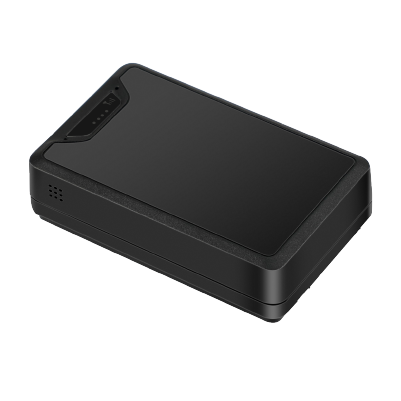

# Concox - LL302

El Concox LL302 es un rastreador GNSS para activos diseñado para la monitorización prolongada de vehículos y bienes. Disponible en las variantes regionales LL302‑E y LL302‑L, el equipo emplea comunicaciones 4G LTE Cat 1 con conmutación a 2G y posicionamiento multisensor que incluye GPS, BDS, LBS y asistencia por Wi‑Fi. Con una batería industrial de 6,000mAh, sensores robustos y un soporte magnético de montaje discreto, el LL302 está orientado a flotas de alquiler, operaciones logísticas, servicios de transporte y protección de activos de alto valor.

Como dispositivo compatible con Plaspy, el LL302 transmite posiciones GNSS y telemetría de sensores a la plataforma Plaspy, de modo que los equipos pueden supervisar activos en tiempo real, recibir alertas y generar informes. La combinación de larga autonomía, modos de reporte configurables y detección de manipulación hace del LL302 una opción práctica para integrar en Plaspy en tareas de supervisión de flotas, flujos de trabajo antirobo y monitoreo ambiental cuando se requieren sensores opcionales de temperatura y humedad.

## Características principales

- Rastreador compatible con Plaspy que ofrece ubicación en tiempo real y telemetría continua para monitorización de flotas y activos.
- Posicionamiento multisensor con GPS, BDS, LBS y asistencia por Wi‑Fi para mayor fiabilidad en la obtención de la posición y precisión declarada por debajo de 2.5 m CEP.
- Batería industrial de larga duración de 6,000mAh con modos de reporte configurables para extender la vida útil en despliegues.
- Sensores integrados que incluyen acelerómetro para detección de vibración, sensor de luz para alertas de manipulación y efecto Hall para monitoreo de puertas o estados; opción de sensores de temperatura y humedad.
- Conectividad principal LTE Cat 1 con conmutación a 2G y dos variantes de hardware regionales para cobertura de distintas bandas.
- Montaje magnético robusto de perfil bajo e IPX5 resistente al agua, adecuado para montaje discreto sobre superficies metálicas.

## Cómo funciona con Plaspy

Al conectarse, el LL302 envía posiciones GNSS y eventos de sensores a Plaspy, donde el dispositivo aparece como un activo gestionado. Plaspy procesa las actualizaciones de ubicación y la telemetría para que los operadores puedan visualizar movimientos, configurar alertas y generar informes operativos que apoyen las tareas diarias de la flota y los procedimientos de seguridad.

- Actualizaciones de ubicación y telemetría en tiempo real hacia Plaspy usando LTE Cat 1 con fallback para mantener conectividad consistente.
- Alertas de manipulación y seguridad basadas en eventos del sensor de luz y acelerómetro para una respuesta rápida.
- Monitoreo de puertas y estados mediante entradas de efecto Hall y periféricos opcionales para visibilidad del estado del activo.
- Telemetría ambiental desde sensores opcionales de temperatura y humedad para soportar vistas de cadena de frío y monitoreo de contenedores.
- Geocercas, alertas de batería baja y notificaciones de movimiento configurables en Plaspy para notificaciones automáticas y seguimiento operativo.

## Casos de uso típicos

- Flotas de alquiler que requieren montaje discreto, gran autonomía y alertas de manipulación para reducir pérdidas y hurtos.
- Proveedores de logística y transporte que necesitan seguimiento en tiempo real y datos ambientales opcionales para envíos.
- Monitoreo de activos y equipos de alto valor donde el montaje magnético seguro y el GNSS preciso facilitan la localización rápida.
- Cadena de frío y control de contenedores usando sensores opcionales de temperatura y humedad combinados con rastreo de ubicación.
- Programas generales de gestión de activos que requieren intervalos de reporte configurables para equilibrar visibilidad y duración de la batería.

## Por qué elegir este rastreador con Plaspy

El LL302 combina una autonomía práctica con posicionamiento multisensor y un diseño compacto y resistente, lo que lo convierte en una opción sólida para organizaciones que demandan rastreo confiable y telemetría periódica. Su conjunto de sensores admite detección básica de manipulación y monitoreo de estado, mientras que la opción de sensores ambientales amplía su utilidad a transportes sensibles a la temperatura y a supervisión de contenedores. Para los usuarios de Plaspy, esto significa que un único dispositivo puede cubrir tanto necesidades de inteligencia de ubicación como de monitoreo de condiciones, minimizando el mantenimiento frecuente.

Para obtener más información sobre cómo Plaspy puede integrarse con dispositivos Concox y evaluar su adecuación para su flota o activos, visite el sitio principal de Plaspy en https://www.plaspy.com. Las especificaciones del producto, disponibilidad y detalles del fabricante pueden cambiar con el tiempo, por lo que le recomendamos verificar los datos técnicos y la información de variantes más recientes en el sitio del fabricante https://www.iconcox.com/ antes de tomar decisiones de compra o despliegue.
