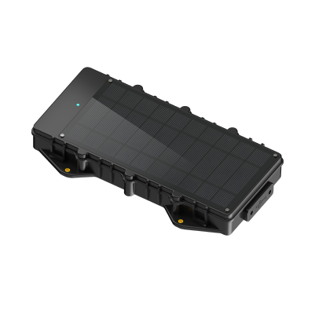

# Concox - LL303

El Concox LL303 es un rastreador GPS 4G con carga solar diseñado para el monitoreo de vehículos de construcción y embarcaciones. Construido con una carcasa resistente con clasificación IP67, panel solar integrado y opción de carga magnética, el LL303 se orienta a despliegues que requieren tiempo prolongado en espera y funcionamiento fiable en entornos exteriores adversos. Sus múltiples modos de funcionamiento y la compatibilidad con accesorios periféricos, como dispositivos Bluetooth y un lector RFID opcional, hacen que el equipo sea adaptable a distintos escenarios de seguimiento de activos.

Como dispositivo compatible con Plaspy, el LL303 puede enviar datos de ubicación y eventos a Plaspy para ofrecer visibilidad centralizada y supervisión operativa. Sus opciones de conectividad y las alertas integradas para eventos como extracción del dispositivo, vibración anormal y anomalías de temperatura o humedad, se alinean con las capacidades de monitoreo, notificación e informes disponibles en Plaspy, convirtiendo al LL303 en una opción práctica para flotas y activos remotos gestionados desde la plataforma.

## Características principales

- Alimentación asistida por solar y opción de carga magnética para reducir mantenimiento y prolongar despliegues
- Comunicación 4G LTE con compatibilidad 2G GSM como respaldo para mantener conectividad en distintas condiciones de cobertura
- Resistencia al polvo y al agua con certificación IP67 para uso fiable en entornos exteriores y marinos exigentes
- Varios modos de funcionamiento para ajustar reportes y comportamiento según necesidades operativas
- Soporta accesorios Bluetooth y lector RFID opcional para ampliar las capacidades de monitoreo
- Alertas integradas por extracción del dispositivo, vibración anormal y anomalías ambientales

## Cómo funciona con Plaspy

El LL303 provee actualizaciones de ubicación y notificaciones de eventos que Plaspy puede mostrar y sobre las que puede actuar, ayudando a los equipos a monitorear activos, responder incidentes y generar reportes operativos. La integración con Plaspy permite un seguimiento unificado y la revisión histórica en flotas mixtas que incluyan maquinaria de construcción y embarcaciones.

- Visualización de ubicación en tiempo real e histórica en Plaspy para reproducción de rutas y conciencia situacional
- Reenvío de eventos y alertas para que Plaspy notifique a los equipos sobre extracción del dispositivo, eventos de vibración o advertencias ambientales
- Datos periféricos de accesorios Bluetooth y RFID que Plaspy puede presentar para aportar contexto operativo adicional
- Dashboards e informes a nivel de flota para seguir la utilización y vigilar la disponibilidad de los activos
- Supervisión operativa centralizada para despliegues mixtos que combinen activos terrestres y marinos

## Casos de uso típicos

- Monitoreo de vehículos de construcción y equipos de obra en sitios amplios o remotos
- Seguimiento de embarcaciones y activos marinos pequeños donde se requiere una resistencia al agua robusta
- Seguimiento de activos fuera de la red o con largos periodos en espera utilizando carga solar para minimizar el mantenimiento
- Alertas anti-manipulación y por extracción para equipos móviles de alto valor
- Monitoreo basado en accesorios, como telemetría de puertas o combustible mediante periféricos Bluetooth e identificación por RFID

## Por qué elegir este rastreador con Plaspy

El LL303 es idóneo para organizaciones que necesitan un rastreador resistente y de bajo mantenimiento para entornos exteriores y marinos. Su capacidad de carga solar y la protección IP67 reducen tiempo de inactividad y visitas de servicio, mientras que los múltiples modos de operación y el soporte de accesorios brindan flexibilidad operativa. Al combinarse con Plaspy, estas características se traducen en mayor visibilidad de la flota, alertas oportunas e informes consolidados que respaldan las operaciones diarias y la planificación de mantenimiento.

Para equipos que gestionan flotas de construcción, equipos de renta o embarcaciones, el LL303 junto con Plaspy ofrece un equilibrio práctico entre durabilidad y conectividad. Si su despliegue requiere rendimiento en espera prolongado y protección robusta para uso exterior, esta combinación vale la pena evaluarla dentro de su flujo operativo.

Para saber más sobre Plaspy y cómo puede gestionar dispositivos como el Concox LL303 visite https://www.plaspy.com. Product specifications, availability, and manufacturer details can change over time, so please verify current specifications on the official Concox site https://www.iconcox.com/.
