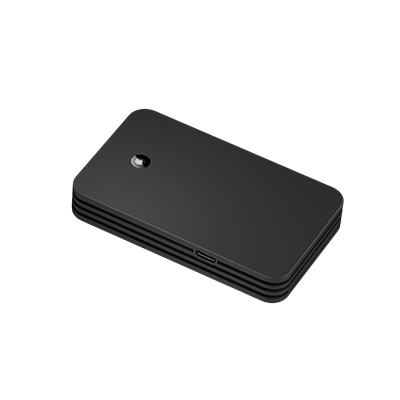

# Concox - LL309

El LL309 es un rastreador GPS compacto pensado para carga refrigerada, entregas de paquetería y protección de activos sensibles donde se requiere monitoreo ambiental continuo. Combina posicionamiento multilocal con un sensor integrado de temperatura y humedad para ofrecer datos de ubicación y condiciones adecuados para la cadena de frío y la logística de alto valor. El equipo está diseñado para escenarios de transporte exigentes, con protección ambiental robusta y retención de datos persistente durante periodos sin conexión.

Como dispositivo compatible con Plaspy, el LL309 envía telemetría de ubicación y condiciones ambientales a los paneles y flujos de alerta de Plaspy. Esta compatibilidad facilita que los equipos de operaciones incluyan monitorización de condiciones junto con el seguimiento de vehículos y activos, permitiendo alertas basadas en reglas, visibilidad de los envíos y reportes consolidados dentro de la plataforma Plaspy.

## Características principales

- Telemetría en tiempo real de ubicación y condiciones ambientales, orientada a la cadena de frío y la logística de paquetería.
- Sensor integrado de temperatura y humedad para monitorización continua y alertas por excepciones.
- Enlace celular para transmisión oportuna de datos, con cacheo local y exportación Type‑C para recuperación post‑viaje.
- Carcasa robusta con protección IP67 y amplio rango de temperatura de operación, apta para carga refrigerada y uso exterior.
- Antenas internas y opciones de configuración local que reducen la complejidad de instalación y aceleran la puesta en servicio.
- Múltiples alarmas, incluyendo desvíos de temperatura y humedad, manipulación y notificaciones de batería baja.

## Cómo funciona con Plaspy

Una vez integrado, el LL309 envía posiciones y lecturas de los sensores ambientales a Plaspy para que los equipos puedan monitorear envíos, activar alertas y generar reportes operativos. Plaspy ingesta los eventos y la telemetría del dispositivo, aplica reglas configurables y muestra notificaciones y datos históricos para apoyar el cumplimiento de la cadena de frío y los procesos contra el hurto.

- Actualizaciones en tiempo real de ubicación y telemetría que ofrecen visibilidad continua en los paneles de Plaspy.
- Excepciones de temperatura y humedad que se encaminan a las reglas y canales de notificación de Plaspy para respuesta rápida.
- Eventos de manipulación, vibración y batería baja capturados como sucesos accionables para mantenimiento y seguridad.
- Cacheo offline y exportación masiva que preservan datos para análisis post‑viaje y trazabilidad regulatoria cuando la cobertura es intermitente.
- Configuración local y exportación desde el dispositivo que simplifican la puesta en servicio y la recuperación forense de datos al integrarlo con Plaspy.

## Casos de uso típicos

- Protección de carga en la cadena de frío con monitorización continua de condiciones y alertas automatizadas.
- Monitoreo a nivel de paquete para productos perecederos como alimentos, fármacos y biológicos.
- Seguimiento de activos de alto valor donde las alertas por manipulación y vibración respaldan la respuesta ante robos.
- Operaciones logísticas con conectividad intermitente que requieren retención fiable de datos y exportación post‑viaje.
- Envíos de última milla y multimodales que necesitan un rastreador compacto que quepa dentro de paquetes y compartimentos refrigerados.

## Por qué elegir este rastreador con Plaspy

El LL309 es una solución enfocada para organizaciones que necesitan telemetría combinada de ubicación y condiciones ambientales dentro de su plataforma de gestión de flotas. Su formato compacto, sensores ambientales, carcasa resistente y manejo de datos offline lo convierten en una opción práctica para equipos de cadena de frío y logística de paquetería que desean integrar la monitorización de condiciones en Plaspy sin añadir sistemas separados.

Para obtener más información sobre cómo Plaspy puede utilizar la telemetría del LL309 en paneles, alertas y reportes visite https://www.plaspy.com. Las especificaciones y la disponibilidad del producto pueden cambiar con el tiempo, por favor verifique los detalles actuales con el fabricante en https://www.iconcox.com/.
