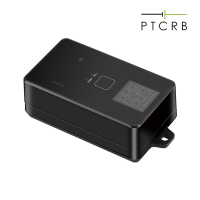

# Concox - LL701

El Concox LL701 es un rastreador de activos de larga autonomía diseñado para la gestión de vehículos pesados y bienes valiosos. Utiliza baterías reemplazables CR123A para ofrecer mayor disponibilidad y portabilidad; con tres baterías puede alcanzar hasta cinco años de funcionamiento según la frecuencia de reporte. El equipo admite alimentación externa para ampliar su vida útil y cuenta con certificación IP67, lo que garantiza operación confiable en entornos adversos.

Como dispositivo compatible con Plaspy, el LL701 es adecuado para monitoreo no continuo de flotas y activos dentro de la plataforma. Su diseño de larga autonomía, carcasa resistente y alertas activadas por eventos, como detección de manipulación y apertura, lo convierten en una opción práctica para organizaciones que requieren rastreo duradero y de bajo mantenimiento. Plaspy puede integrar los datos del LL701 para ofrecer visibilidad, notificaciones y reportes sobre activos en condiciones de operación variadas.

## Puntos clave

- Diseñado para operación de larga autonomía con baterías CR123A reemplazables para reducir el mantenimiento
- Hasta cinco años de funcionamiento con tres baterías según la configuración de reportes
- Certificación IP67 para uso fiable en entornos exteriores o exigentes
- Alertas por eventos, incluyendo detección de manipulación y notificaciones de apertura
- Soporta alimentación externa para extender la vida operativa
- Configuración por Bluetooth para una puesta en marcha rápida mediante app iOS

## Cómo funciona con Plaspy

El LL701 puede integrarse con Plaspy para entregar actualizaciones periódicas de ubicación, alertas de eventos e información sobre la disponibilidad del dispositivo para la gestión de flotas y activos. Plaspy recibe los datos del rastreador y los presenta mediante paneles, mapas e informes orientados al control operativo.

- Mostrar puntos periódicos de ubicación y trayectorias históricas de activos en los mapas de Plaspy
- Recibir y gestionar alertas de eventos del dispositivo, como manipulación y apertura
- Verificar el último registro del dispositivo y su disponibilidad para planificar mantenimiento y revisiones operativas
- Generar reportes y resúmenes que reflejen patrones de rastreo no continuo para activos de largo plazo
- Agrupar y monitorear activos por flota, ubicación o tipo de activo para facilitar la supervisión

## Casos de uso típicos

- Seguimiento a largo plazo de vehículos pesados que no requieren monitorización en tiempo real
- Monitoreo de remolques, contenedores y equipos estacionarios expuestos a condiciones exteriores adversas
- Casos de seguridad de activos que se benefician de alertas por manipulación y apertura
- Rastreo de activos portátiles donde las baterías reemplazables y el bajo mantenimiento son prioritarios
- Implementaciones que necesitan dispositivos robustos y herméticos para esquemas de reporte intermitente

## Por qué elegir este rastreador con Plaspy

El Concox LL701 es ideal para organizaciones que priorizan bajo mantenimiento, robustez y alertas confiables por encima de telemetría continua en tiempo real. Su capacidad de larga autonomía reduce la frecuencia de intervenciones físicas, mientras que la certificación IP67 lo hace adecuado para despliegues en exteriores y operaciones pesadas. Al integrarlo con Plaspy, las actualizaciones periódicas y las funciones de alerta del LL701 se transforman en información operativa, reportes consolidados y notificaciones dirigidas que mejoran la supervisión de activos distribuidos.

Si sus operaciones requieren rastreo de activos duradero con larga vida de batería y notificaciones claras de eventos, el LL701 combinado con Plaspy ofrece una solución práctica y eficiente en costos. Para más información sobre Plaspy y cómo incorporar este dispositivo en sus flujos de trabajo de rastreo visite https://www.plaspy.com. Las especificaciones del producto, disponibilidad y datos del fabricante pueden variar con el tiempo, por lo que le recomendamos verificar la información técnica vigente con el fabricante en https://www.iconcox.com/.
