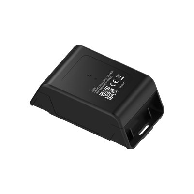

# Concox - LL705

El Concox LL705 es un rastreador GPS 4G diseñado específicamente para el monitoreo prolongado y de bajo mantenimiento de activos de alto valor. Combina conectividad LTE Cat 1 con conmutación a GSM, posicionamiento multisensor que incluye GPS y Beidou BDS, localización por torres celulares (LBS) y BLE, además de una robusta carcasa con clasificación IP67 que garantiza reportes de ubicación continuos en entornos industriales y al aire libre exigentes. El equipo está optimizado para despliegues extendidos mediante una batería Li SOCl2 de alta capacidad de 18,000 mAh y modos de funcionamiento configurables para equilibrar la frecuencia de actualización y la duración de la batería.

Como rastreador compatible con Plaspy, el LL705 se integra con la plataforma para ofrecer visibilidad continua, alertas e informes históricos en programas de gestión de flotas y activos. Plaspy puede procesar los mensajes de ubicación y eventos del LL705 para alimentar geocercas, informes programados y flujos de trabajo de mantenimiento, mientras que las actualizaciones remotas de firmware y las alertas por manipulación o batería baja facilitan el despliegue y la operación a gran escala.

## Aspectos destacados

- Diseñado para uso prolongado en campo con una batería de 18,000 mAh que reduce las visitas de mantenimiento y los costos operativos.
- Posicionamiento multisensor mediante GPS y Beidou, complementado con LBS celular y BLE para mayor resiliencia en la ubicación.
- Carcasa robusta con certificación IP67, apta para despliegues en exteriores, construcción e industrias.
- Modos de funcionamiento configurables que permiten ajustar la frecuencia de reportes y la autonomía según las necesidades de monitoreo.
- Detección de manipulación y alertas por batería baja para proteger activos valiosos y activar mantenimientos oportunos.
- Soporte FOTA para actualizaciones de firmware remotas y una gestión de dispositivos más eficiente.

## Cómo funciona con Plaspy

Al conectarlo a Plaspy, el LL705 envía datos de ubicación y estado a una plataforma centralizada donde los equipos pueden monitorear activos en tiempo real y realizar análisis postevento. Plaspy recibe los mensajes del dispositivo y los transforma en vistas de mapa, alertas e informes que ayudan a los equipos de operaciones y seguridad a responder con rapidez y planear mantenimientos.

- Actualizaciones de ubicación en tiempo real y seguimiento histórico para visibilidad de flota e historial de activos.
- Entrega de eventos y alertas, como notificaciones de manipulación y advertencias de batería baja, integradas en los flujos de trabajo de Plaspy.
- Geocercas y detección de movimiento para activar acciones automatizadas y notificaciones dentro de Plaspy.
- Informes programados y bajo demanda que apoyan la planificación de mantenimiento y la revisión de utilización de activos.
- Funciones de administración remota de dispositivos coordinadas desde Plaspy para actualizaciones de firmware y cambios de configuración.

## Casos de uso típicos

- Monitoreo de equipos de construcción donde las carcasas resistentes y la larga autonomía reducen las visitas a obra.
- Rastreo de maquinaria minera en entornos con señales mixtas que requieren posicionamiento multisensor.
- Seguimiento de remolques y contenedores con largos periodos de espera y alertas de manipulación para mitigar robos.
- Inventario remoto de activos no energizados que requieren verificaciones periódicas de ubicación.
- Flotas de alquiler de equipos que se benefician de telemetría de largo plazo e informes centralizados.

## Por qué elegir este rastreador con Plaspy

Combinar el LL705 con Plaspy ofrece a las organizaciones una solución resiliente y de bajo mantenimiento para la visibilidad de activos a largo plazo. El LL705 prioriza la longevidad y la protección ambiental, mientras que Plaspy proporciona paneles centralizados, enrutamiento de alertas e informes que simplifican la supervisión operativa y la respuesta a incidentes. Juntos reducen la carga operativa de las visitas frecuentes al campo y entregan los datos necesarios para gestionar activos en sitios distribuidos.

Learn more about Plaspy on the main website https://www.plaspy.com. Product specifications, availability and manufacturer details can change over time, so verify current specifications and documentation on the official Concox site https://www.iconcox.com/.
