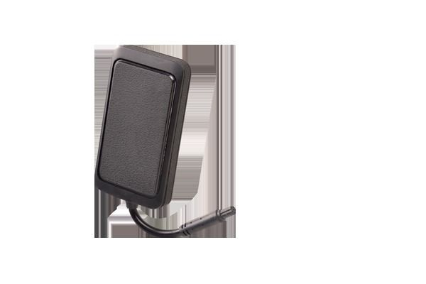

# Concox - MT200

El Concox MT200 MOPLUS es un rastreador GPS para motocicletas diseñado para ofrecer durabilidad y control práctico del vehículo. Con una carcasa resistente con certificación IP65 contra polvo y agua, el MT200 soporta condiciones exteriores exigentes y el uso continuo en vehículos de dos ruedas. El equipo incluye las funciones de rastreo esenciales junto con una cómoda opción de corte de combustible y alimentación que no requiere cableado complejo, lo que lo hace adecuado para instalaciones en motocicletas.

Como dispositivo compatible con Plaspy, el MT200 puede enviar datos de posición en vivo y el estado del dispositivo a Plaspy para monitoreo centralizado y supervisión de flotas. Al integrarlo con Plaspy, usted puede mantener una vigilancia más estrecha sobre las motocicletas mediante visibilidad de ubicación, alertas y opciones de control remoto, mientras que la gestión de energía a nivel de dispositivo ayuda a proteger la batería a largo plazo.

## Aspectos destacados

- Diseñado específicamente para motocicletas con carcasa IP65 a prueba de polvo y agua
- Corte remoto de combustible y alimentación sin necesidad de cableado complejo
- Gestión inteligente de energía para proteger la salud de la batería de la motocicleta
- Rastreo de ubicación en tiempo real para mayor visibilidad y seguridad del activo
- Adecuado tanto para propietarios individuales como para operaciones de alquiler y flotas
- Diseño robusto pensado para uso diario en carretera y fuera de ella

## Cómo funciona con Plaspy

Al conectarse a Plaspy, el Concox MT200 aporta ubicación en vivo y el estado del dispositivo que Plaspy muestra y utiliza para activar flujos operativos. Plaspy ofrece una capa de control unificada para que los administradores de flota y usted puedan monitorear movimientos, recibir alertas y operar las funciones del MT200 desde una sola plataforma.

- Ubicación en vivo y visualización en mapa para vehículos individuales o flotas agrupadas
- Alertas de geocerca y movimiento para notificar salidas o entradas
- Inmovilización remota mediante la función de corte de combustible y alimentación del MT200 cuando esté habilitada
- Notificaciones sobre el estado del dispositivo relacionadas con la gestión de energía y la salud operativa
- Registros históricos de viajes e informes sencillos para revisar rutas y análisis operativos
- Herramientas de agrupamiento y supervisión para gestionar varias motocicletas en una sola vista

## Casos de uso típicos

- Prevención de robo y seguimiento para recuperación de motocicletas individuales
- Gestión de flotas de alquiler con inmovilización remota para garantizar devoluciones
- Gestión de flotas para operaciones de mensajería y reparto en motocicleta
- Monitoreo de activos para contratistas y trabajadores móviles que usan motocicletas
- Supervisión operativa donde se requiere un rastreo resistente a la intemperie

## Por qué elegir este rastreador con Plaspy

El MT200 es una opción práctica para organizaciones y propietarios que necesitan un rastreador enfocado en motocicletas que equilibre robustez con control funcional. Su carcasa IP65 y el diseño con gestión de batería lo hacen apropiado para vehículos expuestos al clima y a patrones de uso variables, mientras que la función de corte de combustible y alimentación aporta una capa adicional de control operativo.

Integrado con Plaspy, el MT200 forma parte de una solución centralizada de monitoreo e informes. Plaspy combina visibilidad del dispositivo, alertas e informes para que los administradores puedan actuar sobre los datos de ubicación y las funciones de control remoto desde una única plataforma, simplificando la supervisión y la seguridad de flotas de motocicletas.

Para obtener más información sobre cómo Plaspy soporta el rastreo de motocicletas y la gestión de flotas visite https://www.plaspy.com. Product specifications, availability, and manufacturer details can change over time, so please verify current technical specifications and documentation with the manufacturer at https://www.iconcox.com/.
