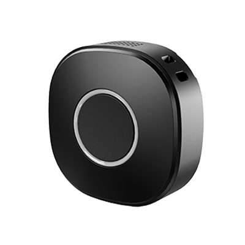

# Concox - PL601

El Concox PL601 es un rastreador GNSS portátil y compacto LTE Cat 1 diseñado para ofrecer seguridad personal fiable y seguimiento de activos pequeños. Integra posicionamiento multimodal con asistencia AGPS, audio HD bidireccional para monitoreo por voz, un botón SOS de pánico y alertas instantáneas configurables para mantener a personas, mascotas y paquetes visibles en tiempo real. El dispositivo presenta un formato resistente y reducido, con opciones de montaje en correa (lanyard) o clip trasero para uso discreto como wearable o sujeto a prendas y objetos.

Al ser compatible con Plaspy desde el primer momento, el PL601 puede operar como un nodo de telemetría ligero dentro de despliegues Plaspy. Las posiciones, alertas de eventos y la telemetría básica de sensores del PL601 se integran en Plaspy para mapas en vivo, reproducción del historial y flujos de notificaciones, mientras que la configuración por BLE y sensores opcionales permiten a los operadores adaptar los reportes y alertas a las necesidades operativas.

## Características principales

- Rastreador GNSS LTE Cat 1 compacto pensado para seguridad personal y monitoreo de activos pequeños.
- Posicionamiento multimodal que combina GNSS, Wi‑Fi y LBS con asistencia AGPS para obtener fijaciones más rápidas.
- Audio HD bidireccional y monitoreo por voz, junto con un botón de pánico SOS dedicado para alertas de emergencia.
- Carcasa robusta con certificado IP65 y opciones de montaje con lanyard o clip trasero para mayor versatilidad.
- Soporte BLE 5.0 para configuración local y sensores opcionales como acelerómetro y barómetro para ampliar la telemetría.
- Larga autonomía de batería adecuada para varios días en modos de reporte inteligente y registro offline para breves periodos sin conexión.

## Cómo funciona con Plaspy

Cuando se configura para Plaspy, el PL601 envía posiciones y eventos del dispositivo a la plataforma Plaspy, donde se integran en los flujos centralizados de seguimiento de flota y activos. Plaspy procesa las señales de posicionamiento multimodal y los eventos, presentándolos como posiciones en vivo, alertas y rutas históricas que los operadores pueden usar para monitoreo e informes.

- Actualizaciones de ubicación en tiempo real y reproducción de rutas históricas disponibles en mapas e informes de Plaspy.
- Alertas SOS y eventos de voz bidireccional dirigidos a los canales de notificación y flujos de respuesta de Plaspy.
- Entradas y salidas de geocerca, batería baja y eventos de ruido o movimiento anómalos que se muestran como alertas en Plaspy.
- Datos opcionales de sensores de movimiento y ambientales enviados a Plaspy para monitoreo de estado de actividad y reglas de activación.
- Conectividad BLE que permite ajuste local del dispositivo y emparejamiento con sensores BLE mientras Plaspy mantiene la visibilidad centralizada.

## Casos de uso habituales

- Monitoreo de seguridad personal para niños, adultos mayores y trabajadores solitarios con funciones de SOS y chequeo por voz.
- Seguimiento de mascotas y paquetes donde se requiere un dispositivo pequeño y ligero para una sujeción discreta.
- Monitorización en alquileres de corta duración y logística de envíos con reproducción de rutas y alertas de geocerca.
- Supervisión de personal de campo donde la ubicación, eventos de movimiento y alertas audibles facilitan la respuesta rápida.
- Nodo de telemetría complementario para añadir datos locales de sensores a un despliegue gestionado por Plaspy.

## Por qué elegir este rastreador con Plaspy

El PL601 es una opción práctica cuando las organizaciones necesitan un rastreador compacto y resistente que priorice funciones de seguridad personal y visibilidad de activos pequeños. Su posicionamiento multimodal y la asistencia AGPS reducen el tiempo hasta la primera fijación en entornos mixtos, mientras que el audio bidireccional y las capacidades SOS añaden una capa extra para monitoreo y respuesta ante emergencias. El soporte BLE y los sensores opcionales permiten extender la telemetría sin aumentar volumen o peso.

Emparejado con Plaspy, el PL601 forma parte de un flujo centralizado de seguimiento y alertas donde los eventos de dispositivo, el historial de ubicaciones y las lecturas de sensores se consolidan para supervisión operativa. En despliegues que combinan rastreadores instalados en vehículos y dispositivos personales ligeros, el PL601 cumple un papel complementario al ofrecer seguimiento discreto con batería que se integra en los canales de reporte y notificación gestionados por Plaspy.

Para obtener más información sobre Plaspy y las capacidades de la plataforma visite https://www.plaspy.com. Las especificaciones del producto, disponibilidad y datos del fabricante pueden cambiar con el tiempo, por lo que le recomendamos verificar los detalles técnicos actuales y certificados en el sitio del fabricante https://www.iconcox.com/.
