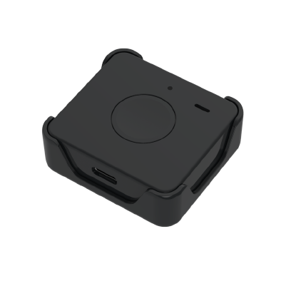

# Concox - Qbit M

El Qbit M de Concox es un rastreador GPS compacto diseñado para la seguridad personal y el monitoreo discreto de activos. Combina posicionamiento GPS y QZSS con conectividad celular LTE‑M para ofrecer actualizaciones de ubicación en casi tiempo real con bajo consumo energético y alertas de emergencia. El equipo está pensado para llevarse con facilidad y mantener acceso continuo a la red, e incorpora funciones orientadas a necesidades diarias como geocercas, alarma sonora y programación de operación.

Al ser compatible con Plaspy, el Qbit M puede enviar datos de ubicación y eventos a los paneles y flujos de notificaciones de Plaspy. Los usuarios de Plaspy obtienen visibilidad centralizada, reproducción histórica y alertas configurables que hacen al Qbit M útil para monitoreo de seguridad, supervisión ligera de flotas y escenarios anti robo. La integración con Plaspy transforma las señales de posición y eventos del equipo en información operativa y notificaciones oportunas.

## Características principales

- Rastreador compatible con Plaspy que ofrece posicionamiento GNSS combinado con reportes por LTE‑M para monitoreo continuo.
- GPS más QZSS para mejorar la precisión de ubicación en muchos entornos operativos.
- Diseño compacto y resistente, adecuado para transporte personal y protección de pequeños activos, con resistencia al polvo y agua IP65.
- Botón de pánico y botones funcionales dedicados para compartir la ubicación de inmediato y generar alertas de emergencia.
- Funciones activadas desde la app como geocercas, alarma sonora y operación programada para apoyar flujos de trabajo de cuidadores y seguridad.
- Diseño de bajo consumo con modos de operación múltiples para equilibrar la autonomía en espera y los intervalos de reporte regulares.

## Cómo funciona con Plaspy

Cuando usted conecta el Qbit M a Plaspy, el dispositivo transmite información de posición y eventos para proporcionar conciencia situacional persistente y alertas configurables. Plaspy incorpora las actualizaciones del rastreador para poblar mapas en vivo, vistas de estado de dispositivos y trayectos históricos, de modo que los equipos puedan monitorear movimientos, responder a alertas y administrar flotas o despliegues de seguridad personal.

- Actualizaciones de ubicación en vivo y estado del dispositivo mostrados en los mapas de Plaspy para monitoreo en tiempo real.
- Eventos de pánico y emergencia reenviados a Plaspy para activar notificaciones o procedimientos de respuesta.
- Alertas de entrada y salida de geocercas, incluidas zonas vinculadas a puntos de acceso Wi‑Fi, utilizadas para automatizar notificaciones y reglas.
- Alertas de batería baja y del zumbador visibles en Plaspy para ayudar a programar mantenimiento y reemplazos.
- Eventos de detección de movimiento que permiten el seguimiento activado por movimiento, la reproducción histórica y la revisión de incidentes.

## Casos de uso típicos

- Monitoreo de seguridad personal para adultos mayores o niños, con alertas de pánico y notificaciones de geocercas.
- Protección de acompañantes y pequeños activos donde se prefiere un rastreador ligero con larga autonomía en espera.
- Seguimiento discreto de paquetes y envíos pequeños que requieren detección de movimiento y alertas remotas.
- Tareas de cuidado y monitoreo de corto alcance como registros programados, comprobaciones de ubicación y ayuda para localizar mediante alarma sonora.
- Flotas livianas o conjuntos de dispositivos donde se requiere seguimiento centralizado y alertas simples.

## Por qué elegir este rastreador con Plaspy

El Qbit M es adecuado para organizaciones e individuos que necesitan seguimiento en tiempo real preciso y de bajo consumo en un formato portátil y pequeño. Su combinación de posicionamiento GNSS, conectividad LTE‑M y funciones orientadas al usuario como botón de pánico y alarma sonora entregan capacidades prácticas para la seguridad personal y la supervisión de pequeños activos. Usar Plaspy para agregar y actuar sobre los datos del Qbit M aporta valor operativo mediante paneles unificados, reglas de notificación e informes históricos.

Si desea explorar cómo el Qbit M puede integrarse en sus flujos de trabajo de seguimiento, conozca más sobre Plaspy en el sitio principal https://www.plaspy.com. Las especificaciones del producto, la disponibilidad y las características del fabricante pueden cambiar con el tiempo, por lo que es recomendable verificar los detalles actuales en el sitio oficial de Concox https://www.iconcox.com/ antes de desplegar.
