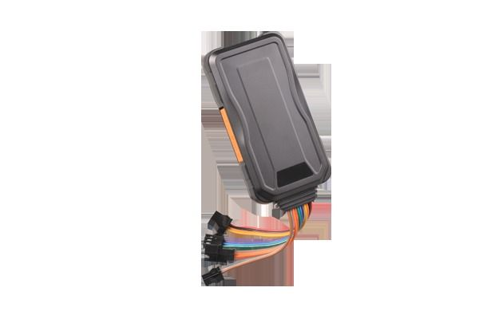

# Concox - TR06

El rastreador de vehículos TR06 de Concox es un dispositivo avanzado que utiliza la red GSM/GPRS y el sistema de posicionamiento por satélite GPS para proporcionar una amplia gama de funciones de seguridad y monitoreo. Este rastreador ofrece una solución confiable para el seguimiento y la protección de vehículos, ya sea para uso personal o comercial.

Una de las características destacadas del TR06 es su capacidad de control remoto del motor. Esto significa que puedes encender o apagar el motor de tu vehículo de forma remota a través de un mensaje de texto o una aplicación móvil. Esta función es especialmente útil en caso de robo o si necesitas desactivar el vehículo en caso de emergencia.

Además del control remoto del motor, el TR06 también ofrece funciones de posicionamiento y monitoreo en tiempo real. Puedes rastrear la ubicación de tu vehículo en cualquier momento a través de una plataforma de software de GPS o una aplicación móvil. Esto te brinda tranquilidad al saber dónde se encuentra tu vehículo en todo momento.

El TR06 también cuenta con una variedad de alarmas de seguridad, como la alarma de vibración, la alarma de corte de energía y la alarma de exceso de velocidad. Estas alarmas te alertarán inmediatamente en caso de cualquier actividad sospechosa o peligrosa relacionada con tu vehículo.

En resumen, el rastreador de vehículos TR06 de Concox es una opción confiable y versátil para el seguimiento y la protección de vehículos. Con su capacidad de control remoto del motor, funciones de posicionamiento en tiempo real y alarmas de seguridad, este rastreador te brinda la tranquilidad de saber que tu vehículo está seguro y protegido en todo momento.

### Características destacadas:

- Control remoto del motor
- Posicionamiento y monitoreo en tiempo real
- Alarmas de seguridad \(vibración, corte de energía, exceso de velocidad\)
- Compatible con plataforma de software de GPS y aplicación móvil

