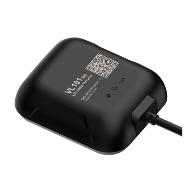

# Concox - VL101

El Concox VL101G es un rastreador para vehículos diseñado para ofrecer seguimiento de ubicación en tiempo real y supervisión de flotas con alta fiabilidad. Basado en posicionamiento GNSS multiconstelación y GPS de doble frecuencia, el dispositivo combina la localización satelital tradicional con un sistema de navegación inercial (INS) para mantener la estimación de posición incluso donde la señal satelital es débil. Soporta comunicación celular con mecanismos de conmutación entre redes y viene alojado en una carcasa con certificación IP66 para uso exterior resistente.

Como dispositivo compatible con Plaspy, el VL101G puede enviar la ubicación y el estado del vehículo a la plataforma de gestión de flotas de Plaspy, ofreciendo visibilidad centralizada y control operativo. Sus funciones principales — posicionamiento multi GNSS, seguimiento asistido por INS, detección de encendido, análisis de comportamiento de conducción y capacidad de corte remoto de motor — se alinean con los flujos de trabajo habituales en Plaspy, por lo que es una opción práctica para flotas que requieren posicionamiento preciso y telemática útil.

## Características principales

- Soporte GNSS multiconstelación que incluye GPS, BDS, GLONASS y Galileo para mayor cobertura satelital
- Posicionamiento de doble frecuencia para mejorar la estabilidad y la precisión en entornos exigentes
- Seguimiento asistido por INS para mantener estimaciones de posición cuando las señales satelitales son débiles
- Comunicación 4G con fallback para mantener conectividad en zonas de cobertura variable
- Carcasa con grado de protección IP66 adecuada para montaje en techo y exposición al exterior
- Análisis de comportamiento de conducción y detección de encendido para generar información operativa
- Capacidad de corte remoto de motor e interfaces ampliables para integrar accesorios

## Cómo funciona con Plaspy

Al integrarse con Plaspy, el VL101G envía actualizaciones de ubicación y estado a la plataforma para que los operadores puedan supervisar los vehículos desde un único panel. Plaspy consolida los datos del rastreador en mapas, alertas e informes que respaldan las operaciones diarias y el análisis a largo plazo.

- Visualización de ubicación en tiempo real y rastro de posiciones para supervisión en vivo y revisión histórica
- Alertas y notificaciones por eventos de comportamiento de conducción y transiciones de encendido
- Informes históricos de viajes, rutas y utilización de activos para apoyar la planificación de la flota
- Comandos de inmovilización remota para recuperación de vehículos o control administrativo cuando esté configurado
- Monitoreo de conectividad y estado del dispositivo para detectar problemas de comunicación o alimentación
- Integración con tableros e informes de Plaspy para supervisión operativa

## Casos de uso típicos

- Seguimiento de flotas para operaciones comerciales de pequeña y mediana escala
- Seguridad y recuperación de vehículos con opciones de inmovilización remota
- Monitoreo de vehículos de renta y uso compartido para registrar encendidos y patrones de uso
- Última milla y logística, donde la precisión de posicionamiento es crítica
- Despliegue de equipos y vehículos en entornos exteriores o condiciones climáticas adversas

## Por qué elegir este rastreador con Plaspy

El VL101G es una opción práctica para organizaciones que necesitan un rastreador resistente con alta fiabilidad en posicionamiento y operación continua en áreas de señal débil. La combinación de soporte multiconstelación GNSS, posicionamiento de doble frecuencia y seguimiento asistido por INS mejora la precisión y la continuidad de la ubicación, lo que resulta valioso para flotas que operan en cañones urbanos o terrenos variados.

Integrado con Plaspy, el dispositivo forma parte de una solución telemática centralizada que prioriza la visibilidad, las alertas y los informes. Plaspy puede consolidar los datos del VL101G en mapas, flujos de eventos e informes operativos para que los equipos tomen decisiones informadas sobre rutas, seguridad y utilización de vehículos. Cuando el cableado y los permisos del dispositivo están configurados, Plaspy también puede habilitar controles de inmovilización remota para respaldar los procesos de seguridad.

Para obtener más información sobre Plaspy y cómo se puede usar el Concox VL101G dentro de la plataforma, visite https://www.plaspy.com. Las especificaciones del producto, la disponibilidad y los detalles del fabricante pueden cambiar con el tiempo, por lo que le recomendamos verificar la información técnica actual en el sitio oficial de Concox https://www.iconcox.com/.
