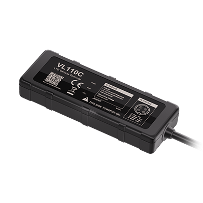

# Concox - VL110C

# VL110C Vehicle GNSS Terminal

El VL110C es un rastreador GPS compacto 4G LTE diseñado para una gestión de vehículos fiable y una implementación compatible con Plaspy en motocicletas, automóviles de pasajeros, vehículos comerciales ligeros y equipos industriales. Con conectividad LTE Cat 1 y respaldo GSM \(2G\), el VL110C ofrece seguimiento en tiempo real y telemetría incluso en áreas con cobertura marginal, lo que lo convierte en una opción ideal para la gestión de flotas, recuperación de vehículos robados y rastreo a nivel de concesionario para vehículos pequeños.

Construido para entornos difíciles, el VL110C combina resistencia IP65 al polvo y al agua, una entrada DC amplia de 9–90V y una batería de respaldo de 270 mAh Li‑Polymer industrial que permite su operación continua cuando se interrumpe la alimentación del vehículo. La compatibilidad con Plaspy garantiza que puedas incorporar datos de ubicación, alarmas y comportamiento de conducción directamente en tus flujos de trabajo de monitoreo y flotas para alertas, informes y acciones remotas como el control del inmovilizador.

## Aspectos clave

- Rastreador GPS compatible con Plaspy para seguimiento en tiempo real y gestión de flotas en diversos tipos de vehículos.
- Conectividad 4G LTE Cat 1 con respaldo GSM \(2G\) para mantener la conectividad en áreas con baja cobertura LTE.
- Caja resistente con protección IP65 y entrada DC de 9–90V para motocicletas, automóviles, vehículos comerciales ligeros y equipos industriales.
- Antena GNSS interna con posicionamiento GPS/BDS/GLONASS de precisión CEP &lt; 2.5 m para datos de ubicación precisos.
- Protección de la batería del vehículo y batería de respaldo de 270 mAh para mantener la telemetría durante pérdidas de energía o incidentes de robo.
- Corte remoto mediante relé para acciones anti-robo y soporte de telemetría de encendido \(ACC\) para monitorización del conductor y de eventos.
- Detección de interferencias GNSS/LTE y alertas enviadas a Plaspy para una investigación y respuesta inmediatas.
- Formato compacto y ligero y ruta de integración sencilla con Tracksolid Pro y plataformas habilitadas para Plaspy.

## Cómo funciona con Plaspy

Integrar el VL110C con Plaspy lleva sus datos de rastreo GPS en tiempo real a un entorno unificado de gestión y monitoreo de flotas. Los datos de ubicación, telemetría y eventos se transmiten por LTE \(con respaldo 2G\) y pueden ser consumidos por Plaspy para mapas en vivo, geocercas, alertas e informes históricos. La integración compatible con Plaspy habilita comandos remotos desde la nube, flujos de trabajo automatizados y telemetría consolidada entre flotas con dispositivos mixtos.

- Actualizaciones de ubicación y telemetría en tiempo real para una conciencia situacional continua y monitorización de rutas.
- Registro de entrada de encendido \(ACC\) para el estado de conducción básico y etiquetado de eventos en los paneles de Plaspy.
- Control remoto del inmovilizador / relé a través de Plaspy para apoyar casos de uso de anti-robo y recuperación de vehículos robados.
- Alertas de detección de interferencia GNSS/LTE reenviadas a Plaspy para una investigación y respuesta inmediatas.
- Eventos de comportamiento de conducción \(aceleración brusca, frenado, toma de curvas y colisiones\) disponibles para informes de seguridad de la flota y entrenamiento.

## Resumen técnico

| Conectividad | Terminal 4G LTE Cat 1 con respaldo GSM \(2G\); ranura nano‑SIM |
| --- | --- |
| Bandas | Varias bandas LTE-FDD/TDD y GSM soportadas; variantes por región disponibles |
| Alimentación y batería | Entrada 9–90V DC; batería de respaldo Li‑Polymer industrial de 270 mAh; protección de la batería del vehículo con desconexión automática y operación en modo respaldo |
| Interfaces | 1 × entrada ACC \(encendido\); 1 × salida de relé para corte remoto \(combustible/energía\); LEDs de estado \(GNSS, celular, alimentación\); USB Type‑C para actualizaciones de firmware; configuración por SMS y herramienta de PC |
| GNSS | GPS / BDS / GLONASS; precisión de posicionamiento CEP &lt; 2.5 m; sensibilidad: seguimiento -165 dBm, adquisición -148 dBm; arranque caliente ≤2 s, arranque en frío ≤38 s; almacena 3000+ registros GNSS |
| Bluetooth | No especificado en la descripción del producto |
| Gestión remota | Configuración vía SMS, herramientas de PC y plataforma en la nube Tracksolid Pro opcional; actualización de firmware por USB Type‑C |
| Factor de forma | Terminal compacto, 94 × 34 × 15 mm; aprox. 44 g; IP65; rango de temperatura de operación –20°C a +70°C; humedad 5–95% sin condensación |
| Certificaciones y documentación | CE, FCC, RoHS; incluido manual de usuario y folleto del producto |

## Casos de uso

- Gestión de flotas para vehículos y motos de pequeño tamaño — seguimiento en tiempo real, reproducción de rutas y telemetría de comportamiento de conducción.
- Protección anti-robo y recuperación de vehículos robados — detección de interferencias, corte remoto basado en relé y alertas de ubicación integradas en los flujos de trabajo de Plaspy.
- Rastreo a nivel de concesionario y de vehículos de alquiler — instalación compacta, batería de respaldo y LEDs de estado facilitan el diagnóstico y la entrega.
- Telemetría operativa para equipos mixtos — monitoreo del estado de encendido, registros de eventos y eventos básicos de choques/conducción brusca para análisis de seguridad y seguros.

## Por qué elegir este rastreador con Plaspy

El VL110C ofrece un equilibrio práctico entre hardware robusto, posicionamiento GNSS preciso y conectividad LTE fiable que se integra de forma limpia con Plaspy para una gestión de flotas escalable. Su amplio rango de entrada de voltaje, protección IP65 y batería de respaldo interna hacen que el dispositivo sea adecuado para motocicletas y vehículos comerciales ligeros que requieren una instalación compacta y operación continua durante pérdidas de energía. Para la protección anti-robo y la recuperación de vehículos robados, la detección de interferencias integrada y el corte remoto mediante relé proporcionan telemetría rápida y accionable que Plaspy puede usar para activar alertas y respuestas remotas.

Elegir el VL110C para despliegues compatibles con Plaspy le ofrece un rastreador GPS compacto que admite seguimiento en tiempo real, telemetría de encendido, control del inmovilizador y análisis del comportamiento de conducción, a la vez que ofrece rutas de configuración simples \(SMS, herramientas de PC, Tracksolid Pro\) y mantenimiento de firmware vía USB Type‑C. El resultado es una solución fiable y de bajo impacto que mejora la visibilidad de la flota, acelera la respuesta ante incidentes y reduce el tiempo de inactividad en flotas de vehículos diversos.

