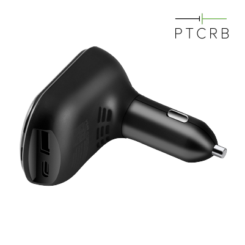

# Concox - VL501

El VL501 es un rastreador GPS LTE plug and play diseñado para instalaciones rápidas y monitorización confiable de flotas. Su diseño con conector de encendedor desmontable y su factor de forma compacto facilitan el despliegue en vehículos sin necesidad de cableado permanente. El equipo combina posicionamiento GNSS multiconstelación con conectividad celular moderna y Bluetooth para ofrecer ubicación precisa y telemetría local útil para operaciones de flota.

Como dispositivo compatible con Plaspy, el VL501 transmite datos de ubicación y eventos a Plaspy para seguimiento en vivo, alertas e informes. La detección de movimiento integrada, las alertas antirrobo, el botón SOS y el almacenamiento local para períodos de conectividad intermitente garantizan telemetría continua y notificaciones accionables dentro de la plataforma Plaspy, lo que hace al VL501 adecuado tanto para despliegues rápidos como para la supervisión continua de la flota.

## Características principales

- Instalación plug and play mediante conector de encendedor desmontable para despliegues rápidos en múltiples vehículos
- Compatible con Plaspy para seguimiento en tiempo real y gestión de flotas mediante conectividad celular y Bluetooth
- Posicionamiento GNSS multiconstelación de alta precisión con CEP reportado menor a 2.5 m en cielo abierto
- Detección de movimiento a bordo, alertas por colisión y desconexión, botón SOS y micrófono en cabina en regiones compatibles para flujos de trabajo de seguridad y antirrobo
- Buffer local de 64 Mb para almacenar eventos durante cortes de conectividad y actualizaciones OTA para facilitar el mantenimiento en campo
- Factor de forma compacto con puertos de carga USB e indicadores LED para uso y supervisión sencillos

## Cómo funciona con Plaspy

Cuando está conectado, el VL501 envía posiciones GNSS y telemetría de eventos a Plaspy a través del enlace celular, mientras que los dispositivos adjuntos por Bluetooth pueden enriquecer la transmisión de datos. Plaspy recibe los datos almacenados en buffer cuando se restablece la conectividad y presenta ubicación, alertas e historial en paneles diseñados para que los gestores de flota supervisen y tomen acciones.

- Actualizaciones de ubicación en tiempo real y reproducción de rutas para visibilidad inmediata de la flota
- Reenvío de eventos y alertas a Plaspy, incluyendo colisiones, vibraciones, desconexiones e incidentes SOS
- Notificaciones de geocercas y eventos de incidente integrados en los flujos de alertas e informes de Plaspy
- Datos de sensores y beacons Bluetooth retransmitidos a Plaspy cuando están soportados, para enriquecer la telemetría
- Almacenamiento local y soporte de firmware OTA para operación resiliente y gestión remota de dispositivos

## Casos de uso típicos

- Flotas de última milla y mensajería que requieren despliegue rápido y seguimiento continuo
- Operaciones de renta y leasing de vehículos que prefieren rastreadores desmontables sin cableado para monitoreo temporal y recuperación
- Pilotos basados en uso y programas de comportamiento del conductor donde la posición y eventos precisos alimentan el scoring
- Flotas temporales o estacionales y contratistas que necesitan instalación plug and play y almacenamiento en buffer
- Gestión general de flotas y protección de activos con geocercas y alertas antirrobo

## Por qué elegir este rastreador con Plaspy

El VL501 es una opción práctica para organizaciones que valoran el despliegue rápido y la gestión sencilla de equipos junto con posicionamiento confiable. Su combinación de alimentación plug and play, detección de eventos a bordo y posibilidad de expansión vía Bluetooth lo convierten en una solución flexible para flotas gestionadas con Plaspy, permitiendo que su equipo ponga vehículos en línea con rapidez y mantenga el flujo de telemetría aun con cobertura intermitente.

Para más información sobre el uso de dispositivos VL501 con Plaspy visite https://www.plaspy.com. Las especificaciones y la disponibilidad del producto pueden cambiar con el tiempo, así que verifique los detalles técnicos actuales y las variantes regionales con el fabricante en https://www.iconcox.com/ antes de su adquisición.
