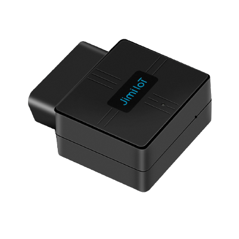

# Concox - VL502

El VL502 es un rastreador vehicular OBDII compacto de Concox, diseñado para flotas corporativas, programas de seguros basados en uso (UBI), monitoreo de concesionarios y supervisión individual del vehículo. Como unidad plug-and-play para el puerto OBDII, reporta telemetría del vehículo como VIN, revoluciones del motor, temperatura del refrigerante, kilometraje acumulado, consumo de combustible, voltaje de batería y estado del encendido, y transmite esos datos por redes móviles para proporcionar visibilidad en tiempo real.

Este modelo es compatible con Plaspy y está pensado para organizaciones que requieren seguimiento de flotas y diagnóstico vehicular sin instalaciones complejas. Al conectarlo a Plaspy, la telemetría y los eventos del VL502 se incorporan a mapas en vivo, alertas e informes para apoyar procesos de recuperación por robo, análisis de comportamiento del conductor, monitoreo de combustible y optimización operativa.

## Puntos clave

- Instalación OBDII plug-and-play para despliegues rápidos de flotas y mínima intervención.
- Compatible con Plaspy para rastreo en tiempo real, monitoreo centralizado e informes.
- Telemetría vehicular completa: VIN, revoluciones del motor, temperatura del refrigerante, kilometraje, consumo de combustible y voltaje de batería.
- Conectividad móvil con 4G LTE y conmutación automática a 2G, además de variantes regionales de bandas para amplia cobertura.
- Posicionamiento GNSS dual con GPS y BDS para mayor precisión y fijación de posición más rápida.
- Acelerómetro integrado para detección de comportamientos de conducción como exceso de velocidad y maniobras bruscas.
- Factor de forma compacto y robusto, adecuado para operación diaria y uso en flotas.

## Cómo funciona con Plaspy

Una vez instalado, el VL502 envía posiciones GNSS y telemetría obtenida vía OBDII a Plaspy, donde esa información se procesa en paneles, alertas e informes históricos. Plaspy utiliza los datos entrantes para ofrecer a gerentes de flota y equipos de seguros información operativa oportuna y notificaciones configurables.

- Actualizaciones de ubicación y telemetría en tiempo real en Plaspy para seguimiento en vivo y reproducción de rutas.
- Parámetros diagnósticos y datos de VIN disponibles para planificación de mantenimiento y verificaciones remotas.
- Informes de consumo de combustible y kilometraje para apoyar la gestión de combustible y análisis de UBI.
- Eventos de encendido e inactividad, además de indicadores de extracción del dispositivo, para monitoreo operativo y alertas antirrobo.
- Eventos basados en acelerómetro para puntuación de comportamiento de conducción e informes de seguridad.

## Casos de uso típicos

- Gestión centralizada de flotas con seguimiento en vivo, historial de rutas y alertas de mantenimiento.
- Programas de seguros basados en uso (UBI) que dependen de datos de kilometraje y comportamiento de conducción.
- Monitoreo en concesionarios y centros de servicio para diagnósticos basados en VIN y preparación de servicios.
- Flujos de trabajo de antirrobo y recuperación usando estado del encendido y alertas por geocercas.
- Programas de seguridad y entrenamiento de conductores apoyados en registros de eventos del acelerómetro.

## Por qué elegir este rastreador con Plaspy

El VL502 combina la comodidad de la conexión OBDII con la profundidad de telemetría que muchas flotas y programas de seguros requieren. Su naturaleza plug-and-play reduce el tiempo de instalación, mientras que la capacidad del dispositivo para reportar VIN, kilometraje y parámetros diagnósticos lo hace útil para mantenimiento, cumplimiento y facturación basada en uso. El posicionamiento GNSS integrado y el acelerómetro aportan los datos de ubicación y eventos que Plaspy utiliza para generar alertas accionables e informes operativos.

Si desea un rastreador OBDII compacto que alimente datos vehiculares detallados a una plataforma de gestión de flotas, el VL502 es una opción práctica para organizaciones que buscan un despliegue ágil y telemetría confiable. Para obtener más información sobre cómo gestionar dispositivos como el VL502 con Plaspy visite https://www.plaspy.com. Las especificaciones del producto, la disponibilidad y los detalles del fabricante pueden cambiar con el tiempo, por lo que le recomendamos verificar las especificaciones actuales en el sitio del fabricante https://www.iconcox.com/.
