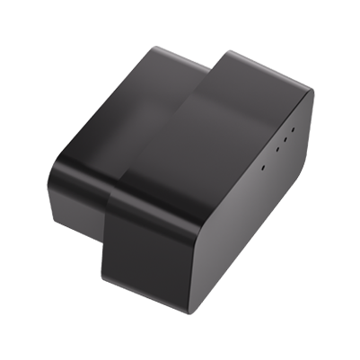

# Concox - VL505

El Concox VL505 es un rastreador GNSS GPS 4G ultra compacto, plug and play, diseñado tanto para vehículos particulares como para flotas comerciales. Instalado en el puerto OBD II del vehículo, el VL505 ofrece ubicación y telemetría en tiempo real mediante LTE Cat 1, combinando posicionamiento por múltiples fuentes con sensores de movimiento y monitoreo de audio a bordo para soportar seguimiento, detección de movimiento y alertas configurables.

Como dispositivo compatible con Plaspy, el VL505 puede transmitir actualizaciones de posición y eventos del dispositivo a Plaspy para supervisión en vivo, reproducción histórica e informes de flota. Su tamaño reducido y su instalación sencilla lo hacen ideal para despliegues masivos donde se exige posicionamiento fiable, notificaciones de eventos y datos accionables que alimenten los paneles y flujos de trabajo de Plaspy.

## Características principales

- Instalación plug and play en OBD II para despliegues rápidos y alimentación confiable desde el vehículo
- Conectividad celular LTE Cat 1 para transmisión de datos estable y baja latencia
- Posicionamiento GNSS multiconstelación y métodos de localización asistida para seguimiento en tiempo real confiable
- Acelerómetro y micrófono integrados para capturar eventos de movimiento y audio en investigaciones de incidentes
- Factor de forma compacto con una pequeña batería de respaldo interna que permite registro temporal durante cortes breves de energía
- Variantes regionales y certificaciones del sector para soportar implementaciones en distintos mercados

## Cómo funciona con Plaspy

Al integrarse con Plaspy, el VL505 envía ubicación y telemetría a través de la red celular para proporcionar posiciones en vivo, detección de movimiento y alertas del dispositivo. Plaspy ingiere esas actualizaciones para que los gestores de flota puedan ver los vehículos en un mapa, recibir notificaciones y generar informes que apoyen la supervisión operativa y los programas de seguridad.

- Actualizaciones de ubicación y telemetría en tiempo real entregadas a Plaspy para seguimiento en vivo y reproducción
- Alertas de eventos como entrada y salida de geocercas, vibración o pérdida de alimentación visibles en Plaspy
- Eventos de conducta de manejo y detección de movimiento disponibles en Plaspy para monitoreo de seguridad y capacitación
- Registro temporal en el dispositivo que preserva puntos recientes durante breves interrupciones de conectividad antes de que Plaspy sincronice los datos históricos
- La configuración y provisión a nivel de dispositivo puede gestionarse junto con los flujos de trabajo de Plaspy para alinear el comportamiento de los informes con las políticas de la flota

## Casos de uso típicos

- Gestión de flotas y despacho en tiempo real para autos y vehículos comerciales ligeros
- Monitoreo antirrobo y recuperación rápida mediante geocercas y alertas por pérdida de energía
- Programas de seguro basado en uso que requieren registros de conducción y viajes
- Supervisión de seguridad y cumplimiento del conductor, incluyendo detección de colisiones y conducción brusca
- Compartición de ubicación de vehículos particulares y supervisión familiar con instalación discreta

## Por qué elegir este rastreador con Plaspy

El VL505 combina la conveniencia plug and play con posicionamiento GNSS de múltiples fuentes y conectividad celular robusta, lo que lo convierte en una opción práctica para organizaciones que necesitan localización de vehículos y reportes de eventos confiables. Su diseño compacto y bajo consumo facilitan implementaciones a gran escala, mientras que los eventos de movimiento y las alertas configurables alimentan los análisis y los sistemas de notificación de Plaspy.

Si desea saber más sobre cómo el VL505 puede integrarse con Plaspy y si se ajusta a sus necesidades operativas, visite Plaspy para explorar las características de la plataforma y las opciones de despliegue https://www.plaspy.com. Tenga en cuenta que las especificaciones del producto, la disponibilidad y los datos del fabricante pueden cambiar con el tiempo; verifique las especificaciones vigentes y las variantes regionales en el sitio del fabricante https://www.iconcox.com/.
