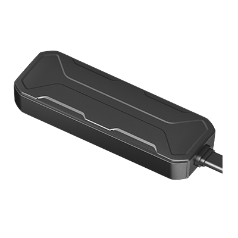

# Concox - Wetrack Lite

El Wetrack Lite es un rastreador GPS compacto de Concox diseñado para la supervisión discreta de vehículos en aplicaciones de alquiler de autos, gestión de flotas y logística ligera. Su tamaño reducido, LED oculto y amplio rango de voltaje lo hacen ideal cuando se requiere un perfil bajo, sin sacrificar el seguimiento en tiempo real ni las notificaciones de eventos. El dispositivo está pensado para proporcionar ubicación e información de estado con mínima detección por parte del conductor.

Como dispositivo compatible con Plaspy, el Wetrack Lite puede enviar datos de ubicación y estado del vehículo a Plaspy para su visualización unificada en mapa, gestión de alertas e informes. Integrar este modelo con Plaspy ofrece a administradores de flota y operadores de renta datos de posición accionables y notificaciones de eventos que apoyan flujos de trabajo antirrobo, análisis de uso y supervisión operativa.

## Características principales

- Rastreador GPS compacto compatible con Plaspy, pensado para supervisión discreta y vigilancia continua.
- Posicionamiento multiconstelación con GPS, BDS y LBS para un reporte de ubicación más preciso.
- Amplio rango de voltaje de operación y protección integrada de la batería del vehículo para desplegarlo en distintos tipos de automotores.
- Factor de forma mini y ligero, apropiado para montaje oculto en autos de alquiler, scooters y equipos ligeros.
- Alertas basadas en eventos como exceso de velocidad, geocerca, movimiento, vibración, detección de batería y desconexión de alimentación.
- Almacenamiento en el dispositivo para preservar historial de ubicación y eventos durante interrupciones temporales de conectividad.

## Cómo funciona con Plaspy

Al emparejarse con Plaspy, el Wetrack Lite transmite actualizaciones de ubicación y paquetes de eventos a la plataforma, donde los datos se normalizan para mostrarse en mapas en vivo, generar alertas y generar reportes históricos. Plaspy aprovecha la posición y las señales del vehículo del rastreador para ofrecer visibilidad continua y notificaciones basadas en reglas para los equipos operativos y administradores de flota.

- Actualizaciones de ubicación en tiempo real para un seguimiento preciso y visibilidad de rutas en los mapas de Plaspy.
- Reporte de encendido y estado ON/OFF del vehículo para apoyar el análisis de utilización e inactividad.
- Alertas por evento para movimiento, exceso de velocidad, entrada y salida de geocerca y vibración anómala, vinculadas a las reglas de notificación de Plaspy.
- Detección de batería y alertas por desconexión de alimentación para señalar posible manipulación o problemas eléctricos.
- Almacenamiento en búfer en el dispositivo que garantiza que el historial completo de viajes esté disponible en Plaspy tras cortes temporales de red.

## Casos de uso típicos

- Gestión de flotas para seguimiento en vivo, supervisión de rutas y reportes de uso basados en encendido.
- Alquiler de autos y movilidad compartida para controlar devoluciones, detectar movimientos no autorizados y gestionar violaciones de geocerca.
- Flujos de trabajo antirrobo y recuperación que usan alertas de movimiento, vibración y eventos de energía para acelerar la respuesta.
- Seguimiento de vehículos de dos ruedas y unidades ligeras donde el tamaño compacto y la tolerancia de voltaje son cruciales.
- Logística de corta distancia y servicios de transporte que requieren visibilidad en tiempo real y continuidad de telemetría con buffering.

## Por qué elegir este rastreador con Plaspy

El Wetrack Lite combina un factor de forma casi invisible con telemetría enfocada en vehículos que se adapta bien a los flujos de trabajo habituales de Plaspy. Su diseño compacto y amplio rango de voltaje lo hacen versátil para autos, scooters y equipos ligeros, mientras que las alertas por eventos alimentan a Plaspy con las señales que los equipos de operaciones y seguridad necesitan para tomar decisiones.

Para conocer más sobre Plaspy y cómo dispositivos compatibles como Wetrack Lite se integran con nuestras funciones de mapas, informes y alertas, visite https://www.plaspy.com. Las especificaciones del producto, disponibilidad y datos del fabricante pueden cambiar con el tiempo, por lo que le recomendamos verificar las especificaciones vigentes en el sitio oficial de Concox https://www.iconcox.com/ antes de comprar o desplegar hardware.
