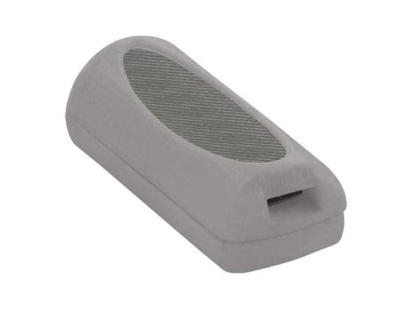

# Condor - CB-714

El CB-714 es un rastreador GPS compacto pensado específicamente para el control de bicicletas y la telemetría del ciclista. Diseñado para ciclistas recreativos, viajeros urbanos, competidores y flotas de alquiler, este modelo destaca por la visualización de rutas, la medición precisa de distancias y el registro fiable de la duración de los viajes, lo que permite supervisar recorridos, verificar usos y analizar rendimiento con confianza.

Como dispositivo compatible con Plaspy, el CB-714 integra su telemetría de ciclismo en la plataforma para ofrecer mapas consolidados de rutas, registros de viajes y resúmenes de duración. Su conjunto de funciones centrado en el ciclismo lo convierte en una opción práctica para operadores y ciclistas que desean datos claros dentro de Plaspy para informes, alertas y análisis históricos.

## Aspectos destacados

- Diseñado específicamente para bicicletas, con énfasis en visualización de rutas distancia y duración de viajes
- Compatible con Plaspy para informes de seguimiento consolidados y visualización en mapas
- Mapeo de rutas preciso para facilitar la revisión y reproducción de recorridos
- Métricas exactas de distancia y tiempo útiles para análisis y facturación por uso
- Ideal para flotas de bicicletas y operaciones de alquiler para supervisar la actividad
- Permite monitoreo antirrobo con historial de ubicaciones y alertas por movimiento
- Diseño simple y centrado en telemetría sin entradas específicas de vehículo innecesarias

## Cómo funciona con Plaspy

Al integrarse con Plaspy, el CB-714 envía la telemetría registrada a la plataforma, donde se muestran y almacenan mapas de rutas, totales de distancia y duraciones de viaje. Usted, como operador o ciclista, podrá acceder a recorridos históricos, generar informes y configurar alertas dentro de Plaspy, lo que habilita visibilidad en tiempo real y análisis detallados posteriores al viaje según la configuración de transmisión del dispositivo.

- Actualizaciones de posición en tiempo real y visibilidad del viaje actual cuando se configura para reportar ubicación en vivo
- Historial de rutas y reproducción de viajes para revisar los trayectos completos realizados
- Métricas de distancia y duración que aparecen en los paneles de Plaspy informes y registros exportables
- Alertas por movimiento o uso no autorizado para apoyar el monitoreo y la respuesta antirrobo
- Resúmenes y reportes a nivel de flota para controlar la utilización y apoyar la facturación o la planificación de mantenimiento

## Casos de uso típicos

- Gestión de flotas para programas de alquiler y bicicletas compartidas para rastrear uso y agregar actividad
- Monitoreo antirrobo y recuperación al vigilar últimas ubicaciones conocidas y patrones de movimiento
- Entrenamiento de ciclistas y análisis de rutas para coaching y revisión de rendimiento
- Apoyo en eventos y tours ofreciendo registros de rutas y seguimiento de participantes para organizadores
- Planificación operativa de mantenimiento usando totales de distancia para programar servicios en flotas

## Por qué elegir este rastreador con Plaspy

El CB-714 ofrece un conjunto de telemetría orientado al ciclismo que se integra de forma natural con Plaspy para proporcionar visibilidad centrada en los viajes y supervisión de flotas. Su énfasis en mapas claros, precisión de distancia y duración de viaje lo hace especialmente útil para operadores que requieren datos directos para informes, facturación y decisiones operativas sin la complejidad propia de dispositivos vehiculares.

Learn more about Plaspy and how compatible trackers are supported at https://www.plaspy.com. Product specifications availability and manufacturer details can change over time so please verify current specifications and official documentation on the manufacturer's site at https://condorskyseeker.com/ before making procurement or deployment decisions.
