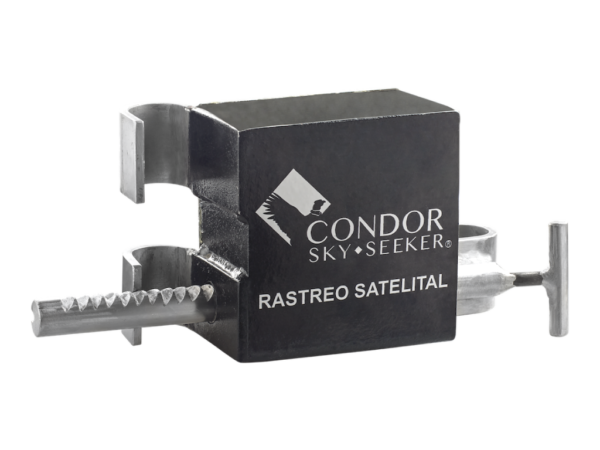

# Condor - CS-146

El CS-146 es un rastreador GPS diseñado específicamente para el control de contenedores y la seguridad de la carga. Pensado para monitorear la posición y el estado del contenedor, el CS-146 transmite ubicación y mensajes operativos vía redes celulares o satelitales para asegurar seguimiento fiable incluso en tramos de transporte mixtos. Su formato y conjunto de funciones están orientados a proteger la carga y facilitar los flujos de trabajo de acceso a contenedores.

Como dispositivo compatible con Plaspy, el CS-146 puede enviar su posición e información de eventos a la plataforma para ofrecer visibilidad centralizada y supervisión operativa. Al conectarlo a Plaspy, las actualizaciones del rastreador aparecen en mapas en vivo, sistemas de alerta y herramientas de informes, de modo que los equipos logísticos puedan monitorear contenedores, responder a eventos de acceso y mantener un registro de auditoría de los envíos.

## Aspectos destacados

- Diseñado para monitoreo de contenedores y seguridad de carga, con un formato compacto para instalación en contenedores
- Transmite posición y estado mediante rutas celulares o satelitales para cubrir grandes áreas
- Capacidad de apertura remota para permitir accesos controlados desde una sala de control central
- Reduce el riesgo de robo al centralizar el control de accesos y entregar actualizaciones de estado oportunas
- Se integra con Plaspy para ofrecer rastreo en vivo, alertas y reproducción histórica de ubicaciones
- Adecuado para operaciones intermodales donde varían los modos de transporte y la cobertura
- Soporta auditoría operativa informando eventos de apertura y cierre para la cadena de custodia

## Cómo funciona con Plaspy

Al emparejar el CS-146 con Plaspy, el dispositivo envía actualizaciones periódicas y basadas en eventos sobre posición y estado a la plataforma. Plaspy procesa esos mensajes para poblar mapas en vivo, activar alertas y flujos de trabajo, y generar reportes que los equipos de operaciones utilizan para gestionar contenedores en tiempo real.

- Rastreo en tiempo real y reproducción histórica para que los equipos vean la ubicación actual y el movimiento a lo largo del tiempo
- Eventos de apertura y cierre remotos reportados en Plaspy para registros de auditoría y alertas configurables
- Mensajes de estado utilizados como telemetría para disparar notificaciones y reglas operativas
- Alertas antifurto por accesos inesperados encaminadas a operadores mediante los flujos de trabajo de Plaspy
- Diseño amigable para integración, de modo que los datos del CS-146 puedan combinarse con otras fuentes de telemetría en los paneles de Plaspy

## Casos de uso típicos

- Gestión de flotas intermodales para visibilidad consolidada a través de tramos por camión, ferrocarril y marítimo
- Prevención de robo y control de acceso para verificar y administrar la actividad de puertas de contenedores desde una sala de control
- Visibilidad de la cadena de suministro para envíos de alto valor o sensibles al tiempo que requieren supervisión continua
- Escenarios de cobertura extendida usando respaldo satelital cuando el servicio celular es intermitente
- Auditorías operativas e informes de cadena de custodia mediante registros de eventos e historial de estados

## Por qué elegir este rastreador con Plaspy

El CS-146 se alinea con programas de seguridad de flotas y carga que requieren visibilidad a nivel de contenedor. Emparejado con Plaspy, ofrece una forma directa de integrar la posición del contenedor y los eventos de acceso en paneles centralizados, alertas e informes que utilizan los equipos operativos. Esa combinación ayuda a optimizar la supervisión y la respuesta sin añadir complejidad innecesaria de integración.

Si desea saber más sobre cómo Plaspy puede gestionar dispositivos Condor CS-146 y otros rastreadores compatibles, visite https://www.plaspy.com. Las especificaciones y la disponibilidad de productos pueden cambiar con el tiempo, por lo que le recomendamos verificar los detalles actuales en el sitio del fabricante https://condorskyseeker.com/ antes de comprar o desplegar el hardware.
