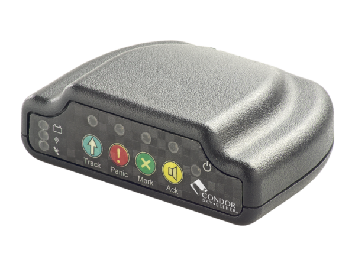

# Condor - TA-913

# TA-913 — Rastreador de aviación compatible con Plaspy

El TA-913 es un dispositivo compacto de comunicaciones y rastreo aeronáutico diseñado para operaciones en aeronaves de ala fija y helicópteros. Construido para la seguridad en vuelo y una integración sencilla con estaciones terrestres, el TA-913 se conecta con Plaspy para ofrecer alertas oportunas, mensajes de estado y comunicaciones por texto satelital entre la aeronave y el control en tierra. Sus controles orientados a la aviación y su puerta de enlace Bluetooth lo convierten en un compañero ideal para operadores que requieren una conciencia situacional fiable y mensajería entre tripulación y tierra.

Compatible con Plaspy desde el primer momento, el TA-913 incorpora botones orientados al piloto y una conexión Bluetooth a smartphones o tabletas para que las tripulaciones puedan intercambiar mensajes de texto por satélite con la estación terrestre incluso cuando fallan los enlaces de radio tradicionales. Use el TA-913 con Plaspy para paneles de mando unificados, alertas y registro de comunicaciones que respaldan la gestión de flotas, la recopilación de telemetría y los flujos de trabajo de seguridad aeronáutica.

## Aspectos clave

- Diseñado para la aviación: desarrollo específico para operaciones de aeronaves de ala fija y de ala rotativa.
- Botón de pánico para señalización de emergencia rápida al control en tierra mediante flujos de trabajo habilitados por Plaspy.
- Botón marcador de punto de interés \(POI\) para registrar y transmitir ubicaciones críticas durante el vuelo o misiones.
- Botón de notificación de llamada de tierra que alerta a la cabina cuando el control en tierra necesita contactar a la tripulación tras la pérdida del enlace de radio.
- Capacidad de mensajería de texto por satélite para intercambiar mensajes breves entre la aeronave y una estación en tierra.
- Puerta de enlace Bluetooth para emparejar un smartphone o tableta, utilizando el dispositivo móvil como interfaz de comunicación y superficie de control.
- Instalación sencilla y controles intuitivos reducen el tiempo de formación de la tripulación y mejoran la preparación operativa.

## Cómo funciona con Plaspy

Cuando se integra con Plaspy, el TA-913 pasa a formar parte de una imagen operativa unificada para las flotas de aeronaves. Plaspy recibe los mensajes de estado, entradas de emergencia y comunicaciones por texto satelital del TA-913, los correlaciona con datos de vuelo y de la operación y los muestra en tiempo real en paneles y mapas. Los operadores reciben alertas, pueden acusar recibo de los mensajes y archivar las comunicaciones para cumplimiento normativo y revisión posterior al vuelo.

- Alertas en tiempo real y retransmisión de mensajes: TA-913 transmite mensajes de seguridad y de estado a Plaspy para la atención inmediata de los operadores.
- Eventos de pánico y POI: los eventos iniciados desde el botón se envían a Plaspy para que los despachadores puedan reaccionar y coordinar la respuesta.
- Puerta de texto satelital: los mensajes de la tripulación se enrutan a través de los registros de comunicaciones de Plaspy para su trazabilidad.
- Integración con smartphones/tablets vía Bluetooth: los dispositivos móviles emparejados con el TA-913 actúan como interfaz de usuario y puerta de enlace de datos.
- Listo para integración: Plaspy captura eventos y mensajes del TA-913 para informes, correlación de telemetría y flujos de trabajo de gestión de flotas.

## Resumen técnico

| Modelo | TA-913 |
| --- | --- |
| Uso previsto | Control y comunicaciones para aeronaves de ala fija y de ala rotativa |
| Conectividad | Mensajería de texto por satélite; conexión Bluetooth a smartphone/tablet |
| Botones / Interfaces | Botón de pánico; botón marcador de POI \(punto de interés\); botón de notificación de llamada de tierra; interfaz Bluetooth |
| GNSS / GPS | No especificado en la descripción proporcionada |
| Bandas | No especificado |
| Alimentación y batería | No especificado |
| Bluetooth | Emparejamiento Bluetooth con smartphone o tableta para mensajería y control |
| Gestión remota | No especificado |
| Formato | Unidad compacta de grado aeronáutico para instalación en aeronaves |

## Casos de uso

- Señalización de emergencia y respuesta rápida: alertas de pánico iniciadas por la tripulación enviadas a través de Plaspy hacia el despacho y los equipos de rescate.
- Contingencia por pérdida de radio: habilita notificaciones de llamada de tierra y mensajería de texto por satélite para mantener el mando y control cuando no está disponible VHF/UHF.
- Registro de POI durante misiones: marcar y transmitir ubicaciones críticas a Plaspy para mapeo, revisión posterior y análisis de la misión.
- Mensajería tripulación a tierra: intercambios cortos de texto por satélite mediante un smartphone/tableta emparejado cuando las comunicaciones por línea de visión están comprometidas.
- Conciencia operativa de la flota: integrar eventos del TA-913 en los paneles de Plaspy para monitorización centralizada de varias aeronaves.

## Por qué elegir este rastreador con Plaspy

El TA-913 está diseñado para operadores que priorizan la seguridad, la continuidad de las comunicaciones y una integración sencilla. Al ser un dispositivo compatible con Plaspy, ofrece una ruta de datos clara desde la cabina hasta el centro de control: los eventos iniciados desde los botones y los mensajes de texto por satélite se convierten en elementos accionables en la interfaz de Plaspy. Eso brinda a los despachadores y gerentes de flota una forma fiable de gestionar emergencias, preservar los registros de comunicaciones y mantener la conciencia situacional a lo largo de la flota.

Emparejar el TA-913 con Plaspy reduce la complejidad de gestionar telemetría y mensajería en operaciones de aviación. Aunque Plaspy puede soportar telemetría más amplia, monitoreo de combustible, funciones de ignición o inmovilizador para dispositivos que las proporcionen, el TA-913 se enfoca en mensajería resiliente, eventos iniciados por la tripulación y la interoperabilidad habilitada por Bluetooth con dispositivos móviles, entregando una capa de seguridad fiable para las operaciones de aeronaves.

