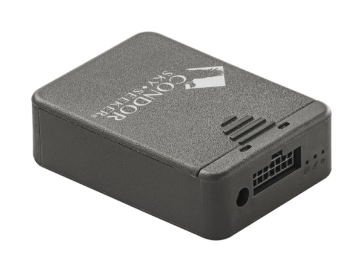

# Condor - TG-512

El rastreador GPS Condor TG-512 es un dispositivo diseñado específicamente para el control y seguimiento de vehículos y maquinarias. Utiliza la última tecnología de geolocalización y transmite datos a través de la red celular. Con múltiples entradas/salidas de propósito general, salidas para micrófono y parlante, antenas GPS y GPRS de alta sensibilidad, interfaz 1-wire y puerto serial RS-232, este rastreador ofrece una amplia gama de funciones y capacidades.

El Condor TG-512 es ideal para empresas que necesitan monitorear y gestionar su flota de vehículos y maquinarias de manera eficiente. Con este dispositivo, es posible obtener información en tiempo real sobre la ubicación, velocidad y estado de los activos, lo que permite tomar decisiones informadas y mejorar la productividad.

Características destacadas del rastreador GPS Condor TG-512:

- Tecnología de geolocalización avanzada
- Transmisión de datos a través de red celular
- Entradas/salidas de propósito general
- Salidas para micrófono y parlante
- Antenas GPS y GPRS de alta sensibilidad
- Interfaz 1-wire
- Puerto serial RS-232

