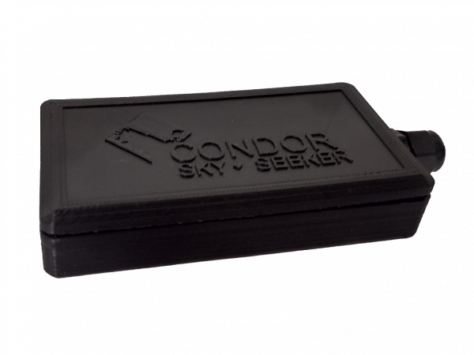

# Condor - TG-610

El TG-610 es un rastreador GPS compacto diseñado para motocicletas y vehículos pequeños. Integra una antena GPS de alta sensibilidad y conectividad GPRS en un formato reducido, con diseño de bajo consumo y E/S sencillas. El equipo ofrece reportes de ubicación confiables en tiempo real, telemetría básica y control antirrobo, pensado para propietarios y gestores de flota que requieren una solución discreta para aplicaciones en vehículos de dos ruedas y vehículos compactos.

Como dispositivo listado como compatible con Plaspy, el TG-610 puede integrarse en los flujos de monitoreo y gestión de flotas de Plaspy para convertir las señales de ubicación y estado en información útil. Su soporte para entradas de inmovilizador y un botón de pánico, junto con la telemetría periódica a través de redes celulares, hace al TG-610 una opción práctica al combinar hardware con Plaspy para seguimiento en vivo, alertas y supervisión de flotas de forma sencilla.

## Aspectos destacados

- Rastreador compatible con Plaspy, optimizado para motocicletas y vehículos pequeños, para seguimiento en tiempo real y monitoreo centralizado.
- Antenas GPS y GPRS de alta sensibilidad integradas para actualizaciones de ubicación consistentes a través de la red celular.
- Diseño de bajo consumo adecuado para vehículos de dos ruedas donde la gestión de energía es importante.
- Entradas y salidas dedicadas para bloqueo de motor y botón de pánico que soportan flujos de trabajo antirrobo y de emergencia.
- Factor de forma compacto que disminuye el impacto visual y facilita la instalación discreta en motocicletas.
- Envía telemetría y señales de estado vía GPRS para que Plaspy genere alertas y reportes oportunos.
- Construido para el uso diario en entornos de motocicletas y vehículos pequeños.

## Cómo funciona con Plaspy

Al conectarlo a Plaspy, el TG-610 envía información de ubicación y estado a través de la red celular GPRS para que Plaspy muestre posiciones en vivo, registre eventos y active notificaciones. Plaspy procesa la telemetría del rastreador y los eventos de E/S para habilitar geovallas, alertas y reportes de flota que ayudan a los operadores a responder rápidamente a incidentes y a supervisar la actividad en curso.

- Actualizaciones de ubicación en vivo y estado de movimiento aparecen en los mapas de Plaspy para visibilidad en tiempo real.
- Las activaciones del botón de pánico y los eventos de inmovilizador se reportan a Plaspy para disparar alertas y flujos de incidentes.
- La telemetría y los cambios de estado de entradas quedan disponibles en los reportes de Plaspy para análisis operativo y trazabilidad.
- Las reglas de geovallas y eventos en Plaspy pueden aplicarse a los datos del TG-610 para automatizar notificaciones y escalamiento.
- La integración admite paneles para flotas pequeñas y supervisión rutinaria mediante las funciones de historial y reportes de Plaspy.

## Casos de uso típicos

- Protección antirrobo y bloqueo remoto para motocicletas, combinando inmovilizador y alertas de pánico.
- Operaciones de alquiler y uso compartido de motocicletas que requieren visibilidad de ubicación y monitoreo básico de uso.
- Servicios de entrega y mensajería con vehículos pequeños que necesitan visibilidad de rutas y actualizaciones de estado.
- Recuperación de activos y disuasión de robos donde el rastreo discreto y la respuesta rápida son críticos.
- Telemetría y reporte de estado básicos para pequeñas flotas que apoyen la gestión operativa.

## Por qué elegir este rastreador con Plaspy

El TG-610 es una opción enfocada para organizaciones que requieren hardware de rastreo compacto y de bajo consumo para motocicletas y vehículos pequeños. Su combinación de GPS integrado, telemetría celular y E/S de control sencilla se alinea bien con las capacidades de Plaspy para seguimiento en vivo, alertas y reportes de flota sin añadir complejidad innecesaria.

Para gestores de flota y propietarios que buscan hardware directo que se integre con una plataforma centralizada, el TG-610 proporciona las señales esenciales que Plaspy necesita para ofrecer visibilidad y flujos de trabajo basados en eventos. Para más información sobre Plaspy y cómo el TG-610 puede encajar en su sistema de rastreo visite https://www.plaspy.com. Las especificaciones del producto y la disponibilidad pueden cambiar con el tiempo por lo que le recomendamos verificar los detalles técnicos y la información de compatibilidad más reciente en el sitio del fabricante https://condorskyseeker.com/.
