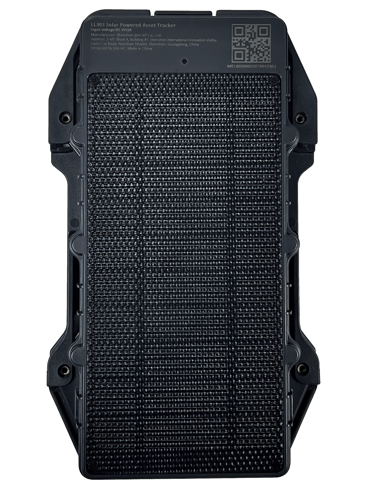

# DCT - Solar Asset Tracker

El DCT Solar Asset Tracker (SPA4G-1204-16) es un rastreador GPS robusto y autosuficiente diseñado para despliegues prolongados en exteriores. Con un panel solar integrado y una batería recargable de 10 Ah, el equipo está pensado para mantenerse operativo en activos remotos sin conexión a la red eléctrica. Combina posicionamiento GNSS con respaldo por Wi‑Fi y LBS, y utiliza conectividad 4G global para entregar actualizaciones continuas de ubicación, estado del dispositivo y alertas de eventos útiles para la supervisión de flotas y escenarios antirrobo.

Este rastreador figura como compatible con Plaspy y puede enviar su telemetría a la plataforma Plaspy para su monitoreo y gestión centralizados. Esa compatibilidad convierte al Solar Asset Tracker en una opción práctica para organizaciones que desean incorporar activos fuera de la red y de larga duración en los flujos de trabajo de Plaspy para seguimiento en vivo, notificaciones y reportes históricos junto con otros dispositivos de la flota.

## Aspectos destacados

- Panel solar integrado con batería recargable de 10 Ah para operación prolongada fuera de la red
- Diseñado para compatibilidad con Plaspy y transmitir ubicación y telemetría en tiempo real a su plataforma de flotas
- Varios métodos de posicionamiento: GNSS con respaldo por Wi‑Fi y LBS para mejorar fijaciones en zonas difíciles
- Conectividad 4G global para telemetría continua, entrega de eventos y gestión remota en la nube
- Carcasa robusta de policarbonato IP67 apta para entornos exteriores, marinos e industriales
- Alertas por eventos como detección de manipulación o vibración, geocercas configurables, movimiento y batería baja
- Opciones de montaje flexibles, como imán o anclaje con pernos, para despliegues rápidos en remolques, contenedores y equipos

## Cómo funciona con Plaspy

Cuando usted lo configura para Plaspy, el Solar Asset Tracker envía datos de ubicación, estado y eventos a la plataforma Plaspy, donde se integran en paneles de control, notificaciones y reportes. Plaspy puede mostrar posiciones en vivo en mapas, activar alertas y conservar datos históricos para auditoría y análisis.

- Actualizaciones de ubicación en tiempo real mediante 4G global para seguimiento en vivo en los mapas de Plaspy
- Alertas inmediatas por manipulación y vibración dirigidas a las notificaciones de Plaspy para una respuesta rápida
- Informes de estado del dispositivo y batería baja para planificar mantenimiento y minimizar tiempos de inactividad
- Geocercas y alertas de movimiento configurables para detectar intrusiones en perímetros y desplazamientos no autorizados
- Datos disponibles para reproducción histórica de rutas, paneles de flota y reportes exportables en Plaspy

## Casos de uso típicos

- Seguimiento de remolques y contenedores para seguridad de carga y visibilidad logística
- Monitoreo de equipos pesados en obras y minas para detectar movimientos no autorizados
- Protección antirrobo de activos remotos mediante alertas de manipulación y geocercas
- Monitoreo de flotas fuera de la red en agricultura y silvicultura, donde la autonomía solar reduce el mantenimiento
- Rastreo de equipos marítimos comerciales y de campo donde la resistencia a la intemperie y las opciones de posicionamiento de respaldo aumentan la fiabilidad

## Por qué elegir este rastreador con Plaspy

El Solar Asset Tracker es una opción sólida para organizaciones que necesitan un dispositivo resistente y de bajo mantenimiento para supervisar activos remotos dentro de Plaspy. Su capacidad de recarga solar y la amplia autonomía de la batería reducen la necesidad de servicios frecuentes, mientras que la carcasa IP67 y las múltiples opciones de posicionamiento ayudan a mantener la visibilidad en entornos exigentes.

Al integrar este rastreador con Plaspy, los equipos obtienen supervisión centralizada de despliegues de larga duración junto con otros activos de la flota, lo que permite alertas coherentes, reportes y flujos operativos unificados. Para despliegues que requieran tipos adicionales de telemetría o sensores periféricos, Plaspy puede combinar los datos del rastreador con otros dispositivos para crear una solución más completa. Conozca más sobre Plaspy en el sitio principal https://www.plaspy.com. Las especificaciones del producto, la disponibilidad y los datos del fabricante pueden cambiar con el tiempo; verifique las especificaciones actuales con la documentación del fabricante en https://www.digitalcomtech.com/
