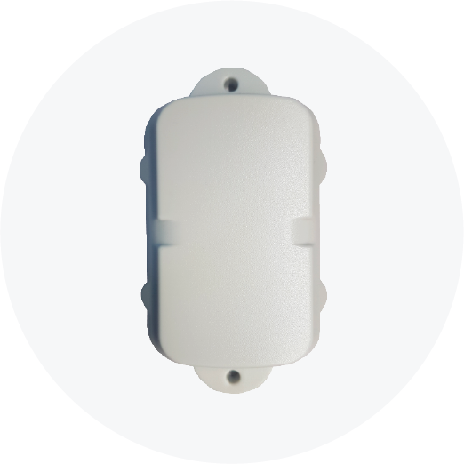

# DCT - Syrus Asset Tracker

El Syrus Asset Tracker es un rastreador GPS robusto e impermeable diseñado para el monitoreo prolongado de activos no alimentados y expuestos. Está concebido para entornos exteriores exigentes y ofrece reportes de ubicación fiables y de bajo mantenimiento para contenedores, remolques, equipos de construcción y otros activos fuera de la red donde la larga autonomía y la comunicación celular consistente son esenciales.

Como dispositivo compatible con Plaspy, el Syrus Asset Tracker se integra con la plataforma para ofrecer visibilidad de ubicación en tiempo real, cadencias de telemetría configurables y alertas por movimiento no autorizado. Su carcasa compacta y resistente a la intemperie, junto con opciones de montaje flexibles, lo convierten en una elección práctica para la gestión de flotas y despliegues industriales de IoT que requieren intervención mínima y reportes constantes durante largos periodos.

## Lo más destacado

- Rastreador GPS compatible con Plaspy, optimizado para monitoreo prolongado de activos e integración con gestión de flotas
- Carcasa resistente e impermeable y opciones de montaje versátiles para uso exterior expuesto
- Variantes celulares múltiples, incluyendo opción 3G heredada y modelos 4G para adaptar a las necesidades de despliegue
- Autonomía extremadamente prolongada gracias al cambio de modos de reporte que equilibra duración de batería y granularidad del seguimiento
- Sensor de movimiento integrado para alertas por desplazamiento no autorizado y reportes basados en eventos
- Aprovisionamiento rápido Place 'n Trace para incorporación veloz de activos en Plaspy
- Variante opcional 4G Temp Tracker con capacidad de temperatura para monitoreo de condiciones del activo

## Cómo funciona con Plaspy

Al integrarse con Plaspy, el Syrus Asset Tracker proporciona telemetría de ubicación y movimiento de bajo mantenimiento y persistente. El dispositivo envía posiciones y eventos de movimiento mediante enlaces celulares a Plaspy, donde los operadores pueden ver ubicaciones en vivo, configurar alertas y analizar movimientos históricos. La configuración remota permite al equipo priorizar la duración de la batería o la frecuencia de seguimiento según cambien las necesidades operativas.

- Ubicación y telemetría de movimiento en tiempo real disponibles en los mapas y paneles de Plaspy
- Alertas por movimiento no autorizado que generan notificaciones y ofrecen instantáneas de ubicación inmediata
- Cambio de modo por aire desde localización de baja potencia a modos de seguimiento de mayor frecuencia mediante Plaspy
- Aprovisionamiento rápido con Place 'n Trace para que los activos aparezcan en Plaspy poco después de la instalación
- Lecturas de temperatura de la variante 4G Temp Tracker pueden integrarse en el monitoreo de condiciones en Plaspy

## Casos de uso típicos

- Seguimiento a largo plazo de remolques, contenedores y equipos móviles sin alimentación vehicular
- Gestión de activos en obras y flotas de alquiler donde se requiere seguimiento de bajo mantenimiento
- Operaciones intermodales y gestión de patios para carga exterior y contenedores de envío
- Monitoreo de activos sensibles a la temperatura usando la variante 4G Temp Tracker
- Despliegues de IoT industrial que necesitan telemetría confiable alimentada por batería y alarmas basadas en eventos

## Por qué elegir este rastreador con Plaspy

El Syrus Asset Tracker es una opción diseñada específicamente para organizaciones que requieren monitoreo confiable y de larga duración de activos sin alimentación. Su diseño durable e impermeable y su montaje flexible lo hacen ideal para aplicaciones industriales y de flota en exteriores, donde las visitas de mantenimiento deben minimizarse y los reportes deben permanecer constantes.

Integrar el Syrus Asset Tracker con Plaspy aporta visibilidad en tiempo real, cadencias de reporte configurables y alertas basadas en eventos dentro de un flujo de trabajo unificado de gestión de flotas o activos. Para necesidades de telemetría más amplias, este rastreador puede operar en despliegues Plaspy junto con rastreadores instalados en vehículos y gateways de sensores compatibles para ampliar el monitoreo donde se requiera.

Conozca más sobre Plaspy en el sitio principal https://www.plaspy.com. Las especificaciones del producto, disponibilidad y datos del fabricante pueden cambiar con el tiempo; por favor verifique la información técnica y los detalles de compra actuales en el sitio oficial del fabricante https://www.digitalcomtech.com/
