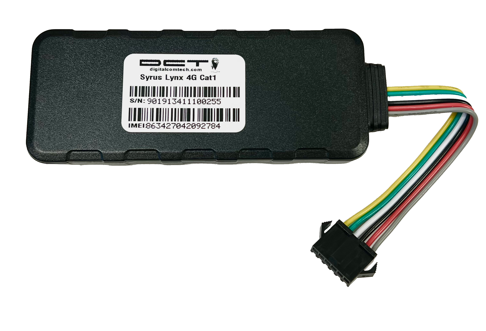

# DCT - Syrus Lynx 4G

El Syrus Lynx 4G es un rastreador GPS GNSS de montaje en vehículo, de diseño compacto y orientado a la gestión robusta de flotas y al seguimiento masivo de unidades. Su tamaño reducido permite instalaciones discretas sin sacrificar la transmisión continua de ubicación ni la telemetría fiable, lo que lo hace adecuado para flotas de alquiler, programas de telemática para aseguradoras y despliegues a gran escala.

Como dispositivo compatible con Plaspy, el Lynx 4G facilita la integración de la telemetría de hardware con las herramientas de monitoreo y generación de informes de Plaspy. Al conectarlo a Plaspy, la posición, el estado y las alertas del rastreador se envían a una plataforma centralizada para visibilidad en tiempo real, notificaciones basadas en reglas y opciones de respuesta remota como el inmovilizador.

## Aspectos destacados

- Compatibilidad confirmada con Plaspy para seguimiento en tiempo real, alertas e integración de informes
- Conectividad LTE Cat 1 4G con retroceso a 3G y 2G para mayor cobertura
- Batería interna de respaldo que mantiene el reporte de ubicación durante cortes de energía
- Telemetría integrada: reportes por tiempo y rumbo, detección de arrastre/remolque y monitoreo de comportamiento de conducción
- Soporte para inmovilizador remoto para habilitar respuestas antirrobo desde la plataforma
- Factor de forma compacto y ocultable, ideal para instalaciones en flotas y vehículos de alquiler
- SIM M2M aprovisionada multioperador para simplificar la logística en despliegues masivos y reducir zonas muertas regionales

## Cómo funciona con Plaspy

El Syrus Lynx 4G transmite la posición GNSS y la telemetría a través de su conexión celular hacia endpoints en la nube que Plaspy ingiere. Una vez conectado como un rastreador compatible con Plaspy, el dispositivo provee flujos en vivo de ubicación y eventos que Plaspy utiliza para la cartografía, las alertas y el análisis histórico, permitiendo que usted monitoree vehículos y actúe sobre incidentes desde un tablero central.

- Ubicación y telemetría en tiempo real visibles en Plaspy para mapeo y monitoreo en vivo
- Eventos de alarma y detección de arrastre/remolque generan alertas inmediatas y notificaciones dentro de Plaspy
- La telemetría de comportamiento de conducción alimenta puntuaciones e informes de seguridad para la supervisión de la flota
- Los comandos de inmovilizador remoto enviados desde Plaspy se reenvían al dispositivo para proteger el activo
- Agregación de datos externos, como sensores o consumo de combustible, en Plaspy cuando estas integraciones están configuradas

## Casos de uso habituales

- Gestión de flotas de alquiler que requieren seguimiento discreto, control de utilización y prevención de robos
- Programas de telemática para aseguradoras que recopilan comportamiento de conducción para pólizas basadas en uso
- Despliegues a gran escala donde el aprovisionamiento con SIM multioperador facilita la logística
- Operaciones de flota que buscan ubicación continua, alertas y reportes históricos para mejorar la eficiencia
- Flujos de trabajo de protección y recuperación antirrobo usando alarmas de arrastre y bloqueo remoto

## Por qué elegir este rastreador con Plaspy

El Syrus Lynx 4G es una opción práctica para organizaciones que usan Plaspy y necesitan un seguimiento continuo y fiable en un paquete compacto. Su conectividad multi red y la batería interna de respaldo ayudan a mantener el reporte durante variaciones de cobertura o interrupciones de energía, mientras que la telemetría integrada —como reportes de rumbo, alarmas de arrastre y monitoreo de comportamiento de conducción— proporciona entradas accionables para los paneles e alertas de Plaspy.

Usado junto con Plaspy, el Lynx 4G cubre las necesidades comunes de flotas, desde monitoreo en vivo y reportes históricos hasta respuestas antirrobo. Para operadores enfocados en flotas de alquiler, telemática para aseguradoras o despliegues de gran volumen, las capacidades combinadas del rastreador y Plaspy ofrecen una vía escalable para centralizar visibilidad y controles operativos. Learn more about Plaspy on our main website https://www.plaspy.com. Product specifications and availability can change over time, so verify current technical details and regional options on the manufacturer site https://www.digitalcomtech.com/.
