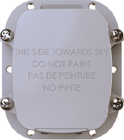

# DCT - Syrus Satcom Lite

The Syrus Satcom Lite \(Item #1204-10\) es un rastreador GPS alimentado por batería y con conectividad satelital, diseñado para ampliar el seguimiento en tiempo real compatible con Plaspy a activos que operan fuera de la cobertura celular. Pensado para entornos duros y remotos, el dispositivo combina detección de movimiento, reporte de posiciones GPS comparativas y entradas de sensores auxiliares configurables para proporcionar a los equipos de operación visibilidad continua y telemetría operable donde los rastreadores tradicionales no pueden llegar.

Como rastreador de activos compatible con Plaspy, Syrus Satcom Lite ofrece visibilidad remota, alertas configurables y notificaciones de emergencia que se integran con plataformas en la nube. Su gestión a través de Pegasus IoT Cloud y la posibilidad de reenviar actualizaciones de estado y alertas urgentes por correo electrónico o mensaje de texto hacen de este rastreador GPS una opción fiable para la gestión de flotas, protección contra robos y monitorización remota de activos en sectores como agricultura, marítimo, construcción, minería, silvicultura, gobierno y seguridad pública.

## Aspectos destacados

- Conectividad habilitada por satélite para un seguimiento fiable fuera de la cobertura celular — ideal para la gestión de flotas remotas y operaciones en campo.
- Diseño alimentado por batería y robusto, pensado para despliegues a largo plazo en entornos adversos.
- Sensores de movimiento integrados y posiciones GPS comparativas que detectan movimientos y cambios de ubicación para flujos de anti-robos y recuperación.
- Entradas de sensores auxiliares configurables permiten telemetría y monitoreo de estado a medida para sus activos.
- Informes intermedios configurables y alertas de emergencia urgentes entregadas por correo electrónico o mensaje de texto para una respuesta rápida.
- Gestionado a través de Pegasus IoT Cloud con visualización en tiempo real y gestión remota del dispositivo; integrable con Plaspy para seguimiento e informes consolidados.

## Cómo funciona con Plaspy

Cuando se despliega como un rastreador GPS compatible con Plaspy, el Syrus Satcom Lite transmite telemetría satelital y GPS a Plaspy \(directamente o a través de una integración\), habilitando el seguimiento en tiempo real, alertas basadas en reglas y una generación de informes centralizada. Plaspy ingiere actualizaciones de ubicación, eventos de movimiento y datos de sensores auxiliares para que los equipos de operación puedan monitorear activos, activar flujos de trabajo y consultar movimientos históricos en mapas y paneles.

- Actualizaciones de ubicación y telemetría en tiempo real enviadas a Plaspy para mantener una visión situacional continua.
- Detección de movimiento y cambios de posición GPS comparativos para alertas de robo y notificaciones de recuperación.
- Telemetría de sensores auxiliares configurables \(entradas personalizadas\) disponible para Plaspy para el monitoreo de condiciones.
- Alertas de emergencia y de excepción enviadas por texto o correo electrónico a listas de contactos para acción inmediata.
- Plaspy puede recibir y mostrar datos de encendido, monitoreo de combustible, inmovilizador o sensores Bluetooth cuando esas entradas o módulos accesorios son provistos por el dispositivo o por integraciones.

## Resumen técnico

| Conectividad | Comunicaciones habilitadas por satélite para seguimiento fuera de cobertura; operación alimentada por batería. |
| --- | --- |
| Bandas | No especificado en el resumen \(consulte la hoja de datos del fabricante para detalles específicos de la red satelital\). |
| Alimentación y batería | Unidad alimentada por batería diseñada para despliegues remotos de larga duración; operación de respaldo para activos fuera de la red. |
| Interfaces | Sensores de movimiento; entradas de sensores auxiliares configurables para telemetría y detección de estado a medida. |
| GNSS | Reporte de posición GPS \(las posiciones GPS comparativas se usan para detectar movimientos y cambios de ubicación\). |
| Bluetooth | No especificado en la descripción proporcionada \(consulte la hoja de datos descargable para la capacidad de sensores Bluetooth\). |
| Gestión remota | Pegasus IoT Cloud para visualización de datos en tiempo real, gestión remota del dispositivo y alertas; disponible la hoja de datos del fabricante para especificaciones completas. |
| Formato | Rastreador de activos robusto alimentado por batería para entornos duros y remotos \(transporte, marítimo, construcción, minería, silvicultura, gobierno\). |

## Casos de uso

- Antirrobo para flotas y equipos pesados — detectar movimientos no autorizados, enviar alertas urgentes y facilitar la recuperación incluso cuando los vehículos están fuera del alcance de la red celular.
- Monitoreo de sitios remotos y activos para construcción, minería o silvicultura — rastrear cambios de ubicación y el estado de los equipos mediante telemetría.
- Rastreo de activos marítimos y agrícolas comerciales — mantener visibilidad de remolques, contenedores y equipos de campo que operan en aguas lejanas o en zonas remotas.
- Despliegues de seguridad pública y gubernamentales — monitorear activos remotos, enviar notificaciones de emergencia y coordinar la respuesta en campo con paneles de Plaspy.

## Por qué elegir este rastreador con Plaspy

Syrus Satcom Lite aporta alcance satelital a tu estrategia de rastreo compatible con Plaspy, cerrando las brechas de cobertura que los rastreadores GPS puramente móviles no pueden cubrir. La combinación de detección de movimiento, lógica de posiciones GPS comparativas y entradas auxiliares configurables ofrece telemetría flexible para la gestión de flotas, programas anti-robos y monitoreo basado en condiciones. Gestionado a través de Pegasus IoT Cloud e integrado en Plaspy, los equipos se benefician de un seguimiento centralizado en tiempo real, alertas configurables y una respuesta ante incidentes más rápida. Para organizaciones que requieren una visibilidad remota confiable —ya sea para flujos de trabajo de encendido o inmovilizador, monitoreo de combustible, sensores Bluetooth o telemetría personalizada—, Satcom Lite ofrece la conectividad remota y los informes configurables necesarios para escalar operaciones y proteger activos en los entornos más exigentes. Para obtener el detalle técnico completo, consulte la hoja de datos descargable del fabricante y planifique su integración con Plaspy para asegurar la telemetría y las alertas que realmente importan a su operación.

