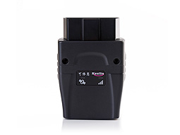

# EElink - GOT08

El GOT08 de SHENZHEN EELINK COMMUNICATION TECHNOLOGY CO., LTD es un rastreador GPS con interfaz OBD plug and play diseñado para instalación rápida y monitoreo continuo del vehículo. Diseñado para conectarse al puerto OBD del vehículo, el GOT08 proporciona datos de ubicación GPS en tiempo continuado, registro de datos a bordo y telemetría vehicular en un formato compacto alimentado por el propio vehículo. Esto lo hace idóneo para administradores de flotas y propietarios particulares que buscan un dispositivo discreto y sin cableado complejo.

Como dispositivo compatible con Plaspy, el GOT08 transmite la ubicación y la telemetría OBD reportada a la plataforma Plaspy para seguimiento en tiempo real, generación de informes y alertas. La combinación de una instalación OBD sencilla y las herramientas de gestión de flotas de Plaspy facilita despliegues rápidos en flotas mixtas y acelera el valor añadido en tareas como monitoreo antirrobo, supervisión de rutas y planificación de mantenimiento.

## Aspectos clave

- Interfaz OBD plug and play para instalación rápida sin necesidad de montaje especializado.
- Compatible con Plaspy para ofrecer seguimiento centralizado y visibilidad de flotas.
- Captura telemetría vehicular y registro a bordo cuando el vehículo expone esos parámetros.
- Diseño compacto alimentado por el vehículo que elimina la necesidad de baterías externas en la mayoría de instalaciones.
- Pensado tanto para operaciones de flotas como para monitoreo de vehículos particulares.
- Permite despliegues más rápidos y reduce el costo de instalación en implementaciones de flota.
- Base útil para flujos de trabajo antirrobo cuando se combina con alertas y reglas en Plaspy.

## Cómo funciona con Plaspy

Cuando el GOT08 se instala en el puerto OBD de un vehículo, reporta la ubicación GPS y la telemetría disponible desde OBD a Plaspy. Una vez que los datos llegan a la plataforma, Plaspy visualiza la posición, almacena registros históricos y puede activar alertas o generar informes según las reglas configuradas. La provisión y el mapeo del dispositivo al vehículo en Plaspy permiten a los responsables integrar los datos del GOT08 en paneles y flujos operativos.

- Actualizaciones de ubicación en tiempo real y reproducción histórica para revisión de rutas e investigación de incidentes.
- Exposición de diagnósticos de motor y eventos relacionados con el encendido en Plaspy cuando el vehículo provee esos parámetros.
- Niveles de combustible y métricas de consumo pueden incluirse en informes si el vehículo transmite esa información por OBD.
- Historiales de viajes y telemetría registrada se guardan para cumplimiento, planificación de mantenimiento y análisis.
- Geocercas y alertas en Plaspy pueden notificar al equipo sobre movimientos inesperados o eventos de límite de zona.
- Combine las transmisiones del GOT08 con los paneles e informes de Plaspy para supervisión operativa.

## Casos de uso típicos

- Gestión de flotas y seguimiento de utilización en flotas mixtas de vehículos.
- Detección y recuperación ante robo usando ubicación en tiempo real y alertas.
- Planificación de mantenimiento preventivo mediante códigos de falla y tendencias de telemetría.
- Monitoreo de combustible y control de costos cuando el vehículo proporciona esos datos.
- Supervisión del comportamiento del conductor y programas de seguridad usando datos de encendido y viajes.

## Por qué elegir este rastreador con Plaspy

El GOT08 es una opción práctica para organizaciones que requieren hardware compatible con Plaspy y con mínima complejidad de instalación. Su factor de forma OBD reduce el tiempo de instalación y las interrupciones, facilitando el despliegue de rastreo en un gran número de vehículos. Al entregar posiciones GPS junto con telemetría reportada por el vehículo a Plaspy, el GOT08 aporta los datos esenciales para monitoreo de ubicación, planificación de mantenimiento e informes de flota.

Para equipos que valoran despliegues previsibles, hardware discreto e integración con una plataforma centralizada de gestión de flotas, el GOT08 representa una solución sencilla alimentada por el vehículo. Plaspy puede aprovechar los datos que proporciona el dispositivo para ofrecer información operativa, alertas y registros históricos que apoyen las operaciones diarias de la flota.

Learn more about Plaspy on the main website https://www.plaspy.com. Product specifications, availability, and manufacturer details can change over time, so verify current specifications and official documentation on the manufacturer website https://www.eelink.com.cn/.
