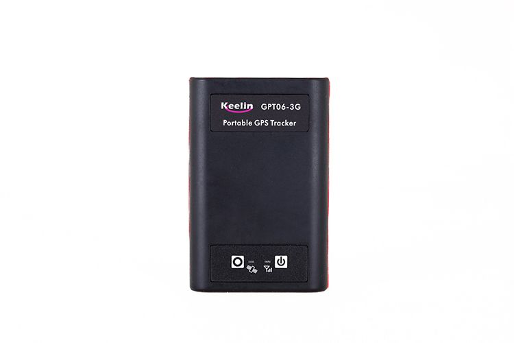

# EElink - GPT06

El EElink GPT06 es un rastreador GPS compacto y versátil diseñado para ofrecer monitoreo de ubicación preciso en una amplia variedad de entornos. Soporta doble modo GSM y WCDMA con siete bandas de frecuencia para una amplia compatibilidad regional y combina un diseño de doble módulo con posicionamiento por GPS, A-GPS y LBS para mejorar la precisión y la confiabilidad de la localización. El equipo proporciona seguimiento en tiempo real, reproducción del historial de rutas, alertas SOS, geocercas y opciones de alarma basadas en movimiento, además de contar con un chasis resistente al agua y al polvo, batería de larga duración y un LED de alta luminosidad para mayor utilidad.

Como dispositivo compatible con Plaspy, el GPT06 puede integrarse en flujos de trabajo de gestión de flotas y activos para ofrecer visibilidad continua e informes de eventos. Su comportamiento de envío de datos y las funciones de alerta integradas se adaptan bien a flujos habituales de Plaspy, como la visualización en vivo de ubicaciones, notificaciones de geocercas, gestión de alarmas y análisis de rutas históricas. Las organizaciones que usan Plaspy pueden aprovechar el GPT06 para supervisión operativa sin asumir conocimientos especializados sobre la electrónica interna del dispositivo, confiando en las funciones documentadas del rastreador para suministrar la información de ubicación y eventos que Plaspy procesa.

## Características principales

- Compatibilidad celular global mediante doble modo GSM/WCDMA y siete bandas de frecuencia para mayor cobertura regional
- Enfoque de posicionamiento dual combinando GPS, A-GPS y LBS para mejorar la fiabilidad de la posición
- Seguimiento en tiempo real con reproducción del historial de rutas para visibilidad continua y revisión posterior a eventos
- Botón SOS y soporte de geocercas para alertas inmediatas y monitoreo de límites virtuales
- Sensor de movimiento integrado y múltiples opciones de alarma para detectar desplazamientos y generar notificaciones
- Diseño resistente al agua y al polvo, batería de larga duración y LED integrado de alta luminosidad
- Soporte para actualizaciones remotas y múltiples protocolos para facilitar la integración con plataformas

## Cómo funciona con Plaspy

Cuando usted usa el GPT06 con Plaspy, el dispositivo transmite datos de ubicación y eventos que Plaspy ingesta y presenta mediante sus herramientas de mapeo, alertas e informes. Plaspy recibe las actualizaciones del equipo y las convierte en visibilidad accionable y registros históricos para gerentes de flota y administradores.

- Ubicación en tiempo real de vehículos y activos mostrada en los mapas de Plaspy para conciencia operativa inmediata
- Alertas de entrada y salida de geocercas enviadas a Plaspy para que los equipos reciban notificaciones de límites
- Eventos SOS y alarmas capturados y priorizados en Plaspy para atención y escalamiento inmediatos
- Reproducción de rutas históricas almacenada en Plaspy para revisión de viajes y cumplimiento
- Estado del dispositivo y alertas de batería baja visibles en los paneles de Plaspy para mantenimiento proactivo
- Funciones de agrupamiento y monitoreo que permiten supervisión a nivel de flota y vistas filtradas por activo

## Casos de uso típicos

- Flotas internacionales de vehículos que necesitan amplia cobertura celular y seguimiento centralizado
- Flotas de alquiler y logística que requieren historial de rutas y control mediante geocercas
- Seguimiento de seguridad personal para individuos o acompañamientos donde las alertas SOS son críticas
- Monitoreo de activos portátiles y envíos que se benefician de alarmas por movimiento
- Rastreo de personal de campo y supervisión operativa en despliegues dispersos o transfronterizos

## Por qué elegir este rastreador con Plaspy

El GPT06 es una opción práctica para organizaciones que requieren un equilibrio entre alcance celular global y métodos de posicionamiento en capas para aumentar la fiabilidad de la ubicación. Sus funciones de seguridad integradas, como SOS y geocercas, combinadas con alarmas por movimiento, lo hacen adecuado para usos mixtos en vehículos, personas y activos portátiles. Desde la perspectiva operativa, el soporte del dispositivo para cargas de datos y actualizaciones por aire se alinea con los flujos de gestión de flotas que Plaspy gestiona, sin necesidad de configuraciones excesivamente personalizadas.

Para los equipos que usan Plaspy, el GPT06 ofrece tipos de eventos y comportamiento de seguimiento previsibles que se integran directamente con las capacidades de visibilidad, alertas e informes de Plaspy. Esto lo convierte en una opción útil cuando necesita datos de ubicación fiables, manejo sencillo de alarmas y reproducción histórica dentro de una única plataforma de gestión.

Para obtener más información sobre cómo se pueden usar dispositivos GPT06 con Plaspy visite https://www.plaspy.com. Las especificaciones del producto, la disponibilidad y los datos del fabricante pueden cambiar con el tiempo por lo que le recomendamos verificar la información técnica y la compatibilidad actuales con el fabricante en https://www.eelink.com.cn/ antes de tomar decisiones de compra o despliegue.
