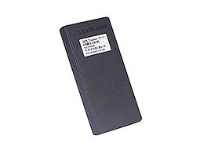

# EElink - GPT15

El GPT15 es un rastreador GPS delgado orientado a viajes, diseñado para equipaje y bienes personales. Combina posicionamiento por capas con un diseño compacto para ofrecer visibilidad portátil de ubicación y detección de manipulación en objetos cotidianos y despliegues de corta duración. El dispositivo integra GPS, posicionamiento por Wi‑Fi y estaciones base, emparejamiento Bluetooth 4.0 con smartphones, un sensor de luz para detección de apertura, y una batería recargable en una carcasa ligera pensada para mochilas, maletas y objetos pequeños.

Como dispositivo compatible con Plaspy, el GPT15 se integra con Plaspy para proporcionar seguimiento en tiempo real, alertas configurables y telemetría centralizada. Su diseño y conjunto de funciones lo hacen adecuado para consumidores y despliegues de activos a pequeña escala que requieren visibilidad continua de ubicación, notificaciones por geocerca y alertas de batería baja, todo consolidado en los paneles y notificaciones de Plaspy.

## Características principales

- Posicionamiento por capas que combina GPS, Wi‑Fi y LBS para mayor fiabilidad en entornos urbanos y de viaje
- Emparejamiento Bluetooth 4.0 con smartphone para detección de proximidad y flujos de trabajo asistidos contra robo
- Alertas de manipulación basadas en sensor de luz para detectar cuando el equipaje o los activos son abiertos o alterados
- Notificaciones de geocerca y batería baja enviadas a Plaspy para alertas oportunas y acciones concretas
- Larga autonomía con batería recargable de 1800 mAh, adecuada para viajes prolongados
- Diseño delgado y liviano de 96 × 50 × 11.2 mm y 65 g para colocación discreta en bolsos y objetos personales
- Configuración remota vía app o SMS para facilitar la gestión en campo sin acceso físico al dispositivo

## Cómo funciona con Plaspy

Cuando se utiliza con Plaspy, el GPT15 transmite eventos de ubicación y sensores que Plaspy recibe, visualiza y reenvía a los usuarios en forma de alertas e informes. Plaspy consolida datos de GPS, Wi‑Fi y estaciones base junto con señales de sensores para que administradores y propietarios puedan seguir movimientos, revisar historiales y recibir notificaciones inmediatas por los canales que prefieran.

- Actualizaciones de ubicación en tiempo real desde GPS, Wi‑Fi y LBS para visibilidad continua en los mapas de Plaspy
- Eventos de entrada y salida de geocerca entregados a Plaspy para monitoreo perimetral y alarmas
- Notificaciones de batería baja mostradas en Plaspy para incentivar recargas o reemplazos a tiempo
- Alertas de manipulación y del sensor de luz remitidas a Plaspy para apoyar detección de robo y manejo indebido
- Emparejamiento Bluetooth y eventos de proximidad integrados en los flujos de trabajo de Plaspy para protección asistida por smartphone

## Casos de uso típicos

- Seguimiento de equipaje y pertenencias durante viajes para maletas, mochilas y artículos de mano en tránsito
- Protección de activos personales como bolsos de cámara, fundas de laptop y otros objetos portátiles de valor
- Monitoreo de paquetes y envíos pequeños donde el tamaño compacto y la ubicación en tiempo real son importantes
- Seguimiento de equipo para eventos y alquileres en despliegues de corta duración
- Visibilidad de inventario a pequeña escala para activos portátiles que requieren verificaciones de ubicación ocasionales

## Por qué elegir este rastreador con Plaspy

El GPT15 es una opción práctica para organizaciones y particulares que necesitan un rastreador compacto y alimentado por batería que se integre con una plataforma centralizada. Su posicionamiento por capas y sensores integrados brindan confianza en la ubicación y detección de manipulación, mientras que la configuración remota y su forma ligera facilitan el despliegue en múltiples escenarios de viaje y protección de bienes personales. Para usuarios de Plaspy, el GPT15 aporta telemetría y alertas accionables sin añadir complejidad innecesaria a las operaciones.

To learn more about Plaspy and how compatible devices like the GPT15 fit into asset visibility and alerting workflows visit https://www.plaspy.com. Product specifications, availability and manufacturer details can change over time, so please verify current specifications on the official manufacturer website at https://www.eelink.com.cn/.
