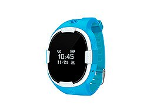

# EElink - GPT18

El GPT18 es un reloj rastreador GPS portátil y compacto diseñado para un monitoreo personal fiable — ideal para niños, personas mayores y personas que se encuentran solas. Compatible con Plaspy desde el inicio, el GPT18 ofrece seguimiento en tiempo real con posicionamiento GPS/Wi‑Fi/LBS, llamadas de voz bidireccionales y una alarma SOS de emergencia de un toque, para que cuidadores y equipos de monitoreo permanezcan conectados y respondan con rapidez. Su modo de trabajo inteligente equilibra la precisión de ubicación con la duración de la batería, y la configuración remota vía servidor, app o SMS facilita la implementación y la gestión dentro de la plataforma Plaspy.

Duradero y fácil de usar, el GPT18 combina características prácticas de seguridad \(alertas de geocerca, aviso de baja batería, alarma de velocidad y conteo de pasos con podómetro\) con una carcasa resistente al agua IP65 y una pantalla OLED para una interacción simple en el propio dispositivo. Como rastreador GPS compatible con Plaspy, extiende las capacidades de telemetría y alertas de Plaspy a casos de uso de seguridad personal mientras encaja en carteras de dispositivos más amplias que soportan gestión de flotas, anti‑robo y otros escenarios de telemetría dentro del ecosistema de Plaspy.

## Puntos destacados

- Rastreador GPS portátil compatible con Plaspy que ofrece seguimiento en tiempo real preciso para la seguridad personal y el monitoreo.
- Posicionamiento multimodal: GPS + Wi‑Fi + LBS con asistencia AGPS para ubicaciones más rápidas y mejor cobertura.
- Alarma SOS de un toque y capacidad de llamadas de voz bidireccionales para garantizar una comunicación de emergencia rápida.
- Modo de funcionamiento inteligente que optimiza el equilibrio entre precisión de ubicación y duración de la batería para despliegues más prolongados.
- Geocerca, alarma de velocidad y alertas de baja batería permiten notificaciones proactivas a través de la plataforma de Plaspy.
- Podómetro y telemetría de actividad para el movimiento básico y conteo de pasos — útil para el monitoreo de cuidadores y para el seguimiento de la actividad física ligera.
- Carcasa protegida IP65, formato compacto y pantalla OLED para uso diario cómodo y comprobación de estado sencilla.
- La configuración remota a través del servidor, de la app móvil o por SMS simplifica el aprovisionamiento y las actualizaciones cuando está integrada con Plaspy.

## Cómo funciona con Plaspy

Al integrarse con Plaspy, el GPT18 transmite datos de ubicación y eventos a la nube de Plaspy para que operadores y cuidadores reciban información oportuna y accionable. Plaspy utiliza esa telemetría para mostrar la posición del dispositivo en mapas, activar alertas y generar informes. Las entradas de configuración remota permiten a los administradores ajustar los intervalos de reporte, los límites de geocerca y los umbrales de alerta sin necesidad de acceder físicamente al reloj.

- Actualizaciones de ubicación y telemetría en tiempo real mediante GPS/Wi‑Fi/LBS, visibles en los paneles de Plaspy y en vistas móviles bajo demanda.
- Alertas de emergencia SOS transmitidas instantáneamente a Plaspy con ubicación y soporte de back-end de llamadas para una respuesta inmediata.
- Soporte de llamadas de voz bidireccionales \(GSM\) para una comunicación directa entre el usuario y cuidadores o centros de monitoreo.
- Alertas de geocerca y alarmas de velocidad enviadas a Plaspy para notificaciones automatizadas y flujos de escalamiento.
- Telemetría de baja batería y estado del dispositivo entregada a Plaspy para que puedas gestionar reemplazos o programar cargas de forma remota.
- Datos de podómetro y movimiento disponibles como telemetría básica de actividad a través de Plaspy para el monitoreo de salud y bienestar.

## Resumen técnico

| Conectividad | GPS, Wi‑Fi, posicionamiento LBS + GSM para voz y datos |
| --- | --- |
| Bandas | GSM 850 / 900 / 1800 / 1900 MHz |
| Potencia y batería | Batería de 470 mAh, se recarga en aproximadamente 2 horas; voltaje de operación 3.7 V DC; corriente 40 mA |
| Interfaz y controles | Pantalla OLED, un botón multifunción; admite llamadas de voz bidireccionales y alarma SOS de emergencia con un toque |
| GNSS | Banda GPS 1575 MHz; precisión GPS 5–15 m; precisión Wi‑Fi 5–50 m |
| Gestión remota | Configuración remota vía servidor, app móvil o SMS |
| Factor de forma y durabilidad | Dimensiones 40 × 35 × 14.8 mm; peso 40 g; carcasa protegida IP65 resistente al agua |

## Casos de uso

- Seguridad de niños y monitoreo parental — seguimiento en tiempo real, alarma SOS y llamadas bidireccionales para una rápida respuesta ante incidentes.
- Cuidado de personas mayores y vida asistida — telemetría de actividad, alertas de baja batería y notificaciones de geocerca para la tranquilidad de los cuidadores.
- Protección de trabajadores aislados o personas vulnerables — dispositivo vestible discreto que ofrece señalización de emergencia inmediata y compartición de ubicación a los monitores de Plaspy.
- Excursiones escolares y salidas en grupo — monitoreo centralizado en Plaspy para gestionar varios dispositivos y establecer límites de geocerca para zonas seguras.
- Monitoreo de la actividad diaria — podómetro y alertas de movimiento para un seguimiento ligero de la actividad física y chequeos de bienestar.

## Por qué elegir este rastreador con Plaspy

El GPT18 aporta un seguimiento personal confiable al ecosistema de Plaspy, con una mezcla de seguridad, conectividad y gestionabilidad. Su posicionamiento multimodal y la asistencia AGPS proporcionan fijaciones rápidas y una precisión de ubicación fiable, mientras que las llamadas bidireccionales y la alarma SOS soportan flujos de trabajo de voz y emergencias críticos. La configuración remota vía servidor/app/SMS reduce la carga de mantenimiento, y el modo de energía inteligente extiende la duración operativa para que los dispositivos permanezcan online cuando más los necesitas.

Aunque el GPT18 está optimizado para la atención a niños y cuidado de mayores, elegir un rastreador GPS compatible con Plaspy te da acceso a una plataforma unificada para telemetría y alertas. Plaspy admite una amplia gama de dispositivos y funciones — desde rastreadores personales como el GPT18 hasta gestión de flotas, anti‑robo, paneles de telemetría y integraciones con monitoreo de combustible o sistemas de encendido/inmovilización para otras unidades compatibles. Esa flexibilidad permite a las organizaciones escalar flujos de trabajo de monitorización y seguridad sin reconfigurar su backend ni volver a capacitar al personal.

