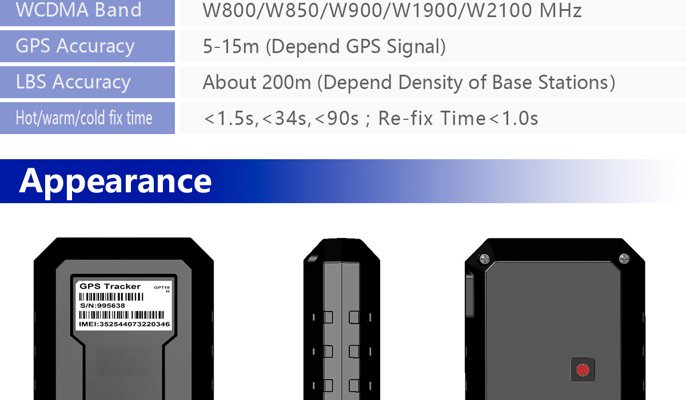

# EElink - GPT19

El EElink GPT19 es un rastreador GPS de larga duración pensado para el monitoreo de vehículos y activos en distintos entornos. Combina una construcción resistente al agua con una opción de montaje magnético para una instalación discreta en vehículos o equipos. Este dispositivo está dirigido a escenarios donde la durabilidad, la instalación sencilla y un tiempo de actividad prolongado son prioridades.

Como dispositivo compatible con Plaspy, el GPT19 puede integrarse en los flujos de trabajo de monitoreo de flotas y activos para ofrecer visibilidad de ubicaciones y alertas de eventos. La compatibilidad se logra mediante el soporte de integración EElink, que permite a Plaspy recibir actualizaciones de posición, eventos de geocerca y señales de configuración remota para ayudar a los equipos a supervisar operaciones desde una plataforma centralizada.

## Características principales

- Carcasa con certificación IP67 para protección contra polvo y exposición temporal al agua
- Montaje magnético para una fijación rápida y discreta en vehículos y activos
- Batería reemplazable de larga duración que soporta intervalos de espera extendidos
- Métodos de ubicación asistida dual para una adquisición de posición más rápida y seguimiento confiable
- Alarmas por geocerca y opciones de configuración remota vía aplicación de servidor o mensajes de texto
- Certificado según estándares regionales habituales y compatible con el protocolo de integración EElink 2.0

## Cómo funciona con Plaspy

El GPT19 se integra con Plaspy para incorporar la ubicación y el estado del dispositivo en un entorno unificado de gestión de flotas. Cuando se conecta mediante la integración EElink, Plaspy puede recibir informes de posición y alertas del dispositivo para facilitar la supervisión y la respuesta ante eventos.

- Mostrar datos de ubicación en tiempo real e históricos dentro de los paneles de Plaspy para el monitoreo de la flota
- Activar alertas de geocerca en Plaspy cuando el dispositivo entra o sale de áreas definidas
- Visualizar el estado del dispositivo y la condición de la batería para que los operadores puedan planificar mantenimiento o reemplazo de batería
- Utilizar los informes de Plaspy para analizar patrones de movimiento y métricas operativas a lo largo del tiempo
- Aplicar flujos de trabajo de configuración remota compatibles con el rastreador a través de Plaspy cuando la integración esté configurada

## Casos de uso típicos

- Flotas de alquiler de vehículos que requieren dispositivos de seguimiento discretos y duraderos
- Operaciones de logística y transporte que monitorean rutas y ubicaciones de vehículos
- Protección y conservación de bienes o activos de alto valor en campo
- Implementaciones IoT donde se necesita larga autonomía de batería y robustez
- Activos remotos que se benefician de una instalación magnética sencilla y monitoreo periódico

## Por qué elegir este rastreador con Plaspy

El GPT19 es una opción práctica para organizaciones que necesitan hardware de seguimiento resistente y de bajo mantenimiento. Su protección IP67 y el montaje magnético lo hacen apto para una amplia variedad de aplicaciones al aire libre y móviles, mientras que la batería reemplazable de larga duración reduce la necesidad de intervenciones frecuentes en sitio. Estas características se alinean con los objetivos de Plaspy de minimizar tiempos de inactividad y simplificar la supervisión de flotas.

Dado que el dispositivo soporta la integración EElink, los datos de las unidades GPT19 pueden canalizarse hacia Plaspy para proporcionar visibilidad unificada, gestión de geocercas, alertas e informes. Cuando los detalles específicos del fabricante sean importantes para la planificación de la integración, consulte la documentación del fabricante para confirmar comportamientos concretos y comandos remotos disponibles.

Para obtener más información sobre el uso de Plaspy con rastreadores compatibles visite https://www.plaspy.com. Las especificaciones de producto y la disponibilidad pueden cambiar con el tiempo, por lo que le recomendamos verificar los detalles técnicos y las certificaciones actuales con el fabricante en https://www.eelink.com.cn/ antes de tomar decisiones finales de despliegue.
