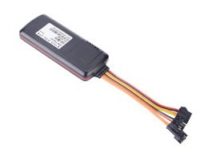

# EElink - GPT19‑H

El GPT19‑H es un rastreador magnético para activos diseñado para despliegues encubiertos a largo plazo y para un monitoreo remoto fiable. Con un imán potente y protección IP67, está pensado para un montaje discreto en remolques, contenedores, maquinaria y otros activos donde la durabilidad y el bajo mantenimiento son prioritarios. El dispositivo combina posicionamiento GPS y LBS y ofrece alertas por movimiento, caídas y manipulación para mantener la visibilidad operativa del activo.

Como rastreador compatible con Plaspy, el GPT19‑H integra su telemetría de ubicación y eventos en los paneles y flujos de alerta de Plaspy. Su batería reemplazable de 4200 mAh y los intervalos de activación configurables reducen las visitas de mantenimiento, mientras que el modo de seguimiento continuo de emergencia y la configuración remota lo convierten en una opción práctica para visibilidad de activos, monitoreo antirrobo y supervisión operativa en flotas gestionadas con Plaspy.

## Características principales

- Rastreador de activos GPS y LBS compatible con Plaspy para monitoreo remoto continuo y visibilidad de flota.
- Batería reemplazable de 4200 mAh con autonomía en espera de aproximadamente 2 a 3 años según la configuración de intervalos de activación.
- Modo de emergencia que soporta seguimiento continuo en tiempo real para eventos de recuperación de alta prioridad.
- Montaje magnético discreto y resistencia IP67, adecuado para remolques, contenedores y equipos exteriores.
- Alertas por movimiento y caída, activación por vibración y alarma por manipulación mediante sensor de luz, que proporcionan telemetría útil para la prevención de robo.
- Posicionamiento híbrido GPS más LBS que mejora los informes de ubicación en entornos con señal marginal.
- Configuración remota que reduce la necesidad de ajustes en sitio y permite afinamiento desde Plaspy.

## Cómo funciona con Plaspy

Cuando se conecta a Plaspy, las posiciones y los datos de eventos del GPT19‑H se integran en una vista única de gestión de flota o activos para que los operadores puedan monitorear ubicaciones en vivo, activar alarmas y generar reportes. Plaspy mapea las alertas de movimiento, caída y manipulación en notificaciones y almacena el historial de eventos para seguimientos operativos y procesos de recuperación.

- Actualizaciones en tiempo real de ubicación y telemetría, incluyendo reporte normal y modos de seguimiento continuo de emergencia.
- Eventos de movimiento, caída y manipulación dirigidos como notificaciones de Plaspy para apoyar la respuesta ante intentos de robo.
- Eventos de entrada y salida de geocerca generados por Plaspy usando los datos GPS y LBS del dispositivo para control perimetral.
- Configuración remota OTA para ajustar intervalos de activación, cadencia de reporte y umbrales de alarma desde Plaspy.
- Opciones de integración complementarias: aunque el GPT19‑H no incluye entradas de ignición o inmovilizador, Plaspy puede consolidar su telemetría con datos de otros dispositivos de la misma flota para reportes unificados.

## Casos de uso típicos

- Seguimiento de remolques y contenedores para visibilidad a largo plazo y preparación para recuperación.
- Monitoreo antirrobo de maquinaria y equipo pesado con alertas por vibración y manipulación.
- Supervisión de activos estacionales o en almacenamiento donde la larga autonomía reduce las tareas de mantenimiento.
- Control perimetral y aplicación de geocercas para detectar movimientos inesperados o violaciones de límite.
- Escenarios de recuperación de alto riesgo que requieren activar seguimiento continuo en tiempo real para persecución y entrega.

## Por qué elegir este rastreador con Plaspy

El GPT19‑H es una buena opción para organizaciones que necesitan rastreo de activos duradero, discreto y de bajo mantenimiento integrado en una plataforma de gestión de flota más amplia. Su batería reemplazable y los intervalos de activación configurables ayudan a reducir los costos operativos en activos dispersos o de acceso poco frecuente, mientras que la protección IP67 y el imán potente aseguran un montaje seguro en entornos exigentes. Conectado a Plaspy, los flujos de eventos del rastreador pasan a formar parte de flujos de trabajo accionables para disuasión de robo, control de geocercas y visibilidad de inventario.

Para más información sobre cómo funciona el GPT19‑H con Plaspy visite el sitio web de Plaspy https://www.plaspy.com. Las especificaciones de producto, disponibilidad y detalles del fabricante pueden cambiar con el tiempo, por lo que le recomendamos verificar las especificaciones y la documentación actual en el sitio del fabricante https://www.eelink.com.cn/.
