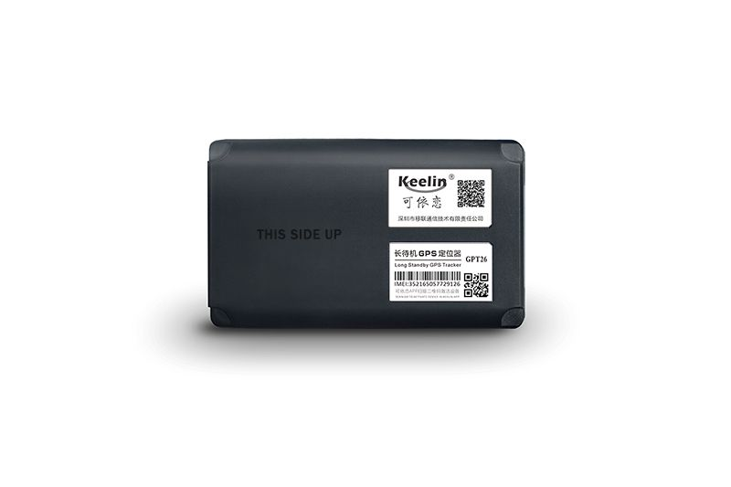

# EElink - GPT26

El EElink GPT26 es un rastreador GPS compacto y resistente diseñado para el monitoreo confiable de activos. Combina compatibilidad cuatribanda con un enfoque de localización dual mediante GPS y LBS. El dispositivo está pensado para ofrecer un prolongado tiempo en espera gracias a su batería de alta capacidad y para resistir entornos exigentes con protección IP67 y una construcción reforzada. El montaje físico se facilita con una base magnética potente, y el rastreador soporta el protocolo EELINK y actualizaciones de firmware OTA para mantenimiento remoto.

Como dispositivo compatible con Plaspy, el GPT26 puede enviar datos de ubicación y estado básico a la plataforma Plaspy para obtener visibilidad centralizada y supervisión de flotas. Su combinación de soporte de redes globales, modos de localización dual y larga autonomía lo hacen una opción práctica para proyectos de monitoreo de activos y vehículos que requieren despliegues prolongados sin supervisión o montajes resistentes en campo. Plaspy puede ingerir los datos del rastreador para presentar posiciones, historial y contexto operativo junto con otros dispositivos en su cuenta.

## Aspectos clave

- Soporte de redes cuatribanda para amplia compatibilidad internacional
- Modo de localización dual que combina GPS y LBS para posicionamiento más consistente
- Batería de alta capacidad de 7000 mAh con rendimiento extendido en espera
- Montaje magnético robusto para fijación rápida a superficies metálicas
- Construcción resistente con protección IP67 contra agua y polvo
- Soporta el protocolo EELINK para integración con plataformas de terceros
- Capacidad de actualización de firmware OTA para mantenimiento remoto

## Cómo funciona con Plaspy

Al conectarse con Plaspy, el GPT26 entrega ubicación y estado básico del dispositivo que Plaspy puede mostrar en mapas, registros y paneles operativos. Plaspy recibe mensajes compatibles del dispositivo y normaliza la información esencial de seguimiento para que los equipos puedan monitorear activos junto con otros equipos y vehículos.

- Visualización de ubicación en tiempo real y seguimiento en mapa para unidades individuales
- Historial de ubicaciones y reproducción de rutas para revisar desplazamientos a lo largo del tiempo
- Alertas y notificaciones configurables por movimiento, entrada/salida de geocercas y cambios de estado
- Agrupación de flotas y asignación de activos para organizar dispositivos por equipo u operación
- Opciones de informes y exportación para obtener información operativa y auditorías

## Casos de uso típicos

- Seguimiento de equipos portátiles y activos montados en metal mediante fijación magnética
- Monitoreo de remolques, contenedores o activos sin alimentación que requieren larga autonomía
- Seguimiento de flotas para vehículos de uso ocasional y activos en áreas remotas
- Seguridad y recuperación de activos cuando se necesita protección impermeable y resistente
- Registro prolongado de ubicaciones para flotas de alquiler o equipos desplegados

## Por qué elegir este rastreador con Plaspy

El GPT26 es una opción práctica para organizaciones que necesitan un rastreador duradero y de larga autonomía que sea sencillo de montar y gestionar. Su capacidad de localización dual ayuda a mantener la detección de posiciones en entornos con señales mixtas, y la gran capacidad de batería reduce la necesidad de recuperarlo con frecuencia para recarga. Estas características encajan bien con usuarios de Plaspy que requieren visibilidad fiable de activos con mínimo mantenimiento en sitio.

Plaspy ofrece una plataforma centralizada para visualizar los datos del GPT26 junto con otros dispositivos, generar informes operativos y configurar alertas que apoyen la gestión diaria de flotas y activos. Para equipos que buscan un rastreador resistente que pueda integrarse en un flujo de trabajo de monitoreo existente, el EElink GPT26 es una opción a considerar.

Para conocer más sobre cómo Plaspy puede trabajar con dispositivos compatibles visite https://www.plaspy.com. Las especificaciones del producto, la disponibilidad y los datos del fabricante pueden cambiar con el tiempo, por lo que le recomendamos verificar la información técnica actual con la documentación oficial de EElink en https://www.eelink.com.cn/.
